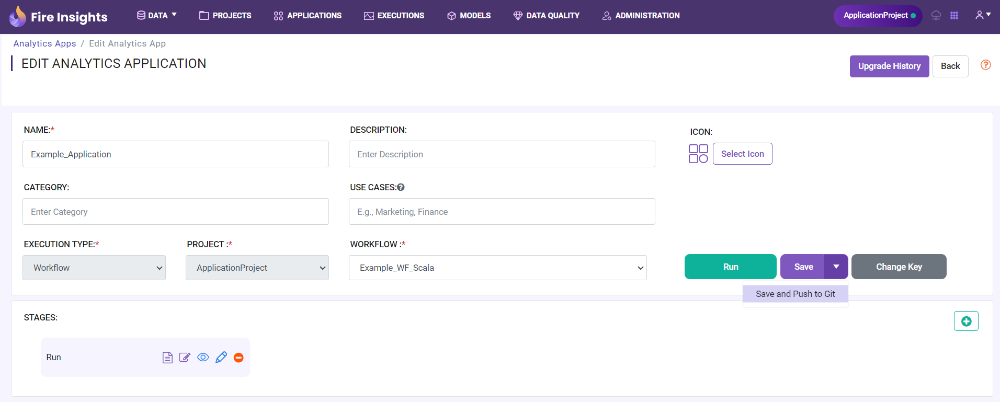
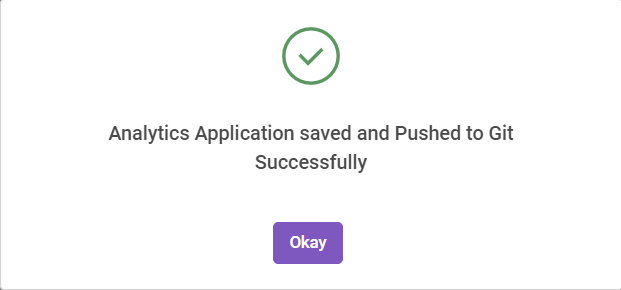

Push Application
=================

Sparkflows allows for changes to application to be pushed to a configured Git repo. Progress made on application can also be saved to be pushed onto Git at any given time. All previously saved application can be accessed via revision history. This document provides information on how to push applications onto remote Git repos, save applications to be pushed at a later day, and view the previous saved versions of a applications.

Commit and push Application to the remote Git repository
-------------------------------------------------------

- Go to create/edit ``Application`` page.
- Select the ``Application`` you wish to save and push it to Git.
- Click on the ``Save and Push to Git`` button.

   
   *Save and Push to Git*
   
   
- Write the ``Commit message`` in the textarea.

 
 
.. figure:: ../../_assets/git/git_application_commitmsg.png
   :alt: PushApplication
   :width: 60%
   
   *Commit Messsage*

- Click on the ``Push`` button.

   *On Success*
   

Application JSON file gets pushed in path : rootFolderPath/Projects/analytics_app/Example_Application.json
