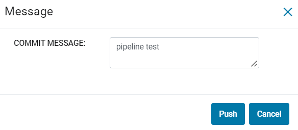

Push Pipeline
================

Commit and push Pipeline to the remote Git repository
-------------------------------------------------------

When you have added new workflow or made changes to existing workflows, you can directly push the changes to Git.

- Go to create/ Edit Pipeline page.
- Create or edit your Pipeline.
- Click on the ``SAVE AND PUSH TO GIT`` button.
- Write the ``Commit message`` on the modal textarea.
- Click on the ``PUSH`` button

*SAVE AND PUSH TO GIT*

.. figure:: ../../_assets/git/git_pipeline.PNG
   :alt: PushWf
   :width: 60%
  
*Commit Messsage*
 
 

   

*On Success*

On success, you will get success message.
