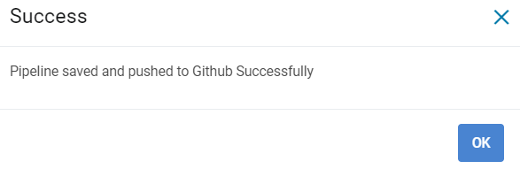

Push Pipeline
================

Sparkflow allows for changes to pipelines to be pushed to a configured git repo. Progress made on pipelines can also be saved to be pushed onto Git at any given time. All previously saved pipelines can be accessed via revision history. This document provides information on how to push pipelines onto remote git repos, save pipelines to be pushed at a later day, and view the previous saved versions of a pipelines.

Commit and push Pipeline to the remote Git repository
-------------------------------------------------------

- Go to create/edit ``Pipeline`` page.
- Select the ``Pipeline`` you wish to save and push to git.
- Click on the ``Save and push to git`` button.

.. figure:: ../../_assets/git/git_pipeline.PNG
   :alt: PushWf
   :width: 60%
   
   *Save and push to git*
   
   
- Write the ``Commit message`` in the textarea.

 
 
.. figure:: ../../_assets/git/git_commitmsg.PNG
   :alt: PushWf
   :width: 60%
   
   *Commit Messsage*

- Click on the ``Push`` button

   *On Success*
   

Workflow json file get pushed in path : rootFolderPath/Projects/pipelines/test.json
