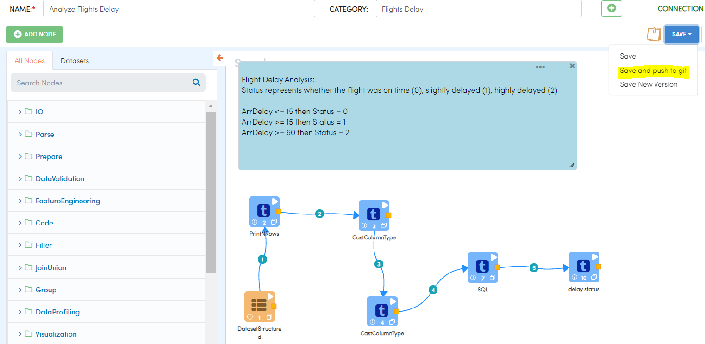
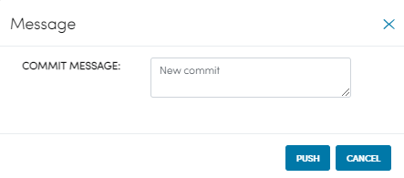
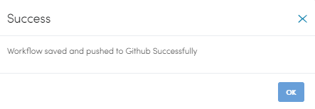
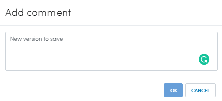
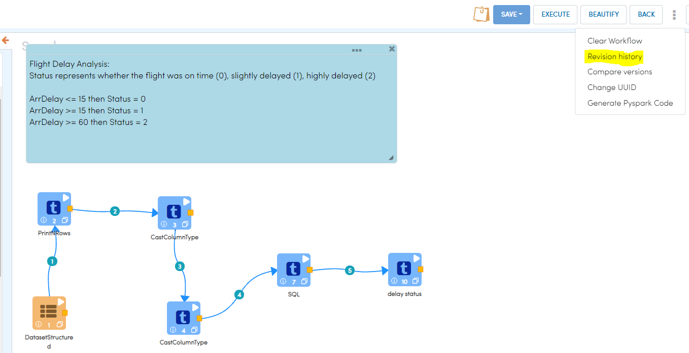
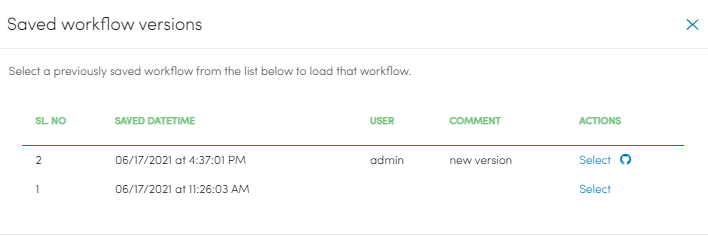

Push Workflow
================

Commit and push workflow to the remote Git repository
-------------------------------------------------------

When you have added new workflow or made changes to existing workflows, you can directly push the changes to Git.

- Go to create/ Edit workflow page.
- Create or edit your workflow.
- Click on the ``SAVE AND PUSH TO GIT`` button.
- Write the ``Commit message`` on the modal textarea.
- Click on the ``PUSH`` button

*SAVE AND PUSH TO GIT*

  
*Commit Messsage*
 
 

   

*On Success*

On success, you will get success message.

You can also save the version of the workflow and push it later.

- Click on the ``SAVE NEW VERSION`` button.
- Add comment.
- Click ``OK`` to save the new version of workflow.

Go to the History.

- You will get the list of workflow versions.
- Click on the ``Git-icon`` to push the selected version of workflow.
- Write the ``Commit message`` on the modal textarea.
- Click on the ``PUSH`` button

*Workflows History*

*Saved Workflow Versions*

  
*Commit message*
  

   

*On Success*

On success, you will get success message.

Workflow json file get pushed in path : rootFolderPath/Projects/Workflows/test.json
