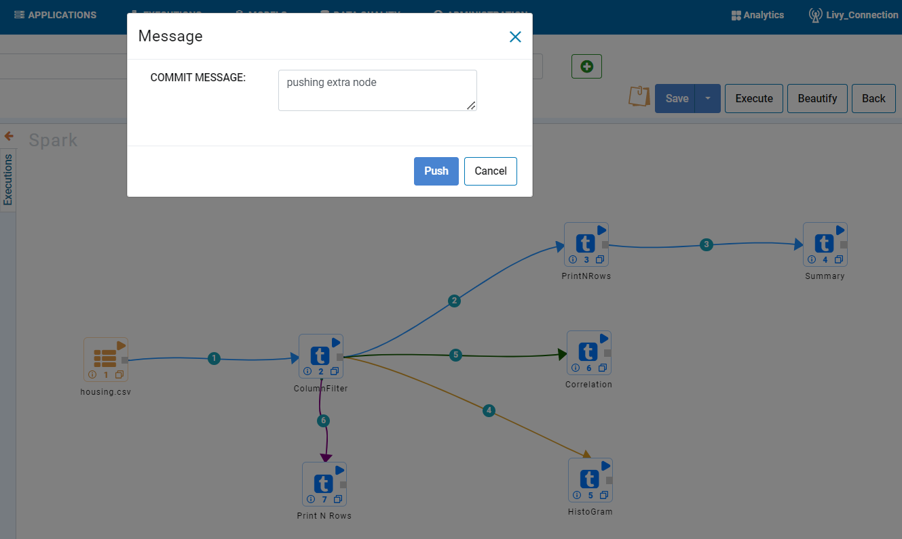
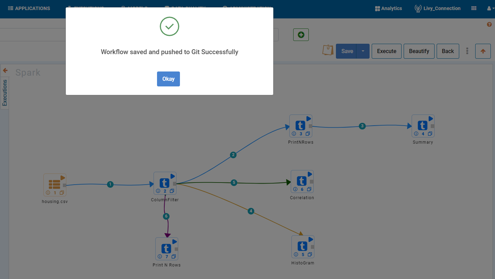
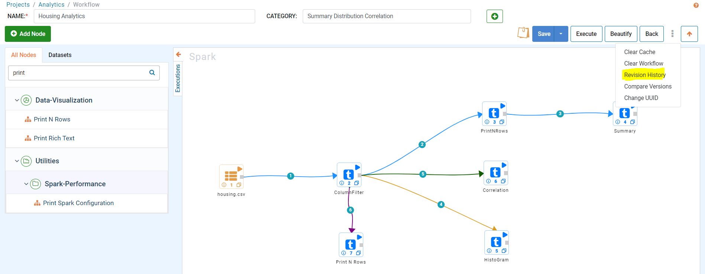
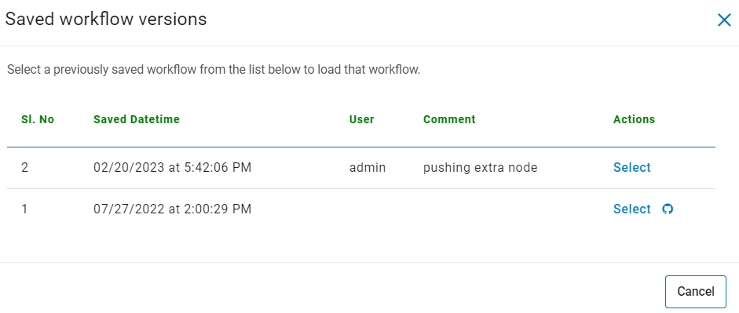
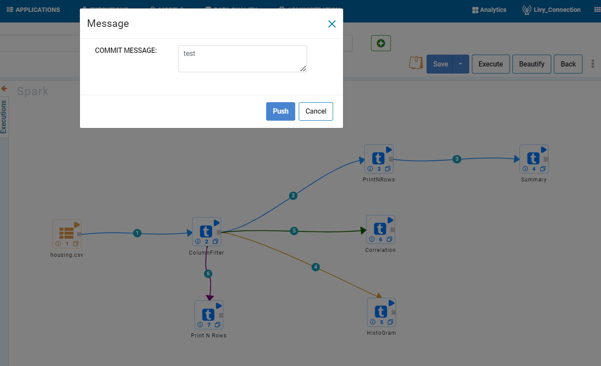
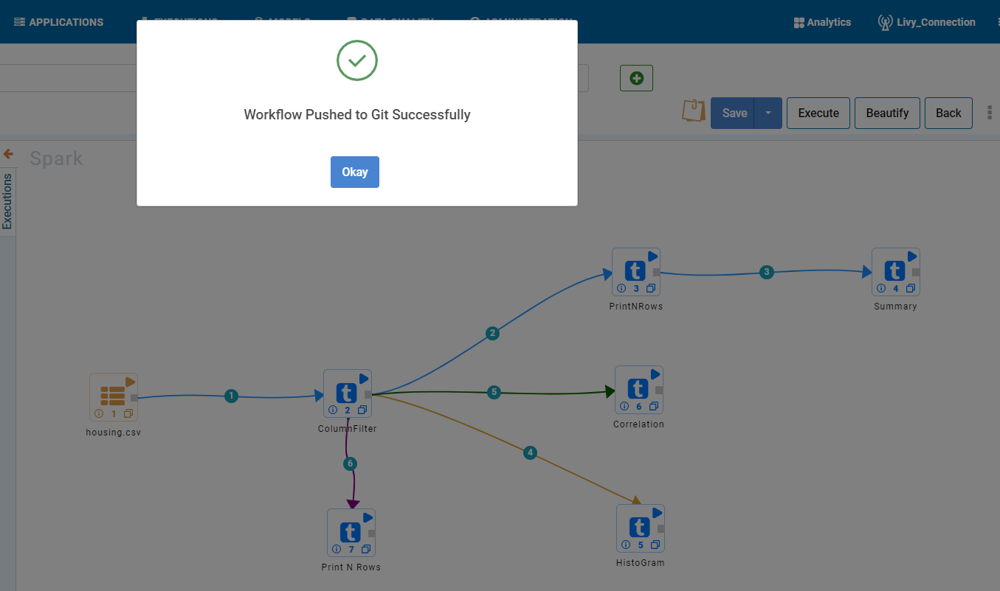

Push Workflow
================

Sparkflows allows for changes to workflows to be pushed to a configured Git repo. Progress made on workflows can also be saved to be pushed onto Git at
any given time. All previously saved workflows can be accessed via revision history. This document provides information on how to push workflows onto remote Git repos, save workflows to be pushed at a later day, and view the previous saved versions of a workflow. 

Commit and Push Workflows to Remote Git Repos
-------------------------------------------------------

When you have added new workflow or made changes to existing workflows, you can directly push the changes to Git.

- Go to create/ Edit workflow page.
- Create or edit your workflow.
- Click on the ``Save and push to Git`` button.
- Write the ``Commit message`` on the modal textarea.
- Click on the ``Push`` button.

*Save and push to Git*

.. figure:: ../../_assets/git/git_push_1.PNG
   :alt: PushWf
   :width: 60%
  
*Commit messsage*
 
 

   

*On success*

On success, you will get success message.

Saving Workflows Outside of Git
---------------

- Click on the ``Save new version`` button.
- Add comment.
- Click ``Ok`` to save the new version of workflow.

.. figure:: ../../_assets/git/save-newVersion-comment.png
   :alt: PushWf
   :width: 60% 

Viewing All Workflow Saved and Pushing a Particular Save to Git
---------------
- Click the ``Three vertical dots`` at the right corner.
- Select ``Revision History`` to get a list of the previous saves.
- Click on the ``Git icon`` to push the selected version of workflow.
- Write the ``Commit message`` on the modal textarea.
- Click on the ``Push`` button.

*Workflows History*

*Saved Workflow Versions*

  
*Commit message*
  

   

*On Success*

On success, you will get success message.

Workflow JSON file gets pushed in path : rootFolderPath/Projects/pipelines/test.json
