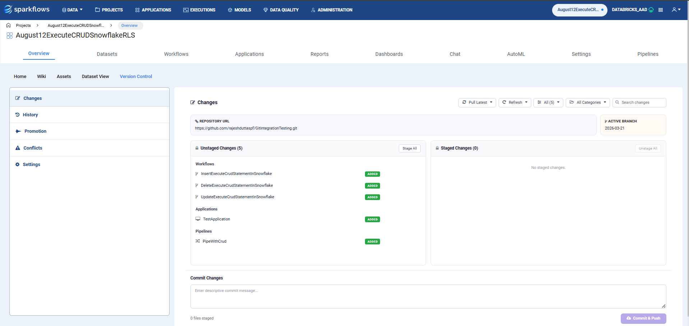
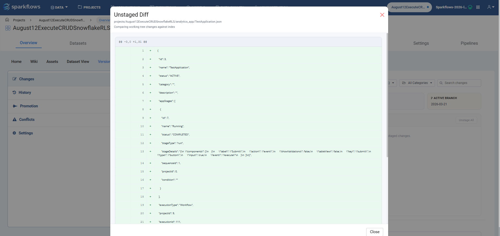
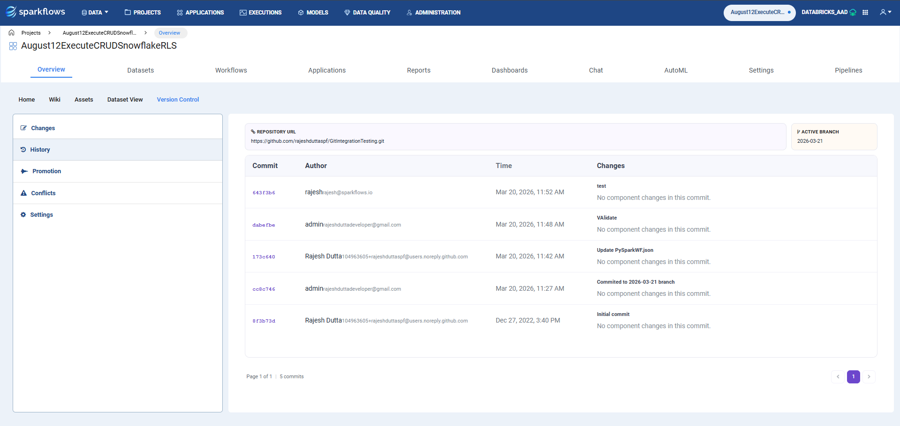
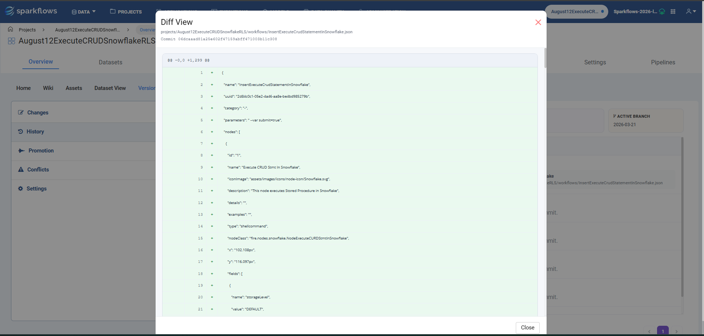
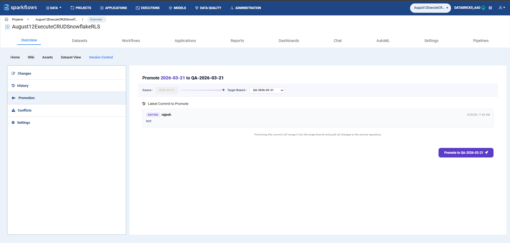
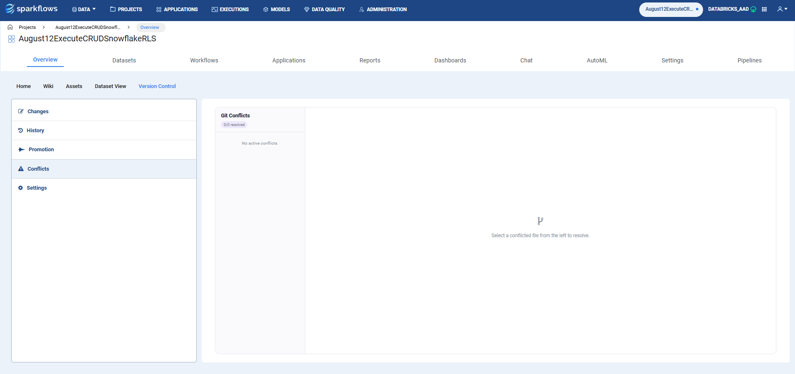
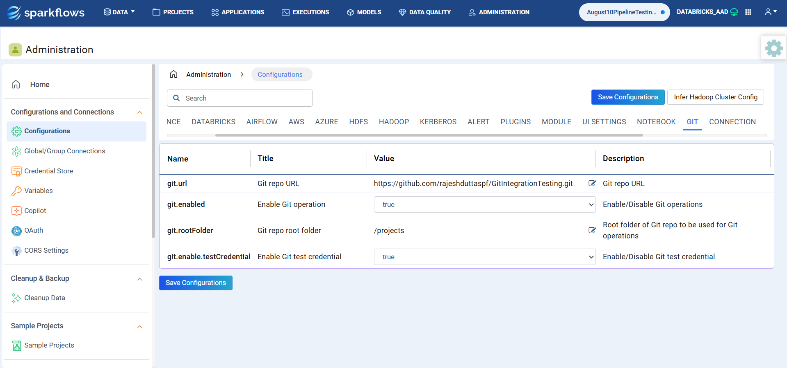
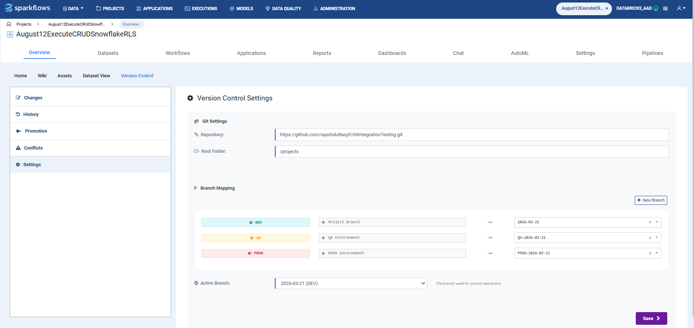
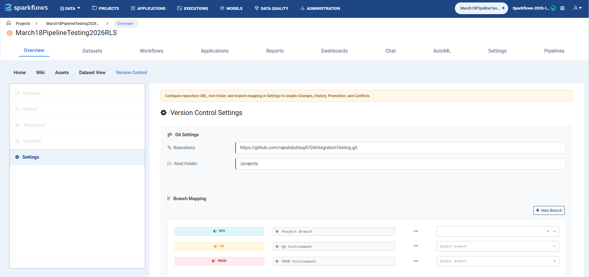

Version Control 
============================

This document outlines the Version Control feature, including its capabilities for managing changes, reviewing history, promoting code, resolving conflicts, and configuring repository settings within Project Overview.

1. Overview
-----------

The Version Control feature provides a unified Git experience within Project Overview. It allows users to review staged and unstaged changes, inspect diffs, manage commit history, promote changes across branches, resolve merge conflicts, and configure repository settings.

The main UI entry point is the **Version Control** tab within Project Overview, which includes the following sub-sections:

- Changes
- History
- Promotion
- Conflicts
- Settings

Navigation Steps
~~~~~~~~~~~~~~~

1. Open Project Overview and navigate to **Version Control**.
2. Use the **Changes** tab to inspect unstaged and staged files.
3. Filter files by status, category, or search text as needed.
4. Open file diffs to verify exact code or content changes.
5. Stage the required files.
6. Enter a commit message and click **Commit and Push**.
7. Use **History** to audit previous commits.
8. Use **Promotion** to move changes to target branches.
9. Use **Conflicts** when merges require manual resolution.

2. Main Capabilities
-------------------

Changes
~~~~~~~

- Displays unstaged and staged changes by component category.
- Supports search by item name.
- Supports status filtering: **All, Modified, Added, Deleted**.
- Supports category filtering with multi-select checkboxes.
- Allows viewing diffs for unstaged and staged files.
- Supports the following actions:

  - Stage all
  - Stage single item
  - Unstage all
  - Unstage single item

- Supports **Pull Latest** and auto-refresh/auto-pull toggles.
- Allows commit and push for staged changes.

**Working Diff:** Compares a current file in either staged or unstaged state.

Feature Details
~~~~~~~~~~~~~~~

.. list-table::
   :header-rows: 1
   :widths: 30 70

   * - Feature
     - Description
   * - Unstaged Changes
     - Shows files currently modified in the working tree and not yet staged.
   * - Staged Changes
     - Shows files added to the index and ready for commit.
   * - Status Filter
     - Filters visible items by change status: All, Modified, Added, or Deleted.
   * - Category Filter
     - Supports multi-select checkboxes for categories such as Datasets, Workflows, Pipelines, Dashboards, Applications, Wiki Docs, Charts, and Credentials.
   * - Search
     - Filters visible items using text entered in the search box.
   * - View Diff
     - Opens a diff modal for the selected file from either the unstaged or staged list.
   * - Refresh
     - Retrieves the updated list of local changes for all project components. Auto-refresh can be enabled to refresh every 3000 ms.
   * - Pull Latest
     - Pulls the latest code changes from Git for the configured active branch. Auto-refresh can also be enabled to run every 3000 ms.
   * - Stage / Unstage
     - Supports both single-item and all-item actions.
   * - Commit and Push
     - Commits staged files with a message and pushes them to the remote repository.

History
~~~~~~~

- Displays commit history with pagination.
- Shows commit metadata such as author, time, and message.
- Lists changed components in each commit.
- Allows opening a diff view for historical file changes.

**History Diff:** Compares a specific commit to its parent.

Promotion and Conflicts
~~~~~~~~~~~~~~~~~~~~~~~

- Promotes a selected commit to a target branch.
- Handles checkout, merge, push, and temporary stash operations.
- Surfaces conflicts when promotion cannot merge cleanly.
- Lists conflicting files and shows current and incoming content.
- Allows resolving conflicts and committing the resolution.

Settings
~~~~~~~~

- Stores repository URL, active branch, root folder, and branch mapping.
- Default values are sourced from the Git configuration set in Administration under Configurations.

3. Note
-------

If the project is not linked, clicking the **Version Control** tab redirects to the **Settings** menu to configure the required values first. All other sections remain disabled and become accessible only after the settings are saved.

