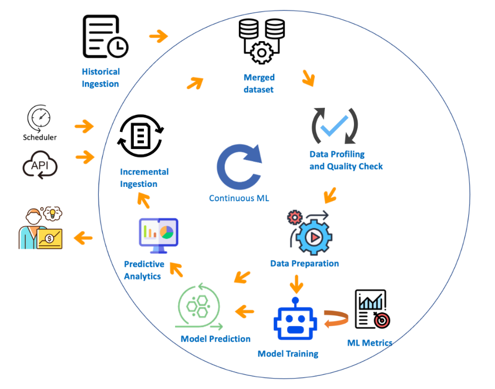
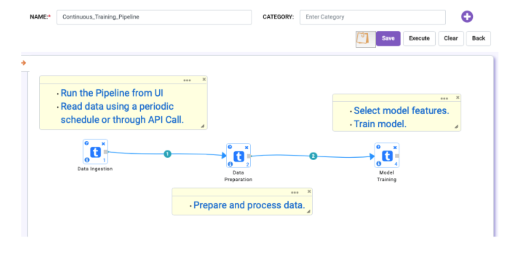
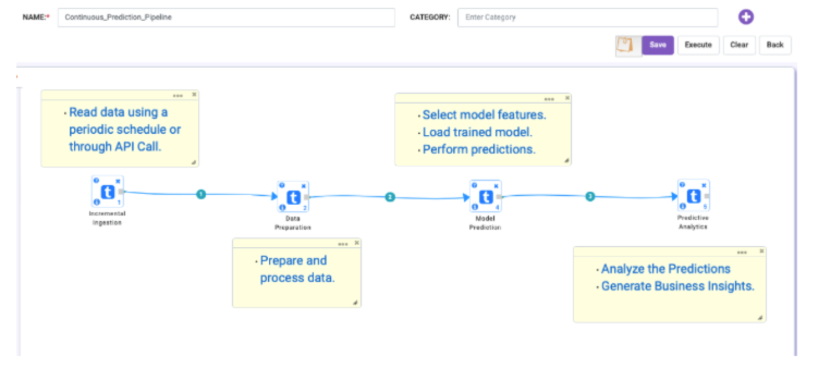
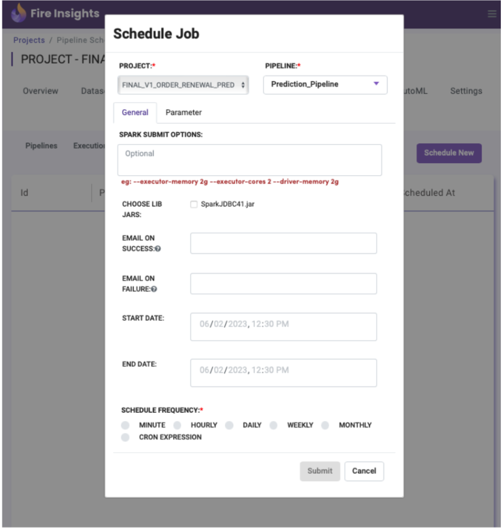

Continuous Machine Learning
========

Sparkflows makes it extremely easy to implement Continuous Machine Learning process in hours. This process ensures that Business Insights are generated in a timely manner against the most recent dataset. It also keeps the ML model uptodate, detects anomalies and merges daily changes with historical data.  

Let’s assume that we have created necessary workflows for data preparation, model training, model prediction, and analytical reports. Continuous Machine Learning can be implemented by creating a Training Pipeline and a Prediction pipeline in Sparkflows. 

The Model Training Pipeline can be scheduled to run periodically. 

* First, the **Data Ingestion Workflow** reads data from a data lake bucket which is regularly updated with incremental data.

* Next, the **Data Preparation Workflow** prepares the ingested data and creates necessary features.

* Finally, the **Model Training Workflow** selects the model features, trains and saves the model.

The Model Prediction Pipeline can be either scheduled to run periodically or directly invoked from another Cloud-hosted Service through API.

* First, the **Incremental Ingestion Workflow** is triggered by either scheduled run or API Call determines the location of the latest files for prediction input.

* Next, the **Data Preparation Workflow** processes the latest data files and merges it with the ‘Training Input’ data so that the Training workflow always runs against the latest dataset.

  * This workflow can also output the required dataset for prediction. For example, in order to predict churning of customers we always need to find all the active customers from the latest data. 

* The **Model Prediction Workflow** reads the processed prediction input data and saves the predictions in the output bucket of the data lake.

* Finally, **Predictive Analytics Workflow** is executed to generate the required Business Insights which are instantly published into pre-defined Reports.  

Additional Notes
-------

Schedule Training or Prediction Pipeline
+++++

Run Pipeline API
++++

* **URL :** http://<HOST>/executePipeline?pipelineName=<PIPELINE_NAME>&projectId=<PROJECT_ID>
 
* **BODY :** { "workflowParameters": "--var <PARAM_NAME> = <PARAM_VALUE>" }
 
* **HEADERS :** token = { <TOKEN_STRING> }

References
--------

* :ref:`ML User Guide<Machine Learning>`

* :ref:`Data Preparation User Guide<Data Preparation Basics>` 

* `Workflow User Guide <https://www.sparkflows.io/templates>`_

* :ref:`Pipeline User Guide<Pipeline Development>`

* :ref:`Scheduling User Guide<Scheduling Pipeline>`

* :ref:`API Usage User Guide<REST API>`

