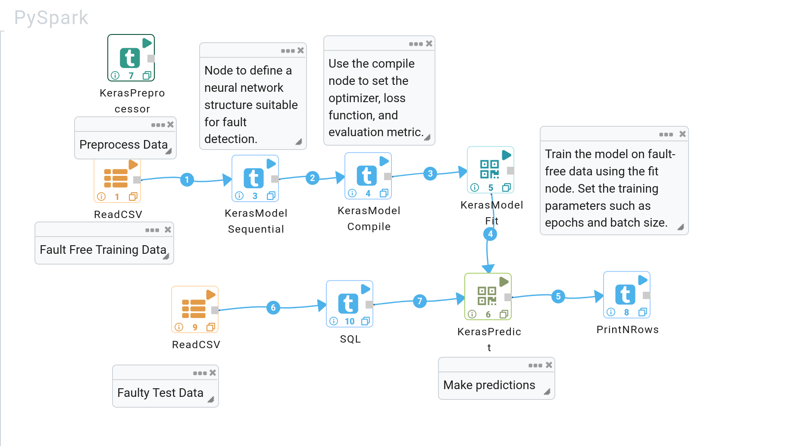

Anomaly Detection
===============

Fire Insights provides the below processors for performing Anomaly Detection using Keras.
Below is an example of implementing Autoencoders for detecting anomalies in a dataset using Keras, providing a powerful approach to identify outliers and abnormal patterns in complex data.

Tennessee Eastman Process Dataset
----------------------------------

The Tennessee Eastman Process (TEP) is a widely used chemical process simulation benchmark for testing fault detection and diagnosis algorithms. The dataset simulates various operational scenarios, including normal conditions and 21 different process faults. These faults include sensor failures, equipment malfunctions, and process disturbances.

TEP has been popular in academia and industry because it represents a real-world challenge with multivariate data and the need for accurate and robust fault detection mechanisms. It provides both training data with normal operation and test data containing different types of faults.

Autoencoders for Fault Detection
--------------------------------

Autoencoders are unsupervised neural networks used for representation learning. They are often employed in fault detection tasks. The idea is to train an autoencoder on fault-free (normal) data, allowing the network to learn how to encode and reconstruct the normal operational patterns. During inference, if the input is faulty data, the autoencoder will reconstruct the input poorly, as it has only learned normal operations, thus making it easier to detect faults.

Autoencoders are particularly useful in situations where labeled faulty data is limited or unavailable, as they can model what "normal" looks like without explicit labels.

Workflow Overview
-----------------

This workflow is designed to detect faults in the Tennessee Eastman process using a sequential deep learning model. Below is a detailed step-by-step explanation of the workflow nodes used:

Nodes Overview
--------------

1. **KerasPreprocessor (Preprocess Data)**:
    - This node preprocesses the dataset before feeding it into the model. Common preprocessing tasks include scaling, normalization, and handling missing values.User can add custom Python code for this.
   
2. **ReadCSV (Fault-Free Training Data)**:
    - This node loads the fault-free training data from the Tennessee Eastman dataset. The model learns to recognize normal operating conditions using this data.

3. **KerasModel Sequential**:
    - Defines a sequential neural network model, where layers are stacked one by one. This is suitable for simpler models where the output of one layer is passed as input to the next.

    .. list-table::
       :widths: 20 80
       :header-rows: 1

       * - Title
         - Description
       * - Layers
         - Enter the layers information separated by commas, and key & value pairs separated by colons. Example: `layer_type:Dropout, rate:0.2`.
       * - Unsupervised
         - Specify whether to enable the autoencoder in unsupervised mode. Options: `false` (default) for supervised, or `true` for unsupervised.

   .. figure:: ../../../../docs/_assets/machinelearning/keras_sequential.png
      :alt: Deep Learning
      :width: 90%

4. **KerasModel Compile**:
    - This node compiles the Keras model, setting up the optimizer, loss function, and evaluation metrics. Compiling is essential before training the model.

    .. list-table::
      :widths: 20 80
      :header-rows: 1

      * - Title
        - Description
      * - Optimizer
        - Name of the optimizer to be used. Available options: `adam`.
      * - Loss
        - String (name of the objective function), objective function, or `tf.losses.Loss` instance. Available options: `mse` (mean squared error).
      * - Metrics
        - List of metrics to be evaluated by the model during training and testing. Example: `mse, mae`.
      * - Loss Weights
        - Optional list or dictionary specifying scalar coefficients (Python floats) to weight the loss contributions of different model outputs.
      * - Sample Weight Mode
        - Specify the sample weight mode (optional).
      * - Weighted Metrics
        - List of metrics to be evaluated and weighted by `sample_weight` or `class_weight` during training and testing.
      * - Target Tensors
        - Specify target tensors (optional).

   .. figure:: ../../../../docs/_assets/machinelearning/keras_model_compile.png
      :alt: Deep Learning
      :width: 90%

5. **KerasModel Fit**:
    - This node is responsible for training the model using the fault-free data. The model will learn to predict normal operational behavior based on the provided dataset.

    .. list-table::
       :widths: 20 80
       :header-rows: 1
   
       * - Title
         - Description
       * - Target Column
         - The label column for model fitting.
       * - Batch Size
         - Specify the batch size. Default value is None (i.e., -1).
       * - Epochs
         - Number of epochs (iterations over the dataset). Default value is 1.
       * - Verbose
         - Level of verbosity for training output. Default value is 1.
       * - Callbacks
         - List of callbacks to be applied during training. Default value is None (i.e., -1).
       * - Validation Split
         - Fraction of the training data to be used as validation data.
       * - Validation Data
         - Dataset for validation. Default value is None (i.e., -1).
       * - Shuffle
         - Boolean value indicating whether to shuffle the training data before each epoch. Default value is `true`.
       * - Class Weight
         - Dictionary mapping class indices to a weight. Default value is None (i.e., -1).
       * - Sample Weight
         - Array of weights for the training samples. Default value is None (i.e., -1).
       * - Initial Epoch
         - Epoch at which to start training. Default value is 0.
       * - Steps Per Epoch
         - Number of steps per epoch. Default value is None (i.e., -1).
       * - Validation Steps
         - Total number of validation steps to run. Default value is None (i.e., -1).
       * - Validation Frequency
        - Perform validation every `x` number of epochs. Default value is 1.
       * - Max Queue Size
         - Maximum size for the generator queue. Default value is 10.
       * - Workers
         - Number of workers to use for data loading. Default value is 1.
       * - Use Multiprocessing
         - Boolean value indicating whether to use multiprocessing. Default value is `false`.
       * - Unsupervised
         - Boolean value indicating whether the model is unsupervised. Default value is `false`.

   .. figure:: ../../../../docs/_assets/machinelearning/keras_modelfit_1.png
      :alt: Deep Learning
      :width: 90%

   .. figure:: ../../../../docs/_assets/machinelearning/keras_model_fit_2.png
      :alt: Deep Learning
      :width: 90%

6. **ReadCSV (Faulty Test Data)**:
    - This node reads the faulty test data from the Tennessee Eastman dataset. The test data contains various faults, and the trained model will attempt to detect them.
    
7. **KerasPredict**:
    - This node uses the trained Keras model to predict faults in the test dataset. Based on the input data, it generates the predicted fault labels.

    .. list-table:: 
       :widths: 20 80
       :header-rows: 1
   
       * - Title
         - Description
       * - Target Column
         - The label column for model fitting.
       * - Batch Size
         - Specify the batch size for predictions. Default value is None (i.e., -1).
       * - Verbose
         - Level of verbosity for prediction output. Default value is 1.
       * - Steps
         - Total number of steps for predictions. Default value is None (i.e., -1).
       * - Callbacks
         - List of callbacks to be applied during prediction. Default value is None (i.e., -1).
       * - Max Queue Size
         - Maximum size for the generator queue during prediction. Default value is 10.
       * - Workers
         - Number of workers to use for data loading during prediction. Default value is 1.
       * - Use Multiprocessing
         - Boolean value indicating whether to use multiprocessing for predictions. Default value is `false`.
       * - Unsupervised
         - Boolean value indicating whether the model is unsupervised. Default value is `false`.
       * - Threshold Loss Function
         - The loss function to be used for determining the threshold during anomaly detection. Options include `mse` (mean squared error) and `mae` (mean absolute error). Default value is `mse`.

   .. figure:: ../../../../docs/_assets/machinelearning/keras_predict_1.png
      :alt: Deep Learning
      :width: 90%

   .. figure:: ../../../../docs/_assets/machinelearning/keras_predict_2.png
      :alt: Deep Learning
      :width: 90%

8. **PrintNRows**:
    - This node prints the first few rows of the output for validation. It allows you to inspect the results of the prediction step and ensures that the model is performing as expected.
