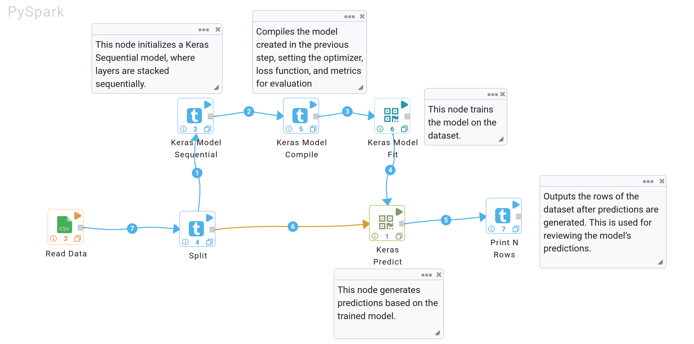

Building Deep Learning Workflows
===============================
This guide explains how to create deep learning workflows using Keras and PySpark. Below are the steps involved in loading data, building, training, and predicting with a model.

Build the Model
---------------

Use the `KerasModel Sequential` node to define the structure of the model. This model allows for stacking multiple layers sequentially.

- **Node**: `KerasModel Sequential`
- **Steps**:
  - Define the input layer to ensure that the input shape matches the shape of your data.
  - Add appropriate hidden layers and choose activation functions according to the type of task (e.g., classification or regression).

Compile the Model
-----------------

Use the `KerasModel Compile` node to compile the model. This step specifies the optimizer, loss function, and evaluation metrics.

- **Node**: `KerasModel Compile`
- **Parameters**:
  - `Optimizer`: Choose the optimizer (e.g., `Adam`, `SGD`).
  - `Loss Function`: Select based on the task:
    - For classification tasks, use `categorical_crossentropy`.
    - For regression tasks, use `mean_squared_error`.
  - `Metrics`: Common metrics include `accuracy` for classification tasks,and `mse, mae` for regression tasks.

Train the Model
---------------

Use the `KerasModel Fit` node to train the model on your dataset. Configure parameters such as the number of epochs and batch size.

- **Node**: `KerasModel Fit`
- **Parameters**:
  - `Epochs`: Set the number of epochs (e.g., 10 epochs).
  - `Batch Size`: Specify the number of samples per gradient update.
  - `Validation Split`: Optionally, set a validation split to evaluate the model on unseen data during training.
  - `Shuffle`: Enable to shuffle the training data before each epoch.

Make Predictions
----------------

Use the `KerasPredict` node to generate predictions based on the trained model.

- **Node**: `KerasPredict`
- **Parameters**:
  - `Batch Size`: Set the batch size for making predictions.
  - `Verbose`: Control the level of verbosity (e.g., `0` for silent, `1` for progress).
