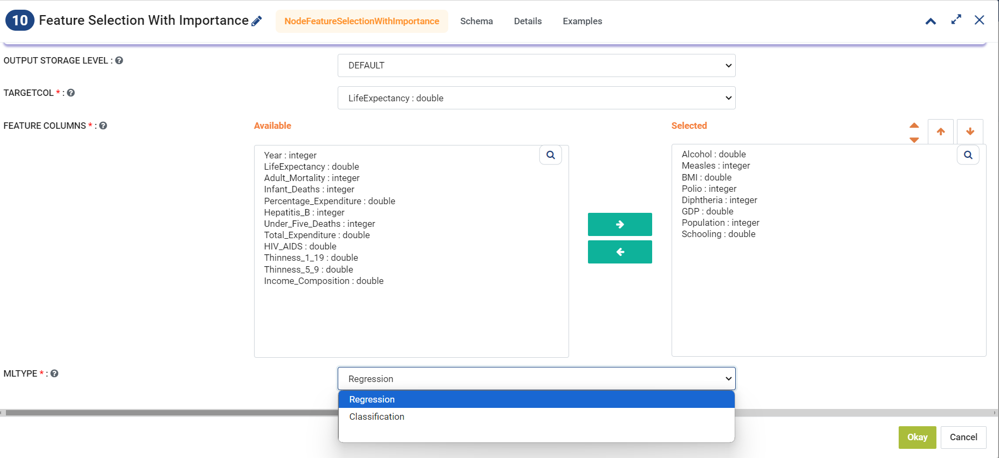
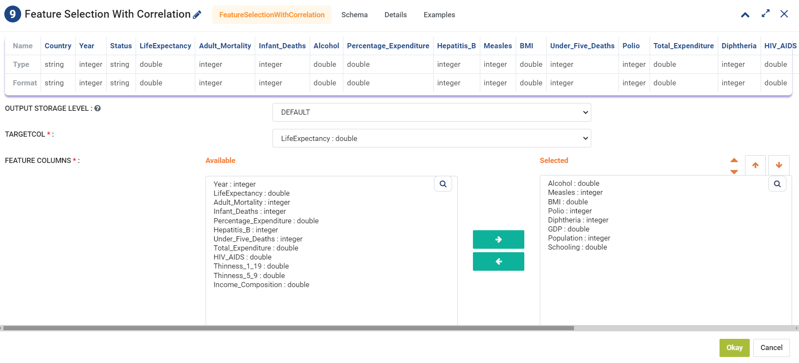

Feature Selection
=================
Feature selection is the process of identifying and selecting a subset of relevant features from a larger set of features for use in building a machine learning model. The goal of feature selection is to select a subset of features that are most informative and have the most predictive power, while also reducing the dimensionality of the data and the risk of overfitting.

Fire Insights provides two methods for doing Feature Selection:

  * Feature Selection using Correlation
  * Feature Selection using Feature Importance
     
Feature Selection With Importance
---------------------

This processor builds a regression model containing all of the features, and ranks the features based on their predictive power. This processor has 2 outputs, it prints a list with the features ranked, and it passes on a dataset containing only the top features. The number of features passed on can be changed in the configuration pane. The label column is always passed on, along with the selected features. If the dataset is going to be used for classification models instead of regression, the user can select Classification in the MLTYPE option.

|

|
.. list-table:: **Feature Selection with Importance Options**
   :widths: 30 70
   :header-rows: 1

   * - Section
     - Description
   * - Feature Columns
     - Lists all the potential features that can be included for model training. 
   * - Selected
     - Shows the features that have been selected for the analysis.
   * - TargetCol
     - Indicates the primary variable of interest, with which the correlation of other features is to be identified.
   * - ML Type
     - Specifies the type of machine learning model that can be applied. The interface allows selection between regression and classification models, adapting the approach based on the nature of the target variable.

Feature Selection With Correlation
----------------------

This node builds a correlation matrix containing all of the features, and ranks the features based on their correlation. This processor has 2 outputs, it prints a list with the features ranked by correlation, and it passes on a dataset containing only the top features. The number of features passed on can be changed in the configuration pane. The label column is always passed on, along with the selected features.  

|

|
.. list-table:: **Feature Selection with Correlation Options**
   :widths: 30 70
   :header-rows: 1

   * - Section
     - Description
   * - Feature Columns
     - Lists all the potential features that can be included for model training. 
   * - Selected
     - Shows the features that have been selected for the analysis.
   * - TargetCol
     - Indicates the primary variable of interest, with which the correlation of other features is to be identified.
