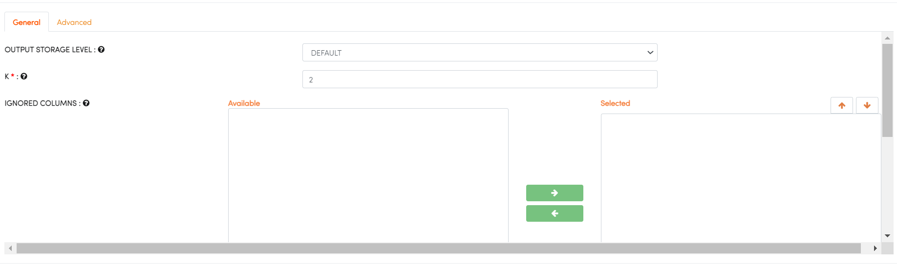

PCA
====
PCA (Principal Component Analysis) is a technique used to reduce the dimensionality of a dataset by transforming the data into a new set of linearly uncorrelated variables called principal components. The goal of PCA is to identify patterns in the data, such as directions of maximum variance, and to project the data onto a lower-dimensional subspace that captures most of the variation in the original data.

The basic steps of PCA are as follows:

* **Standardize the data**: The first step is to standardize the data by subtracting the mean and dividing by the standard deviation, so that all the features are on the same scale.
* **Compute the covariance matrix**: The next step is to compute the covariance matrix of the standardized data. The covariance matrix is a square matrix that contains the pairwise covariances between the features.
* **Compute the eigenvectors and eigenvalues**: The eigenvectors and eigenvalues of the covariance matrix are computed next. Eigenvectors are unit vectors that represent the directions of maximum variance in the data, and eigenvalues are scalars that represent the amount of variance in the data along each eigenvector.
* **Select the principal components**: After obtaining the eigenvectors and eigenvalues, the principal components can be selected by keeping the top k eigenvectors with the highest eigenvalues, where k is the desired number of dimensions in the reduced space.
* **Project the data onto the principal components**: The last step is to project the original data onto the principal components to obtain the new, lower-dimensional representation of the data.

PCA can be useful in various ways like data visualization, denoising and feature extraction. By reducing the dimensionality of the data, PCA can make it easier to visualize patterns in the data and to identify relationships between variables. Additionally, PCA can be used to remove noise from the data, by projecting the data onto the directions that capture most of the variation in the data. It can also be used as a feature extraction technique, by projecting the data onto the most informative directions and using the resulting principal components as features for further analysis.

You can find the details at the H2O website : https://docs.h2o.ai/h2o/latest-stable/h2o-docs/data-science/pca.html

Below are details which can be needed on H2O PCA processor:

.. list-table:: H2O PCA
   :widths: 20 80
   :header-rows: 1

   * - Title
     - Description
   * - K
     - Specify the number of clusters (group of data) in a dataset that are similar to each other.
   * - IGNORED COLUMNS
     - Specify the column or columns to be excluded from the model. 
   * - IGNORE CONST COLUMNS
     - Specify whether to ignore constant training columns.
     

   
other parameters: https://docs.h2o.ai/h2o/latest-stable/h2o-docs/data-science/pca.html#defining-a-pca-model
