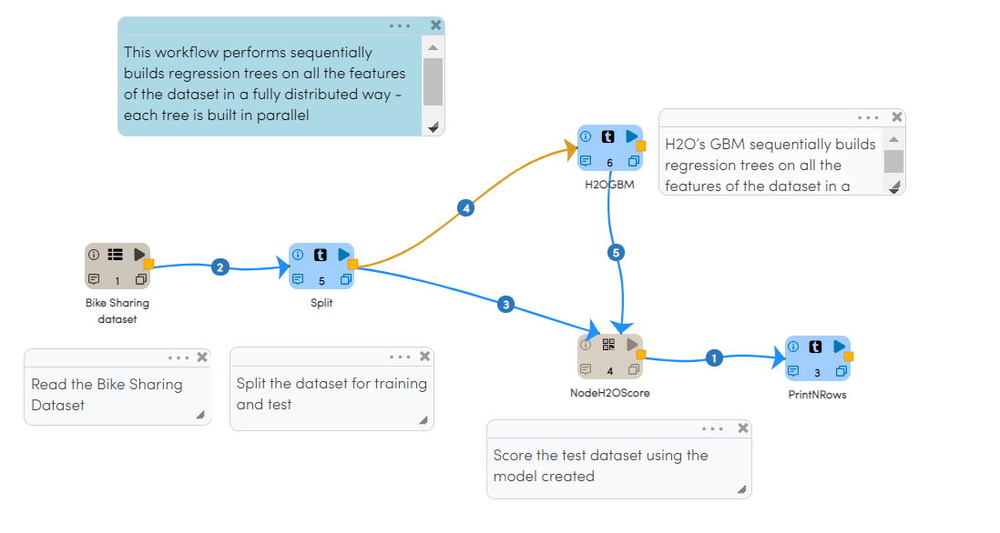

Building H2O Workflows
==================================

Below is an example H2O workflow. It builds a Regression Model for predicting the number of Bike Rentals at a given day/hour.

There is a certain pattern to be followed when building the predictive H2O workflows.

* Read in the Data
* Perform feature engineering
* Split the dataframe for training and test
* Use a model building node like Regression/Classification/Clustering to create the model on the training dataset
   By selecting the isResponseIsCategorical field to true, classification model will be tarined.
   Train Metrics is displayed in execution result page and also viewd in model page.
* Use a prediction node for predicting on the test dataset using the Model created
    To get the test metrics enable the isTest field to true.
    

