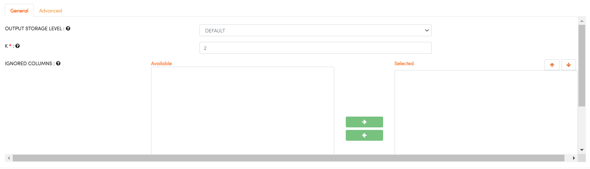

H2O
===

.. panels::
    :container: container-lg pb-3

    :doc:`/user-guide/machine-learning/h2o/building-h20-workflows`
    
    Building H2O workflows
    
    ---

    :doc:`/user-guide/machine-learning/h2o/clustering`

    Clustering using H2O
    
    ---

    :doc:`/user-guide/machine-learning/h2o/regression-classsification`

    Regression & Classification using H2O
    

   
.. list-table:: H2O Processors in Fire Insights
   :widths: 20 80
   :header-rows: 1

   * - Title
     - Description
   * - H2O DRF
     - Distributed Random Forest (DRF) is a powerful classification and regression tool. When given a set of data, DRF generates a forest of classification or regression trees, rather than a single classification or regression tree.
   * - H2O K-Means
     - K-Means falls in the general category of clustering algorithms. Clustering is a form of unsupervised learning that tries to find structures in the data without using any labels or target values. Clustering partitions a set of observations into separate groupings such that an observation in a given group is more similar to another observation in the same group than to another observation in a different group.
   * - H2O GBM
     - Gradient Boosting Machine (for Regression and Classification) is a forward learning ensemble method. The guiding heuristic is that good predictive results can be obtained through increasingly refined approximations. H2O’s GBM sequentially builds regression trees on all the features of the dataset in a fully distributed way - each tree is built in parallel.
   * - H2O GLRM
     - Generalized Low Rank Models (GLRM) is an algorithm for dimensionality reduction of a dataset. It is a general, parallelized optimization algorithm that applies to a variety of loss and regularization functions. Categorical columns are handled by expansion into 0/1 indicator columns for each level. With this approach, GLRM is useful for reconstructing missing values and identifying important features in heterogeneous data.
   * - H2O GLM
     - Generalized Linear Models (GLM) estimate regression models for outcomes following exponential distributions. In addition to the Gaussian (i.e. normal) distribution, these include Poisson, binomial, and gamma distributions. Each serves a different purpose, and depending on distribution and link function choice, can be used either for prediction or classification. 
   * - H2O XGBoost
     - XGBoost is a supervised learning algorithm that implements a process called boosting to yield accurate models. Boosting refers to the ensemble learning technique of building many models sequentially, with each new model attempting to correct for the deficiencies in the previous model. In tree boosting, each new model that is added to the ensemble is a decision tree. XGBoost provides parallel tree boosting (also known as GBDT, GBM) that solves many data science problems in a fast and accurate way. For many problems, XGBoost is one of the best gradient boosting machine (GBM) frameworks today.

H2O DRF
-------

Distributed Random Forest (DRF) is a powerful classification and regression tool. When given a set of data, DRF generates a forest of classification or regression trees, rather than a single classification or regression tree. Each of these trees is a weak learner built on a subset of rows and columns. More trees will reduce the variance. Both classification and regression take the average prediction over all of their trees to make a final prediction, whether predicting for a class or numeric value. (Note: For a categorical response column, DRF maps factors (e.g. ‘dog’, ‘cat’, ‘mouse) in lexicographic order to a name lookup array with integer indices (e.g. ‘cat -> 0, ‘dog’ -> 1, ‘mouse’ -> 2.)

You can find the details at the H2O website : http://docs.h2o.ai/h2o/latest-stable/h2o-docs/data-science/drf.html

Below are details which can be needed on H2O DRF processor:

.. list-table:: H2o DRF
   :widths: 20 80
   :header-rows: 1

   * - Title
     - Description
   * - RESPONSE COLUMN
     - select RESPONSE COLUMN
   * - IS RESPONSE COL CATEGORICAL
     - Specify a response column type (numeric or categorical) Separates the Classification and Regression.
   * - IGNORE CONST COLUMNS
     - Specify whether to ignore constant training columns.
   * - IGNORED COLUMNS
     - Specify the column or columns to be excluded from the model. 
     
.. figure:: ../../../_assets/model/h2o/1.PNG
   :alt: H2O DRF
   :width: 90%
   
H2O K-Means
----------

K-Means falls in the general category of clustering algorithms. Clustering is a form of unsupervised learning that tries to find structures in the data without using any labels or target values. Clustering partitions a set of observations into separate groupings such that an observation in a given group is more similar to another observation in the same group than to another observation in a different group.

You can find the details at the H2O website : https://docs.h2o.ai/h2o/latest-stable/h2o-docs/data-science/k-means.html

Below are details which can be needed on H2O K-Means processor:

.. list-table:: H2o K-Means
   :widths: 20 80
   :header-rows: 1

   * - Title
     - Description
   * - K
     - Specify the number of clusters (group of data) in a dataset that are similar to each other.
   * - IGNORED COLUMNS
     - Specify the column or columns to be excluded from the model. 
   * - IGNORE CONST COLUMNS
     - Specify whether to ignore constant training columns.
     
.. figure:: ../../../_assets/model/h2o/2.PNG
   :alt: H2O DRF
   :width: 90%
   
H2O GBM
-------

Gradient Boosting Machine (for Regression and Classification) is a forward learning ensemble method. The guiding heuristic is that good predictive results can be obtained through increasingly refined approximations. H2O’s GBM sequentially builds regression trees on all the features of the dataset in a fully distributed way - each tree is built in parallel.

You can find the details at the H2O website : https://docs.h2o.ai/h2o/latest-stable/h2o-docs/data-science/gbm.html

Below are details which can be needed on H2O GBM processor:

.. list-table:: H2O GBM
   :widths: 20 80
   :header-rows: 1

   * - Title
     - Description
   * - RESPONSE COLUMN
     - select RESPONSE COLUMN
   * - IS RESPONSE COL CATEGORICAL
     - Specify a response column type (numeric or categorical) Separates the Classification and Regression.
   * - IGNORE CONST COLUMNS
     - Specify whether to ignore constant training columns.
   * - IGNORED COLUMNS
     - Specify the column or columns to be excluded from the model. 

.. figure:: ../../../_assets/model/h2o/3.PNG
   :alt: H2O GBM
   :width: 90%
     
H2O GLRM
--------

Generalized Low Rank Models (GLRM) is an algorithm for dimensionality reduction of a dataset. It is a general, parallelized optimization algorithm that applies to a variety of loss and regularization functions. Categorical columns are handled by expansion into 0/1 indicator columns for each level. With this approach, GLRM is useful for reconstructing missing values and identifying important features in heterogeneous data.

You can find the details at the H2O website : https://docs.h2o.ai/h2o/latest-stable/h2o-docs/data-science/glrm.html

Below are details which can be needed on H2O GLRM processor:

.. list-table:: H2O GLRM
   :widths: 20 80
   :header-rows: 1

   * - Title
     - Description
   * - K
     - Specify the rank of matrix approximation.
   * - IGNORED COLUMNS
     - Specify the column or columns to be excluded from the model: Class
   * - IGNORE CONST COLS
     - Specify whether to ignore constant training columns : true
 

 
H2O GLM
-------

Generalized Linear Models (GLM) estimate regression models for outcomes following exponential distributions. In addition to the Gaussian (i.e. normal) distribution, these include Poisson, binomial, and gamma distributions. Each serves a different purpose, and depending on distribution and link function choice, can be used either for prediction or classification.

You can find the details at the H2O website : https://docs.h2o.ai/h2o/latest-stable/h2o-docs/data-science/glm.html

Below are details which can be needed on H2O GLM processor:

.. list-table:: H2o GLM
   :widths: 20 80
   :header-rows: 1

   * - Title
     - Description
   * - RESPONSE COLUMN
     - select RESPONSE COLUMN
   * - IS RESPONSE COL CATEGORICAL
     - Specify a response column type (numeric or categorical) Separates the Classification and Regression.
   *  - OFFSET COLUMN
      - Specify a column to use as a offset, the value cannot be same as value of weights_column.
   *  - WEIGHTS COLUMN
      - Specify a column to use for the observation weights, which are used for bias correction (The specified weights_column must be included in the specified training_frame)  
   * - IGNORE CONST COLUMNS
     - Specify whether to ignore constant training columns.
   * - IGNORED COLUMNS
     - Specify the column or columns to be excluded from the model. 
     
.. figure:: ../../../_assets/model/h2o/5.PNG
   :alt: H2O DRF
   :width: 90%

H2O XGBoost
-----------

XGBoost is a supervised learning algorithm that implements a process called boosting to yield accurate models. Boosting refers to the ensemble learning technique of building many models sequentially, with each new model attempting to correct for the deficiencies in the previous model. In tree boosting, each new model that is added to the ensemble is a decision tree. XGBoost provides parallel tree boosting (also known as GBDT, GBM) that solves many data science problems in a fast and accurate way. For many problems, XGBoost is one of the best gradient boosting machine (GBM) frameworks today.

You can find the details at the H2O website : https://docs.h2o.ai/h2o/latest-stable/h2o-docs/data-science/xgboost.html

Below are details which can be needed on  H2O XGBoost processor:

.. list-table:: H2o XGBoost
   :widths: 20 80
   :header-rows: 1

   * - Title
     - Description
   * - RESPONSE COLUMN
     - select RESPONSE COLUMN
   * - IS RESPONSE COL CATEGORICAL
     - Specifies a response column type(numeric or categorical). Separates the Classification and Regression.
   * - FEATURE COLUMNS
     - Specify the column or columns to be included for feature.
   * - FOLD COLUMN
     - Specify a column to use as the fold.
   * - WEIGHTS COLUMN
     - Specify a column to use for the observation weights, which are used for bias correction.
     
.. figure:: ../../../_assets/model/h2o/6.PNG
   :alt: H2O XGBOOST
   :width: 90%     
   
   
.. toctree::
   :hidden:

   building-h20-workflows.rst
   clustering.rst
   
