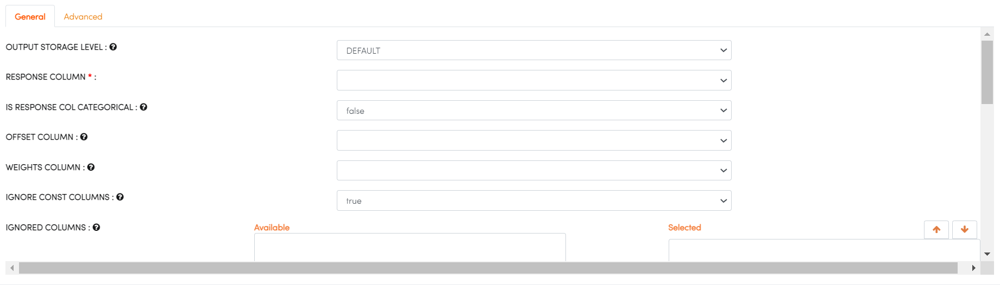

H2O GBM
-------

Gradient Boosting Machine (for Regression and Classification) is a forward learning ensemble method. The guiding heuristic is that good predictive results can be obtained through increasingly refined approximations. H2O’s GBM sequentially builds regression trees on all the features of the dataset in a fully distributed way - each tree is built in parallel.

For more details, visit the H2O website at: https://docs.h2o.ai/h2o/latest-stable/h2o-docs/data-science/gbm.html

Below are the required parameters which can be specified in the H2O GBM processor:

.. list-table:: H2O GBM
   :widths: 20 80
   :header-rows: 1

   * - Parametrs
     - Description
   * - RESPONSE COLUMN
     - Select Response Column.
   * - IS RESPONSE COL CATEGORICAL
     - Choose the type of response column. It can be either numeric corresponding to Regression or categorical corresponding to Classification.
   * - IGNORE CONST COLUMNS
     - Specify whether to ignore constant training columns.
   * - IGNORED COLUMNS
     - Specify the column or columns to be excluded from the model. 

For more details on other parameters, visit: http://docs.h2o.ai/h2o/latest-stable/h2o-docs/data-science/gbm.html#defining-a-gbm-model
