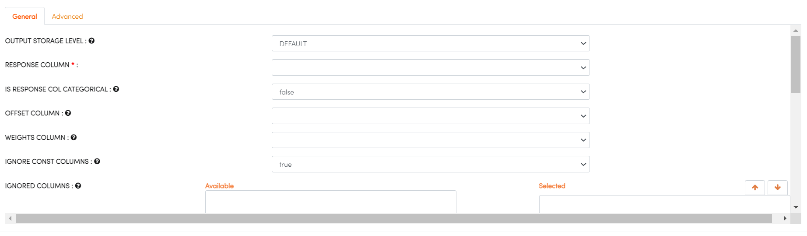

H2O GLM
-------

Generalized Linear Models (GLM) estimate regression models for outcomes following exponential distributions. In addition to the Gaussian (i.e. normal) distribution, these include Poisson, binomial, and gamma distributions. Each serves a different purpose, and depending on distribution and link function choice, can be used either for prediction or classification.

You can find the details at the H2O website : https://docs.h2o.ai/h2o/latest-stable/h2o-docs/data-science/glm.html

Below are required parameters which can be specified in the H2O GLM processor:

.. list-table:: H2o GLM
   :widths: 20 80
   :header-rows: 1

   * - Parameters
     - Description
   * - RESPONSE COLUMN
     - select RESPONSE COLUMN
   * - IS RESPONSE COL CATEGORICAL
     - Specify a response column type (numeric or categorical) Separates the Classification and Regression.
   *  - OFFSET COLUMN
      - Specify a column to use as a offset, the value cannot be same as value of weights_column.
   *  - WEIGHTS COLUMN
      - Specify a column to use for the observation weights, which are used for bias correction (The specified weights_column must be included in the specified training_frame)  
   * - IGNORE CONST COLUMNS
     - Specify whether to ignore constant training columns.
   * - IGNORED COLUMNS
     - Specify the column or columns to be excluded from the model. 
     

   
other parameter: https://docs.h2o.ai/h2o/latest-stable/h2o-docs/data-science/glm.html#defining-a-glm-model
   
   
