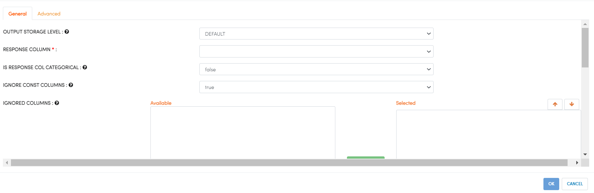

H2O GLRM
--------

Generalized Low Rank Models (GLRM) is an algorithm for dimensionality reduction of a dataset. It is a general, parallelized optimization algorithm that applies to a variety of loss and regularization functions. Categorical columns are handled by expansion into 0/1 indicator columns for each level. With this approach, GLRM is useful for reconstructing missing values and identifying important features in heterogeneous data.

For more details, visit the H2O website at: https://docs.h2o.ai/h2o/latest-stable/h2o-docs/data-science/glrm.html

Below are the required parameters which can be specified in the H2O DRF processor:

.. list-table:: H2O GLRM
   :widths: 20 80
   :header-rows: 1

   * - Parameters
     - Description
   * - RESPONSE COLUMN
     - Select Response Column.
   * - IS RESPONSE COL CATEGORICAL
     - Choose the type of response column. It can be either numeric corresponding to Regression or categorical corresponding to Classification.
   * - IGNORE CONST COLUMNS
     - Specify whether to ignore constant training columns.
   * - IGNORED COLUMNS
     - Specify the column or columns to be excluded from the model.
     

For more details on other parameters, visit: https://docs.h2o.ai/h2o/latest-stable/h2o-docs/data-science/glrm.html#defining-a-glrm-model

