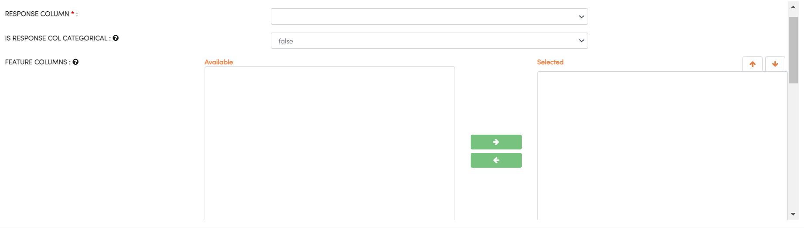

H2O XGBoost
-----------

XGBoost is a supervised learning algorithm that implements a process called boosting to yield accurate models. Boosting refers to the ensemble learning technique of building many models sequentially, with each new model attempting to correct for the deficiencies in the previous model. In tree boosting, each new model that is added to the ensemble is a decision tree. XGBoost provides parallel tree boosting (also known as GBDT, GBM) that solves many data science problems in a fast and accurate way. For many problems, XGBoost is one of the best gradient boosting machine (GBM) frameworks today.

You can find the details at the H2O website : https://docs.h2o.ai/h2o/latest-stable/h2o-docs/data-science/xgboost.html

Below are required parameters which can be specified in the H2O XGBoost processor:

.. list-table:: H2o XGBoost
   :widths: 20 80
   :header-rows: 1

   * - Parameters
     - Description
   * - RESPONSE COLUMN
     - select RESPONSE COLUMN
   * - IS RESPONSE COL CATEGORICAL
     - Specifies a response column type(numeric or categorical). Separates the Classification and Regression.
   * - FEATURE COLUMNS
     - Specify the column or columns to be included for feature.
   * - FOLD COLUMN
     - Specify a column to use as the fold.
   * - WEIGHTS COLUMN
     - Specify a column to use for the observation weights, which are used for bias correction.
     

   
other parameters: https://docs.h2o.ai/h2o/latest-stable/h2o-docs/data-science/xgboost.html#defining-an-xgboost-model

