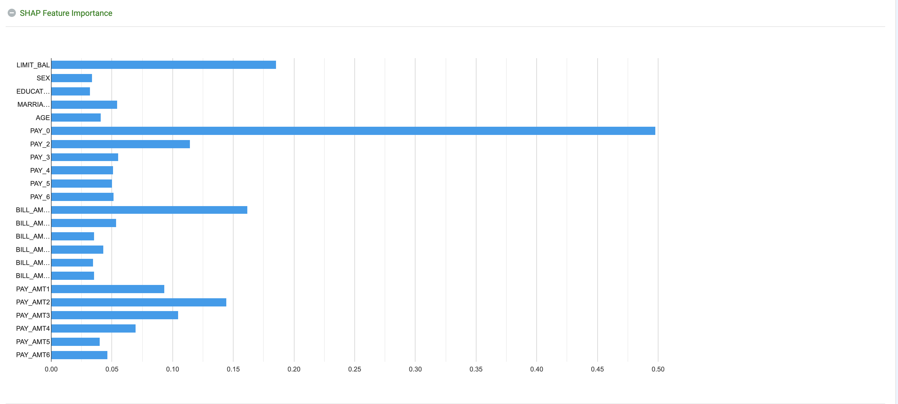
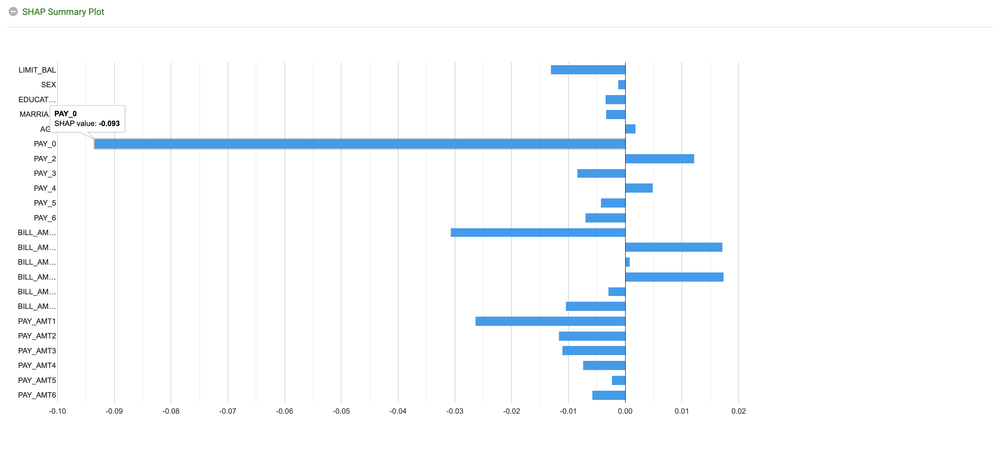

Shapley
=======
Shapley values are a method for fairly distributing a value among a group of individuals based on their contribution to that value. They were first introduced in cooperative game theory by Lloyd Shapley in 1953.

Shapley values are widely used in many industries, particularly in explainable AI, to understand and interpret the behavior of complex machine learning models, by identifying which variables are responsible for the decision-making process.

In the context of machine learning, Shapley values can be used to explain the contribution of individual features or variables to the predictions of a model. The idea is to attribute a value to each feature based on how much it contributes to the prediction, while accounting for the interactions between the features.

The calculation of Shapley values can be broken down into several steps:
* All possible coalitions (subsets of features) are created, where each coalition represents a different way of generating the prediction.
* A value for each coalition is calculated, which represents the average marginal contribution of that coalition in generating the prediction.
* The value for each feature is obtained by averaging the values of all coalitions where the feature is present.
* These values represent how much each feature is contributing to the model's output by accounting for its interactions with other features.

Shapley values are considered a desirable feature attribution method because they have several desirable properties, like symmetry, additivity and linearity, plus they take into account the interactions among features. They also have the advantage of being model-agnostic, meaning they can be used to explain the predictions of any model.

The Shapley value might be the only method to deliver a full explanation. In situations where the law requires explainability – the Shapley value might be the only legally compliant method, because it is based on a solid theory and distributes the effects fairly.

More on Shapley values can be found here - https://christophm.github.io/interpretable-ml-book/shapley.html#the-shapley-value-in-detail

More on SHAP can be found here - https://christophm.github.io/interpretable-ml-book/shap.html

Sparkflows supports SHAP value computations for Tree based h2o algorithms for regression and binomial classification usecases. The below nodes can be leveraged to get Shapley contributions:
  - H2O Distributed Random forest
  - H2O Gradient Boosted machine
  - H2O XGBoost
  - H2O AutoML

Below are the details of how the SHAP values can be computed:
  - In the above mentioned nodes, one can set the field `WITH CONTRIBUTIONS` to `True` during training the model and then during scoring to ask the model to compute the SHAP Summary plot. Screenshot below
  - When scoring on a dataset trained with the above field set, one can see the average SHAP Summary plot.
 
  

The SHAP Feature Importance plot looks like below:

   
   
The SHAP Summary plot looks like below:

   
