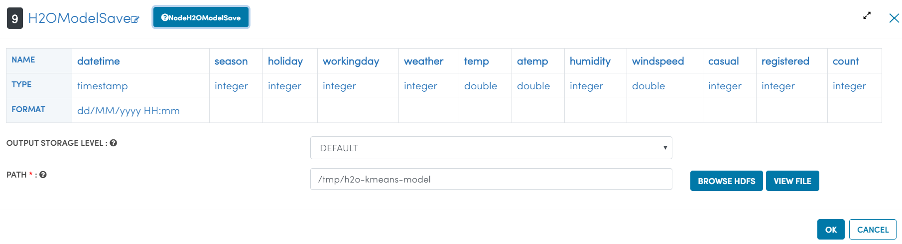
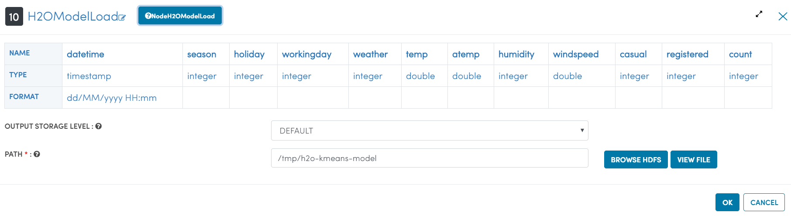
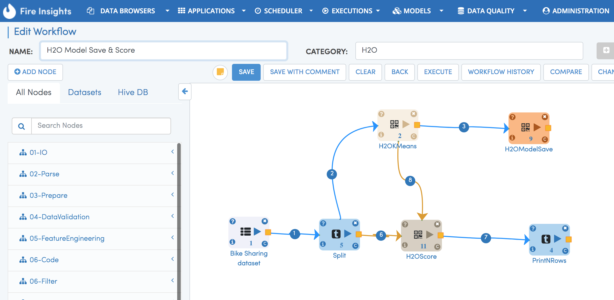
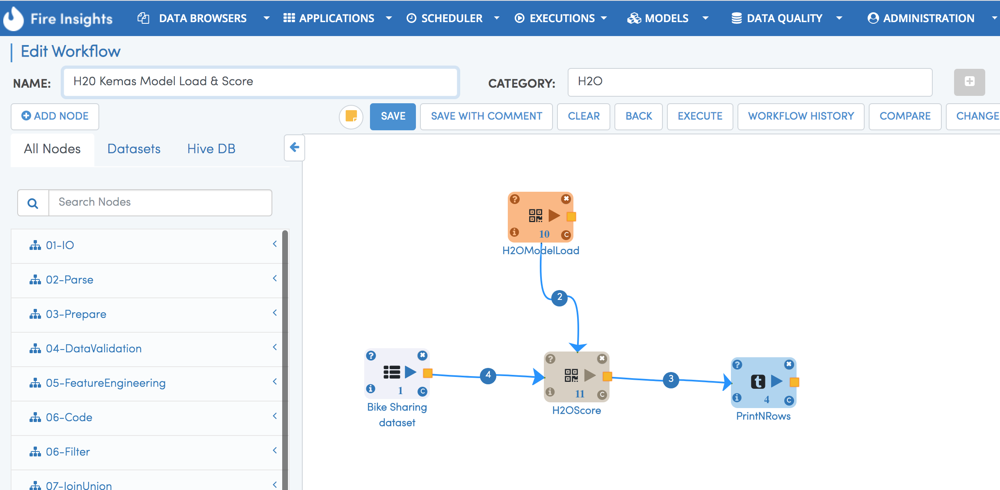

Persisting H2O Models
=====================

H2O Models
----------

H2O Models can be saved in binary format or in MOJO format. Sparkflows has processors to save and read them back.

Save H2O Model Processor
+++++++++++++++++++++

H2OModelSave Processor saves the H2O model at the specified path in the binary format.

   
Load H2O Model Processor
+++++++++++++++++++++
   
H2OModelLoad Processor loads the H2O model in binary format from the specified path.

More details of saving and loading the H2O Models is available here:

http://docs.h2o.ai/h2o/latest-stable/h2o-docs/save-and-load-model.html

Save and Load H2O Workflow
++++++++++++++++++++++++++
   

Below is a workflow that saves the generated H2O model on the file system.

   
 
Below is a workflow that loads back the saved model and use it in batch scoring.

   
