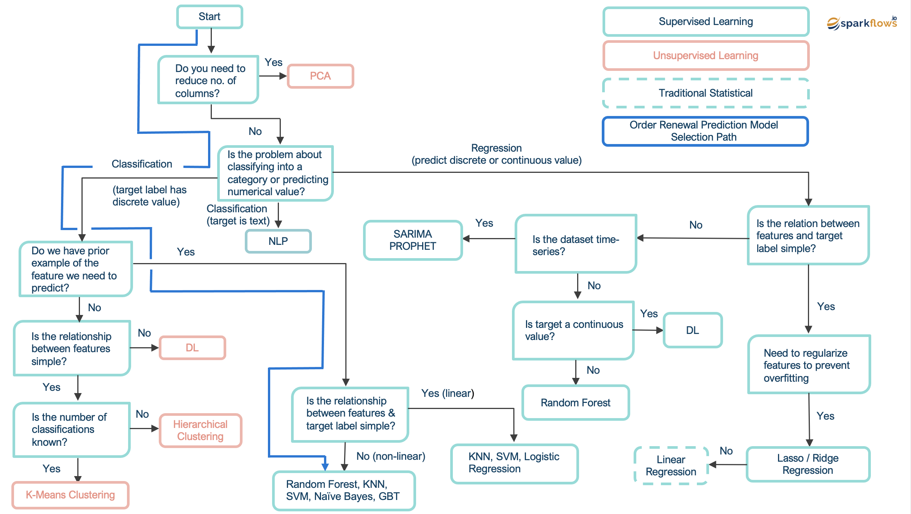

Introduction to Machine Learning
=========================

Machine learning is a subfield of artificial intelligence that involves the development of algorithms and statistical models that allow systems to automatically improve their performance with experience. Its practitioners train algorithms to identify patterns in data and to make decisions with minimal human intervention.

Machine learning is used when:

- The rules cannot be coded in to arrive at the outcome, e.g., recognizing emails as spam or not.
- We want to scale for huge datasets, e.g., recognizing spam or not for millions of emails.

Machine learning can be used in a wide range of applications and industries, but it is particularly useful when you have a large amount of data and you want to make predictions or identify patterns in that data. Some of the examples where you might use machine learning include:  

* **Predicting outcomes**: This could include anything from forecasting stock prices to predicting which customers are most likely to churn.
* **Classifying items**: This could include identifying spam emails, sorting images into categories, or diagnosing medical conditions based on patient data.
* **Clustering data**: This could include grouping customers by purchasing behavior, grouping genes by expression patterns, or identifying communities in social networks.
* **Optimizing business processes**: This could include personalizing marketing campaigns, optimizing supply chains, or automating decision-making processes.
* **Computer vision**: Machine learning models can be trained to classify, detect, and segment images and videos, which is useful for self-driving cars, security cameras, and more.
* **Natural Language Processing (NLP)**: Machine learning models can be used for understanding and processing text, this could be for sentiment analysis, language translation, chatbots, among other use cases.
* **Recommendation systems**: Machine learning models can be used to make personalized recommendations based on users' past behavior and preferences.

There are 3 major types of learning that can be used to develop ML models. These are:

**Supervised learning** - 
This is the most common type of machine learning and it involves training a model on a labeled dataset, where the correct output (label) is already known. The goal of the model is to make predictions based on the input data that it has seen during training. Examples of supervised learning problems include classification, regression, and forecasting.

**Unsupervised learning** - 
This type of machine learning involves training a model on an unlabeled dataset, where the correct output is not known. The goal of the model is to find patterns and structure in the input data. Examples of unsupervised learning problems include clustering and dimensionality reduction.

**Reinforcement learning** - 
This type of machine learning involves training a model to make decisions in an environment, where the goal is to maximize a reward. The model learns through trial and error, and it is common in autonomous systems, like self-driving cars and robots.

==============================

Following flow-chart explains how to use different types of ML Algorithms based on the patterns in data and tyoes of use cases.

