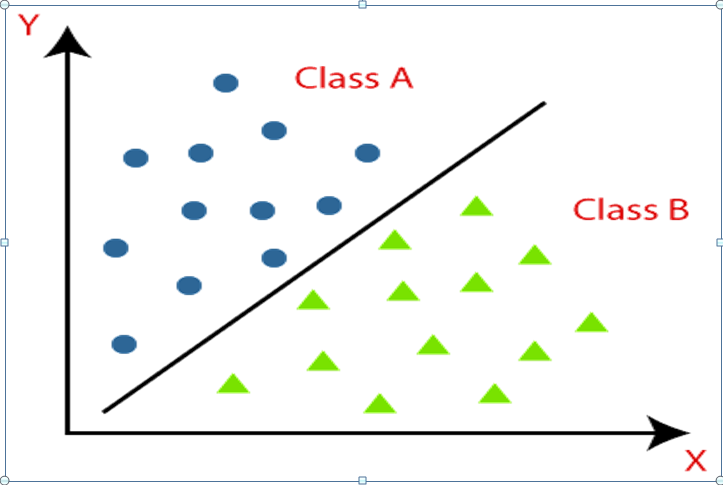

Classification
==============

Classification is a technique to investigate the relationship between independent variables or features and a dependent variable or target or outcome. In classification, an algorithm is used to predict categorical outcomes like ``Yes`` or ``No``, ``Good`` or ``Bad`` etc. 

Classification problems are one of the most common applications in machine learning models, especially in supervised machine learning. It also comes under predictive modelling. The main purpose of classification is to build a model of the allocation of class labels in terms of predictor features. The classifiers are then used to classify class labels of the testing instances where the values of the predictor features are known, to the value of the class label which is unknown.

Classification algorithms can be better understood using the below diagram. In the below diagram, there are two classes, class A and Class B. These classes have features that are like each other and dissimilar to other classes.

**The following are a few examples of classification:** 

- An emergency room in a hospital measures 26 features (age, blood pressure, sugar level etc.) of newly admitted patients. A decision must be taken whether the patient will be shifted to ICU or not. Due to the high cost of ICU and low availability, the problem is to predict high risk patients and discriminate from low-risk patients. 

- A credit card company typically received hundreds of thousands of applications for a new card. The applications usually contain information about applicant’s socio-economic attributes like age, sex, salary range, own a house or not etc. The problem is to categorize the applicants into those who have good credit and bad credit. 

- Nowadays, a lot of sensors are installed in the plants. The sensors constantly generate the relevant data and store it in the clouds.  Processing the data coming from sensors, an IoT system not only displays the data, but also predicts operational malfunctioning and points at the root causes of problems. Thus, comparing current data coming from sensors and the data stored in the cloud as acceptable values, a classifier can predict whether the system will break down in near future or not. 

- Astronomers are cataloguing the distance objects in the sky using long exposure CCD (charge-coupled device) images. The objects are labelled as star, galaxy, nebula etc. The images are highly noisy and faint. It may take a few years to correctly label an object. Machine learning classification models are used to automate the process and improve the efficiency.

There are hundreds of classification algorithms available in books and literature.

The following are common and most used classification techniques:

**Naive Bayesian** – The Naïve Bayesian classifier is based on the famous The Bayes’ theorem with independent assumptions between predictors. A Naive Bayesian model is easy to build, with no complicated iterative parameter estimation which makes it particularly useful for very large datasets. Regardless of its simplicity, the Naive Bayesian classifier often outperforms more sophisticated classification methods and often does surprisingly well and is widely used. For an observation, the Bayes classifier calculates posterior probability for each of the different classes and assigns to the class with maximum posterior probability. 

**Decision Tree** - Decision tree builds classification models in the form of a hierarchical structure. Decision tree is developed through a step-by-step incremental process of breaking down the dataset into smaller and smaller. In the final process it generates a tree with decision nodes and leaf nodes. A decision node has two or more branches. Leaf node represents a classification or decision. The root node in a tree which corresponds to the best predictor from given datasets. Decision trees classifier can be used for both categorical and numerical data. 

The following steps are involved in decision trees:

1. The root of the tree is selected from the attribute of the dataset by using the concept of information gain.
2. Split the training dataset into subsets. And these subsets are prepared in such a way that each subset contains data with the same value for an attribute.
3. Continue the process of step 1 and step 2 on each subset until you find leaf nodes in all the branches of the tree. 

A decision tree is constructed based on top-down approach from a root node and involves partition of data into subsets that contain instances with similar values upon leaf nodes. The splitting or the partition is done in such a way each subset contains very similar objects. To quantify this, DT used to minimize an entropy function or try to increase the information gain.

**Logistic Regression** - Logistic regression predicts the probability of an outcome that can only have Boolean values. The prediction is done on both numerical and categorical. A linear regression is not suitable to predict the value of a binary variable for two reasons.
A linear regression cannot predicate the values within acceptable range. Since the dichotomous experiments can only have one of two possible values for each experiment, the residuals will not be normally distributed about the predicted line. But logistic regressions produce a logistic curve, which is limited to values between 0 and 1. Logistic regression is like a linear regression, but the curve is constructed using the natural logarithm rather than the probability. 

**K Nearest Neighbors** - K nearest neighbours (KNN) is a simple algorithm that stores all available cases and classifies new cases based on a similarity measure (e.g., distance functions). KNN has been used in statistical estimation and pattern recognition based on their nearest neighbours and it should be an odd number. If K = 1, then simply assigned to the class of its nearest neighbour. Or If K is an odd number, then assigned to the class of maximum votes of its nearest neighbour.  KNN is a special case of Naïve Bayes. 

**Support Vector Machine** - A Support Vector Machine (SVM) classifies information by finding the maximized hyper plane that is used as margin between the two classes. The steps involved in SVM are:

1. Generate different hyper-planes and then identify the right hyper-plane.
2. Optimize the hyper plane with maximize margin between the classes 
3. The kernel trick for non –linear hyper-plane used in SVM technique for misclassifications of linear hyper-plane.
4. For high dimensional space where we reformulate the problem so that data is mapped implicitly to this space. 

**Feed-forward neural network** - A feed-forward network is a non- repetitive network which travels in one direction. It contains input, output, and hidden layers. Elements are passed in the input layer for processing data to calculations. There will be a link between input, hidden and output layers and each input will have some weight. These weights are processed and make computation based upon the weights of inputs. It will be calculated and forward and input to other hidden layers and it will continue until it reaches the output. A threshold function is used to quantify the output of a neuron in the output layer.
