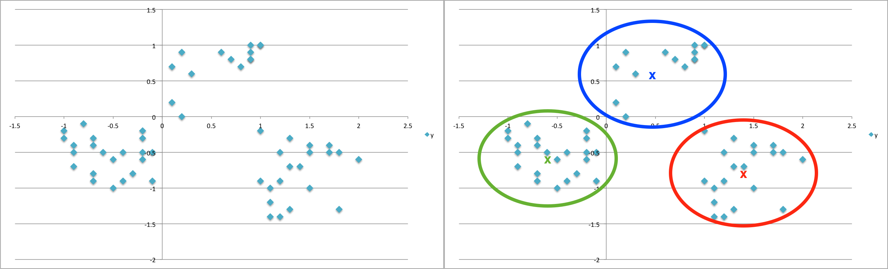

Clustering
==========

Cluster analysis groups data objects based only on information found in the data that describes the objects and their relationships. The goal is that the objects within a group be similar (or related) to one another and different from (or unrelated to) the objects in other groups. The greater the similarity or homogeneity within the groups and greater the difference or heterogeneity between the groups, the better the clustering.

Let us look at this example data. Here we have only data points but no prior information of grouping. But in this data, you visually see that there are 3 natural clusters; and a clustering algorithm is supposed to come up with these 3 clusters. This is what we expect the clustering algorithm to do.

Cluster analysis comes under unsupervised learning. When we are dealing with a dataset, but data are not labelled, we use unsupervised techniques. Using unsupervised learning, we try to discover hidden structures of the data. We want to explore the data to find some structure in them, but we do not have any reference to check. That is why cluster analysis also comes under exploratory analysis. We can find the hidden structures in different ways. One of them is natural grouping of the data. Natural grouping of the data is an important analysis. When we are dealing with a very large dataset one of the biggest challenges that we face is heterogeneity of data. So, we try to divide the data into some homogeneous groups. These groupings or labelling are done by the analysts based on observations with similar attributes. Clustering is the most popular type of unsupervised learning.

The following are a few examples of cluster analysis:  

- **Land cover segmentation:**  

  Flood is a relatively high flow or stage in a river, markedly higher than the usual; it also includes the inundation of low land which may result therefrom. Floods may  be caused by natural events, by human activities, or by combinations of both. Regardless of their cause, floods have a profound effect on people and the economy. On an  annual basis floods leave over 3 million people homeless and affect the personal and economic fortunes of another 60 million people. Throughout the history of mankind,  floods have brought tremendous wealth and prosperity to civilizations, and yet at the same time, they have caused huge losses and resulted in untold suffering for millions of people. To minimize these losses, it is very important to identify the flooded regions as soon as possible. Multichannel satellite image analysis is used nowadays to detect flooded regions. The changes in land cover segmentation in pre-flood images and post flood images is the key point here.

- **Document clustering:**  

  Pharmaceutical or Insurance companies or people who are going through regulations and compliance for their products need to submit a lot of reports. Pharmaceutical companies are submitting thousands of reports in prescribed formats every year for approval of new drugs. With the advance of deep learning, people are trying to create a standard template of reports so that medical writers can create a report with minimal changes. Document clustering, paragraph clustering or sentence clustering help a lot in this scenario. It is nearly impossible to read thousands and thousands of paragraphs to find out contextually similar sentences from the documents and form a template. Cluster analysis play a key role here. Using deep learning techniques, nowadays we can compute contextual similarities between pairs of two sentences. While learning clustering techniques, we will see how these similarities help in forming clusters or groups easily. 

- **Customer Segmentation:** 

  Customer segmentation refers to the practice of separating customers into discrete groups, or segments, based on shared characteristics, such as age, gender, common interests, or purchasing habits. Customer segmentation is also known as consumer segmentation or target market segmentation. These segments enable businesses to better understand who their customers are and what matters to them and strategize accordingly. Customer segmentation enables you to engage in one-to-one marketing — that is, marketing that leverages individualized messaging to speak directly to the recipient’s interests. 
  
- **Graph Clustering:**  

  Graph clustering divides the nodes of a graph into groups.  In a social networking graph, these groups could represent people with same/similar hobbies. One very useful application that come in my mind is fighting against terrorism. Research on usages of social network analysis to study terrorism and insurgency has increased dramatically after the 9/11 attacks against the United States. The study of relational analysis and grouping provide a variety of concepts, theories, and analytical tools to better understand the behaviour of militant groups. Changes in graph structure of the suspected groups in social networks sometimes help to act before any insurgency takes place.

- **Insurance Fraud Detection:**  
  Machine learning has a critical role to play in fraud detection and has numerous applications in automobile, healthcare, and insurance fraud detection. Utilizing past historical data on fraudulent claims, it is possible to isolate new claims based on its proximity to clusters that indicate fraudulent patterns. Since insurance fraud can potentially have a multi-million-dollar impact on a company, the ability to detect frauds is crucial.
  
 There are different types of clustering algorithms available. One of those algorithms is partition based in nature and this is the most popular one. This algorithm divides the data into several groups. k-means is an example of a partition-based clustering algorithm. We need to set the number of clusters that say ‘k’ at the beginning. Partitioning algorithms partition the data into k clusters. The algorithm will partition in such a way that most similar data points belong to the same cluster.  
