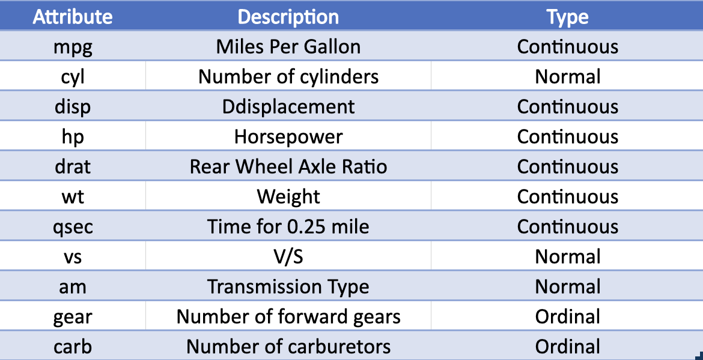

Regression
==========

Regression is a supervised learning technique in machine learning that is used for predicting a continuous target variable based on one or more input features. The goal of regression is to model the relationship between the input features and the target variable, so that we can use the model to make predictions on new, unseen data.

There are several types of regression algorithms, including:

* **Linear regression**: This is the most basic type of regression, and it models the relationship between the input features and the target variable as a linear equation. Linear regression can be used for both simple and multiple linear regression, where simple linear regression involves one input feature and multiple linear regression involves more than one input feature.

* **Polynomial regression**: This is an extension of linear regression, and it models the relationship between the input features and the target variable as a polynomial equation. It can be used for modeling non-linear relationships between the input features and the target variable.

* **Ridge and Lasso Regression**: These are extensions of linear regression that include a regularization term to help prevent overfitting and improve the interpretability of the model. Ridge regression adds a term to the cost function that punishes large weights, and Lasso regression adds a term to the cost function that not only punishes large weights but also forces some of the weights to be zero, which can be useful for feature selection.

* **Support Vector Regression**: This is a variation of Support Vector Machines that can be used for regression tasks. It is useful when the dataset has a large number of features and a small number of samples.

Let’s consider a motivating example of Regression. Suppose you imagine you work in an automobile industry. As a data scientist a prototype design is given to you, and all kinds of engineering features are given to you. For example, the length of the car is given to you. The engine type is given to you. Wheel type is given to you. Horsepower of the car is given to you. Weight of the car is given to you. These features are all engineering features of the prototype car. What is not given to you is miles per gallon, meaning if this car drives for a while, then on an average how many miles can it run per gallon of petrol or gasoline? Mpg (Miles per gallon) is not a feature or engineering feature of the car – so you want to predict the mpg as the feature of the prototype car, because this is one of the features that buyers or customers of the car always look for. Just think, your company invested a few billion dollars to produce a concept car, but the car gives very low mileage compared to other cars available in the market. So, your company would like to know in advance what the expected mileage of the concept car, given all engineering features.

Regression analysis helps manufacturers in matter. We explain the process with the following example of linear regression.

Linear regression is the most common and popular method in regression. By linear regression, we mean that outcomes are linear combination of features

.. figure:: ../../../_assets/machinelearning/availablecard.png
      :alt: Cars
      :width: 40%

Suppose the above is a list of available cars in the market and with engineering features and mileage. The description of the features are given below.

Our objective is to express ``mpg`` in terms of available engineering features something like the following: -
``mpg ≈  12.3 + cyl × -0.11 + disp × 0.01 + hp × -0.02 + drat × 0.79 + wt × -3.72 + qsec × 0.82 + vs × 0.32 + am × 2.52 + gear × 0.66 + carb × -0.2``

If we can do, then for given cyl, disp, hp, draft, qsec, vs, am, gear and carb weight of concept or prototype car, we will have a fair idea about the approximate mileage of the car. 

Now the million-dollar question is how we can find the numbers like 12.3, -0.11, 0.01 etc given above.

Regression analysis helps to find such best possible numbers through the training process. Once you have these numbers, you are good to check the mileage of your concept car and if it fits within your company’s business objective then the company should go ahead and roll out the concept car. 
