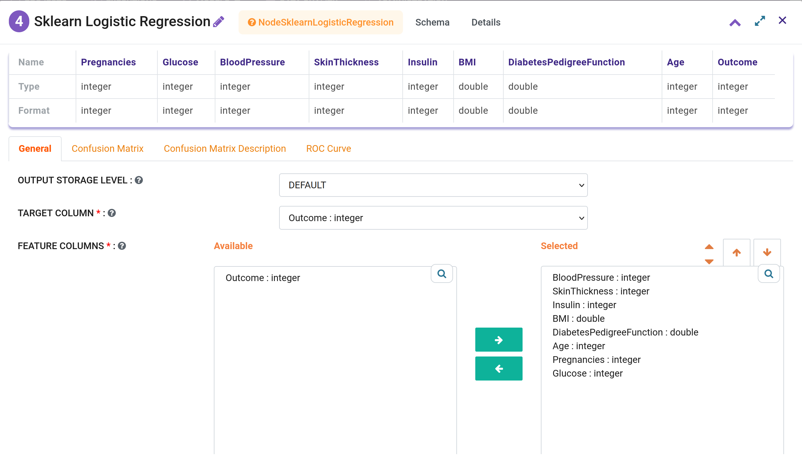
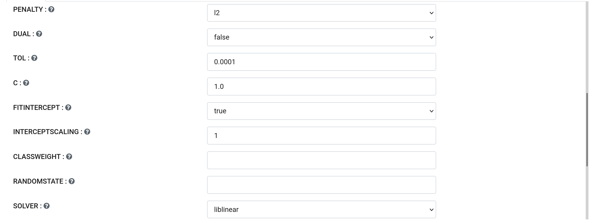
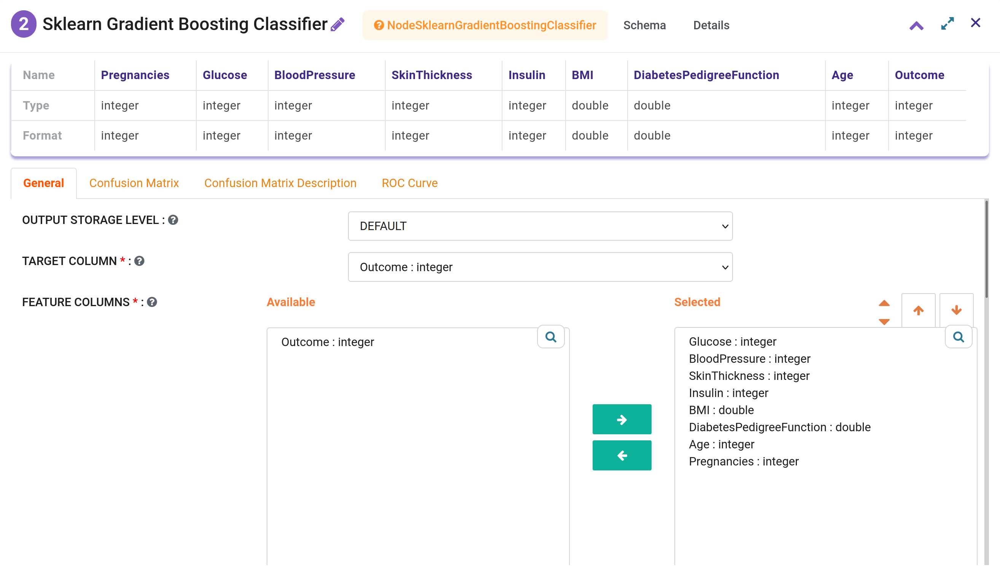
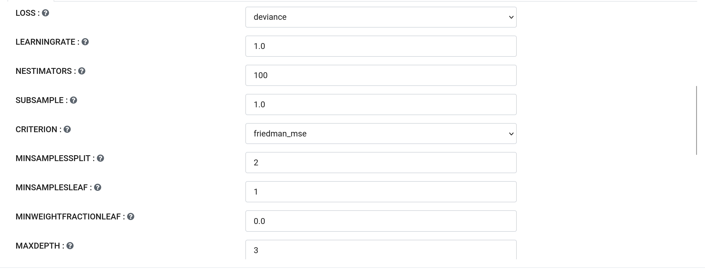
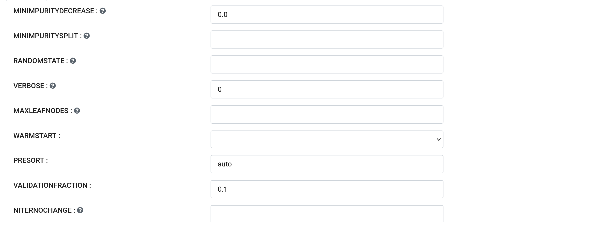
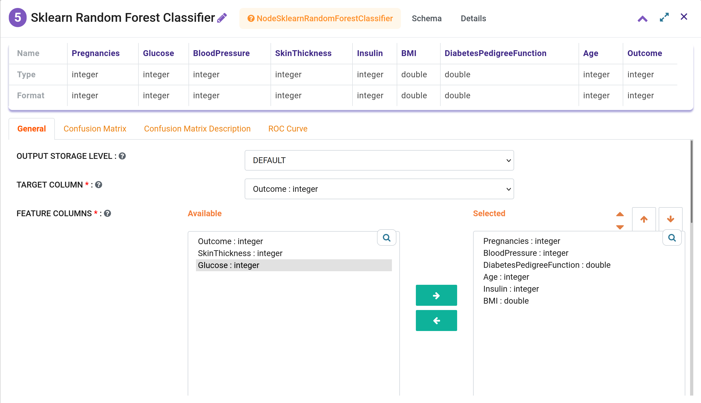
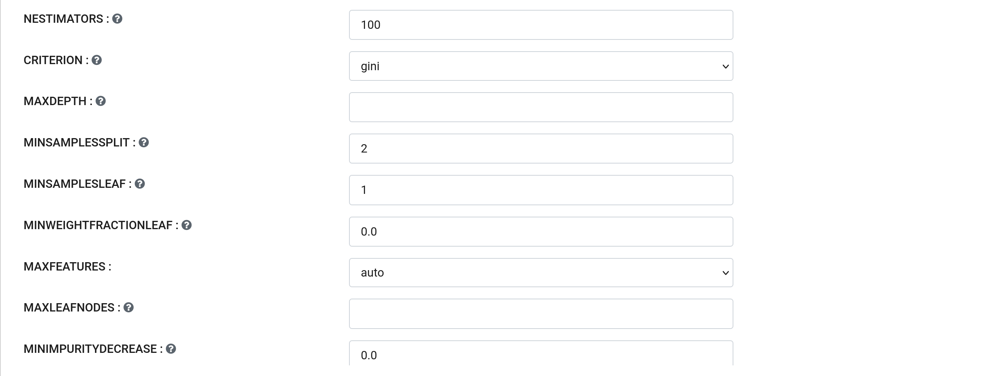
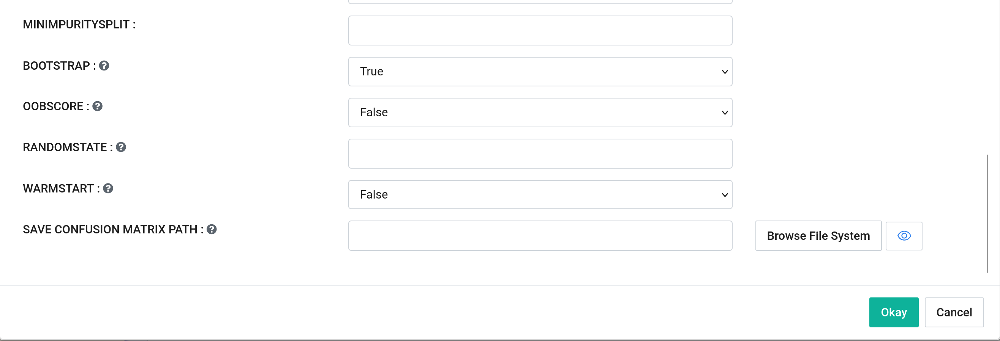

Classification
==============

.. list-table:: Scikit Learn based Classification Processors in Fire Insights
   :widths: 30 70
   :header-rows: 1

   * - Title
     - Description
   * - Logistic Regression Classifier
     - In LR Classifier, probabilities describing the possible outcomes of a single trial are modeled using a logistic function. It is implemented in the linear_model library.

   * - Gradient Boosting classifier
     - The Gradient Boosting Classifier is an additive ensemble of a base model whose error is corrected in successive iterations (or stages) by the addition of Regression Trees which correct the residuals (the error of the previous stage).

   * - Random forest classifier
     - A random forest is a meta estimator that fits a number of decision tree classifiers on various sub-samples of the dataset and uses averaging to improve the predictive accuracy and control over-fitting. The sub-sample size is always the same as the original input sample size but the samples are drawn with replacement if bootstrap=True (default).

Logistic Regression Classifier
-----------------------------

In LR Classifier, probabilities describing the possible outcomes of a single trial are modeled using a logistic function. It is implemented in the linear_model library.

.. list-table:: Parameter Details
   :widths: 30 70
   :header-rows: 1

   * - Parameter
     - Description
   * - Target Column
     - The label column for model fitting. It must be of a numeric data type such as integer, long, double, float, or int.
   * - Feature Columns
     - Feature columns of type all numeric.
   * - Penalty
     - The norm used in the penalization. Options: "l1", "l2", "elasticnet".
   * - Dual
     - Dual or primal formulation. Options: "false", "true".
   * - Tol
     - Tolerance for stopping criteria.
   * - C
     - Inverse of regularization strength; must be a positive float.
   * - Fitintercept
     - Specifies if a constant (a.k.a. bias or intercept) should be added to the decision function. Options: "false", "true".
   * - InterceptScaling
     - Useful only when the solver 'liblinear' is used and fit_intercept is set to True.
   * - ClassWeight
     - Weights associated with classes in the form {class_label: weight}.
   * - RandomState
     - The seed of the pseudo random number generator to use when shuffling the data.
   * - Solver
     - Algorithm to use in the optimization problem. Options: "liblinear", "newton-cg", "lbfgs", "liblinear", "sag", "saga".
   * - Maxiter
     - Maximum number of iterations taken for the solvers to converge.
   * - MultiClass
     - If the option chosen is 'ovr', then a binary problem is fit for each label. For 'multinomial', the loss minimized is the multinomial loss fit across the entire probability distribution. Options: "ovr", "multinomial", "auto".
   * - Verbose
     - For the liblinear and lbfgs solvers set verbose to any positive number for verbosity.
   * - WarmStart
     - When set to True, reuse the solution of the previous call to fit as initialization. Options: "false", "true".
   * - Save Confusion Matrix Path
     - Save Confusion Matrix.

More details are at the `Scikit-learn LogisticRegression page <https://scikit-learn.org/stable/modules/generated/sklearn.linear_model.LogisticRegressionCV.html>`_.

Gradient Boosting classifier
----------------------------

The Gradient Boosting Classifier is an additive ensemble of a base model whose error is corrected in successive iterations (or stages) by the addition of Regression Trees which correct the residuals (the error of the previous stage).

.. list-table:: Parameter Details
   :widths: 30 70
   :header-rows: 1

   * - Parameter
     - Description
   * - Target Column
     - The label column for model fitting. It must be of a numeric data type such as integer, long, double, float, or int.
   * - Feature Columns
     - Feature columns of type all numeric.
   * - Loss
     - The loss function to be optimized. 'Deviance' refers to deviance (logistic regression) for classification with probabilistic outputs. Options: "deviance", "exponential".
   * - LearningRate
     - Learning rate shrinks the contribution of each tree by learning_rate.
   * - NEstimators
     - The number of boosting stages to be run.
   * - Subsample
     - The fraction of samples to be used for fitting the individual base learners.
   * - Criterion
     - The function to measure the quality of a split. Options: "friedman_mse", "mse", "mae".
   * - MinSamplesSplit
     - The minimum number of samples required to split an internal node.
   * - MinSamplesLeaf
     - The minimum number of samples required to be at a leaf node.
   * - MinWeightFractionLeaf
     - The minimum weighted fraction of the sum total of weights (of all the input samples) required to be at a leaf node.
   * - MaxDepth
     - Maximum depth of the individual regression estimators.
   * - MinImpurityDecrease
     - A node will be split if this split induces a decrease of the impurity greater than or equal to this value.
   * - MinImpuritySplit
     - Threshold for early stopping in tree growth. A node will split if its impurity is above the threshold.
   * - RandomState
     - Controls the randomness of the bootstrapping of the samples used when building trees.
   * - Verbose
     - Enable verbose output. If set to 1, it prints progress and performance occasionally (the more trees, the lower the frequency).
   * - MaxLeafNodes
     - Default value is None, which means unlimited leaf nodes (-1).
   * - WarmStart
     - If set to True, the model retains previous trees when adding more, rather than starting from scratch. Options: "True", "False".
   * - Presort
     - Presorting the data to speed up finding the best splits.
   * - ValidationFraction
     - The proportion of training data to set aside as a validation set for early stopping.
   * - NIterNoChange
     - Number of iterations with no improvement to stop training early. Default value is None (-1).
   * - Tol
     - The tolerance for early stopping.
   * - SaveConfusion Matrix Path
     - The path where the confusion matrix should be saved.

More details are at the  `Scikit-learn GradientBoostingClassifier page <https://scikit-learn.org/stable/modules/generated/sklearn.ensemble.GradientBoostingClassifier.html>`_.

Random forest classifier
-------------------------

A random forest is a meta estimator that fits a number of decision tree classifiers on various sub-samples of the dataset and use averaging to improve the predictive accuracy and control over-fitting.

.. list-table:: Parameter Details:
   :widths: 30 70
   :header-rows: 1

   * - Parameter
     - Description
   * - Target Column
     - The label column for model fitting. It must be of a numeric data type such as integer, long, double, float, or int.
   * - Feature Columns
     - Feature columns of type all numeric.
   * - NEstimators
     - Specifies the number of trees in the forest.
   * - Criterion
     - The function to measure the quality of a split. 'gini' for the Gini impurity and 'entropy' for the information gain. Options: "gini", "entropy".
   * - MinSamplesSplit
     - The minimum number of samples required to split an internal node. Higher values prevent creating nodes with few samples, which can be sensitive to noise.
   * - MinSamplesLeaf
     - The minimum number of samples required to be at a leaf node. A split point is only considered if it leaves at least this many training samples in each of the left and right branches.
   * - Criterion
     - The function to measure the quality of a split. Options: "friedman_mse", "mse", "mae".
   * - MinSamplesSplit
     - The minimum number of samples required to split an internal node.
   * - MinWeightFractionLeaf
     - The minimum weighted fraction of the sum total of weights required to be at a leaf node. Weights are assigned to individual samples in the construction of the tree.
   * - MinWeightFractionLeaf
     - The minimum weighted fraction of the sum total of weights (of all the input samples) required to be at a leaf node.
   * - MaxFeatures
     - The number of features to consider when looking for the best split. Options: "auto", "sqrt", "log2", "None".
   * - MaxLeafNodes
     - Grow a tree with MaxLeafNodes in a best-first fashion. If not set, an unlimited number of leaf nodes is used.
   * - MinImpurityDecrease
     - Threshold for a node to split based on impurity. The higher the value, the more conservative the algorithm will be, helping to control overfitting.
   * - MinImpuritySplit
     - Threshold for early stopping in tree growth. (Deprecated)
   * - Bootstrap
     - Whether bootstrap samples are used when building trees. If False, the whole dataset is used to build each tree. Options: "True", "False".
   * - OobScore
     - Whether to use out-of-bag samples to estimate the generalization accuracy. Options: "True", "False".
   * - RandomState
     - Controls the randomness of the bootstrapping of the samples used when building trees. Default value is None.
   * - WarmStart
     - When set to True, the existing trained trees in the model are reused and additional trees are added to the ensemble. This can save time when incrementally increasing the number of trees in the model. Options: "True", "False"
   * - Save Confusion Matrix Path
     - The path where the confusion matrix should be saved after model evaluation.

More details are at the `Scikit-learn RandomForestClassifier page <https://scikit-learn.org/stable/modules/generated/sklearn.ensemble.RandomForestClassifier.html>`_.

