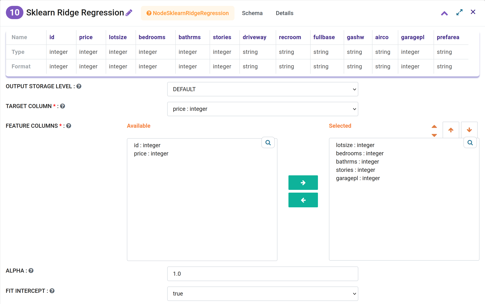
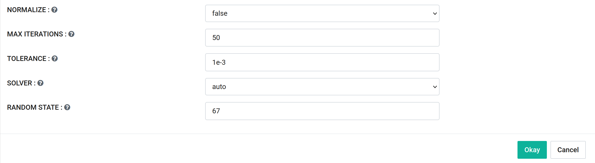
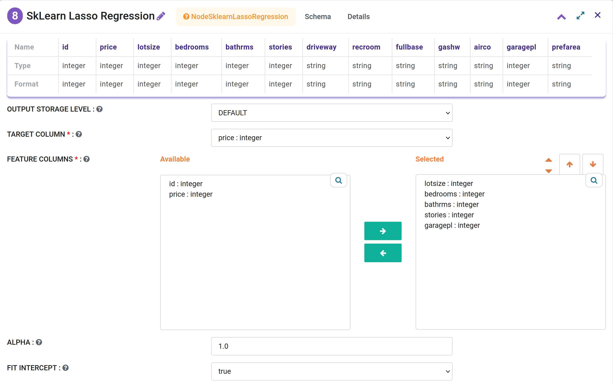
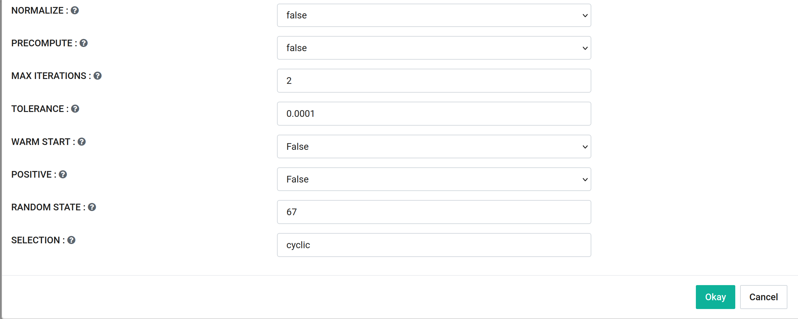
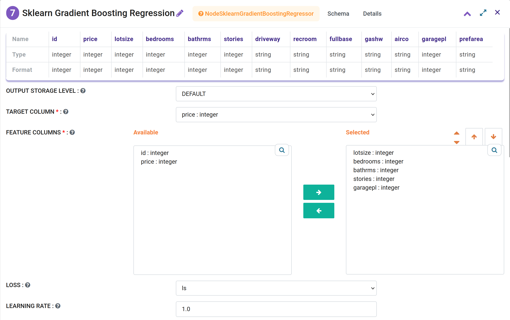
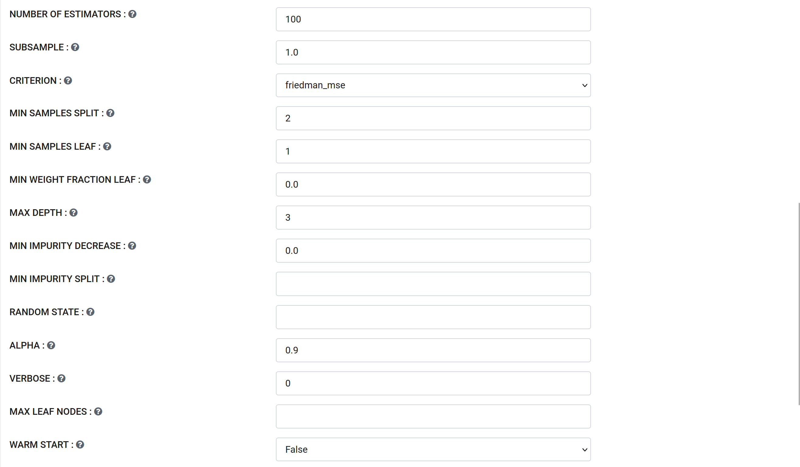
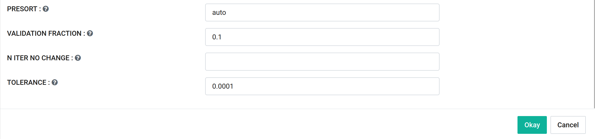
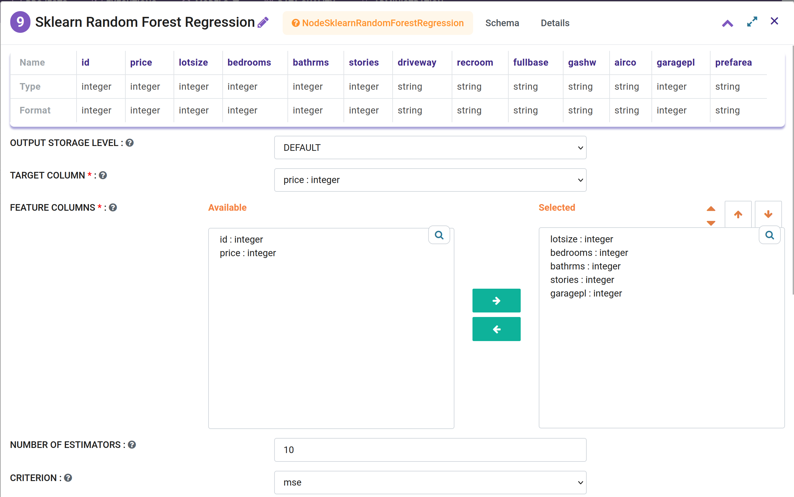
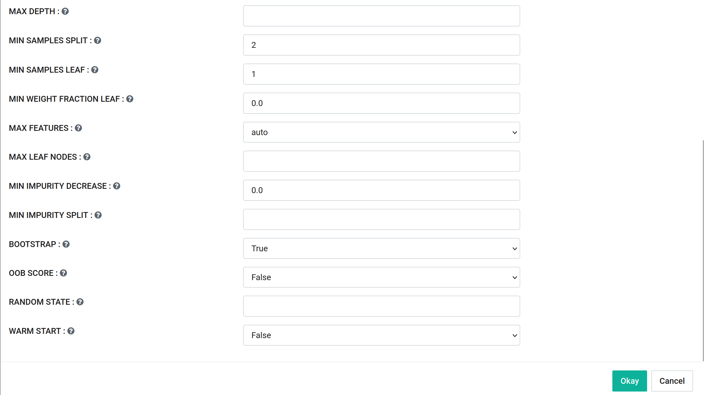

Regression
===========

.. list-table:: Scikit Learn based Regression Processors in Fire Insights
   :widths: 30 70
   :header-rows: 1

   * - Title
     - Description
   * - Ridge regression
     -  Ridge regression addresses some of the problems of Ordinary Least Squares by imposing a penalty on the size of the coefficients. The ridge coefficients minimize a penalized residual sum of squares.
     
   * - Lasso regression
     - The Lasso is a linear model that estimates sparse coefficients. It is useful in some contexts due to its tendency to prefer solutions with fewer non-zero coefficients, effectively reducing the number of features upon which the given solution is dependent.

   * - Gradient Boosting regression
     - GB builds an additive model in a forward stage-wise fashion; it allows for the optimization of arbitrary differentiable loss functions. In each stage a regression tree is fit on the negative gradient of the given loss function.
     
   * - Random forest regression
     - A random forest is a meta estimator that fits a number of classifying decision trees on various sub-samples of the dataset and uses averaging to improve the predictive accuracy and control over-fitting. The sub-sample size is always the same as the original input sample size but the samples are drawn with replacement if bootstrap=True (default). 

Ridge regression
----------------

Ridge regression is an extension of linear regression where the loss function is modified to minimize the complexity of the model. This modification is done by adding a penalty parameter that is equivalent to the square of the magnitude of the coefficients.

.. list-table:: Parameter Details
   :widths: 30 70
   :header-rows: 1

   * - Parameter
     - Description
   * - Target Column
     - The label column for model fitting.
   * - Feature Columns
     - Feature columns of type - all numeric, boolean, and vector.
   * - Alpha
     - Constant that multiplies the L2 term, regularization strength.
   * - Fit Intercept
     - Whether to calculate the intercept for this model. Options: false, true.
   * - Normalize
     - If True, the regressors X will be normalized before regression by subtracting the mean and dividing by the l2-norm. This parameter is ignored when Fit Intercept is set to False. Options: false, true.
   * - Random State
     - The seed of the pseudo-random number generator to use when shuffling the data for the solver.
 

More details are at the Scikit-learn page:

https://scikit-learn.org/stable/modules/generated/sklearn.linear_model.Ridge.html

Lasso Regression
-----------------

Lasso regression or the Least Absolute Shrinkage and Selection Operator, is also a modification of linear regression. In Lasso, the loss function is modified to minimize the complexity of the model by limiting the sum of the absolute values of the model coefficients (also called the l1-norm).

.. list-table:: Parameter Details
   :widths: 30 70
   :header-rows: 1

   * - Parameter
     - Description
   * - Target Column
     - The label column for model fitting.
   * - Feature Columns
     - Feature columns of type - all numeric, boolean, and vector.
   * - Alpha
     - Constant that multiplies the L1 term. Defaults to 1.0. Alpha = 0 is equivalent to an ordinary least square, solved by the LinearRegression object.
   * - Fit Intercept
     - Whether to calculate the intercept for this model. If set to false, no intercept will be used in calculations. Options: false, true.
   * - Normalize
     - If True, the regressors X will be normalized before regression. This parameter is ignored when Fit Intercept is set to False. Options: false, true.
   * - Precompute
     - Whether to use a precomputed Gram matrix to speed up calculations. Options: false, true.
   * - Max Iterations
     - The maximum number of iterations.
   * - Tolerance
     - The tolerance for the optimization: if the updates are smaller than tol, the optimization code checks the dual gap for optimality and continues until it is smaller than tol.
   * - Warm Start
     - When set to True, reuse the solution of the previous call to fit as initialization, otherwise, just erase the previous solution. Options: True, False.
   * - Positive
     - When set to True, forces the coefficients to be positive. Options: True, False.
   * - Random State
     - The seed of the pseudo-random number generator that selects a random feature to update.
   * - Selection
     - If set to ‘random’, a random coefficient is updated every iteration rather than looping over features sequentially by default. This often leads to significantly faster convergence, especially when tol is higher than 1e-4.

More details are at the Scikit-learn page:

https://scikit-learn.org/stable/modules/generated/sklearn.linear_model.Lasso.html

Gradient Boosting regression
--------------------------

Gradient Boosting builds an additive model in a forward stage-wise fashion; it allows for the optimization of arbitrary differentiable loss functions. In each stage a regression tree is fit on the negative gradient of the given loss function.

.. list-table:: Parameter Details
   :widths: 30 70
   :header-rows: 1

   * - Parameter
     - Description
   * - Target Column
     - The label column for model fitting.
   * - Feature Columns
     - Feature columns of type - all numeric, boolean, and vector.
   * - Loss
     - The loss function to be optimized. 'ls' refers to least squares regression. Options: ls, lad, huber, quantile
   * - Learning Rate
     - Learning rate shrinks the contribution of each tree by learning_rate.
   * - Number of Estimators
     - The number of boosting stages to be run.
   * - Subsample
     - The fraction of samples to be used for fitting the individual base learners.
   * - Criterion
     - The function to measure the quality of a split. Options: friedman_mse, mse, mae.
   * - Min Samples Split
     - The minimum number of samples required to split an internal node.
   * - Min Samples Leaf
     - The minimum number of samples required to be at a leaf node.
   * - Max Depth
     - Maximum depth of the individual regression estimators.
   * - Min Impurity Decrease
     - A node will be split if this split induces a decrease of the impurity greater than or equal to this value.
   * - Min Impurity Split
     - Threshold for early stopping in tree growth. A node will split if its impurity is above the threshold.
   * - Random State
     - Controls the randomness of the bootstrapping of the samples used when building trees.
   * - Alpha
     - The alpha-quantile of the huber loss function and the quantile loss function.
   * - Verbose
     - Enable verbose output. If 1 then it prints progress and performance once in a while.
   * - Max Leaf Nodes
     - Grow trees with max_leaf_nodes in best-first fashion. If not set, then unlimited number of leaf nodes.
   * - Warm Start
     - When set to True, reuse the solution of the previous call to fit as initialization, otherwise, just erase the previous solution. Options: True, False.
   * - Presort
     - Whether to presort the data to speed up the finding of best splits in fitting.
   * - Validation Fraction
     - The proportion of training data to set aside as validation set for early stopping.
   * - N Iter No Change
     - Used to decide if early stopping will be used to terminate training when validation score is not improving.
   * - Tolerance
     - Tolerance for the early stopping. When the loss or score is not improving by at least tol for n_iter_no_change iterations, training stops.

More details are at the Scikit-learn page:

https://scikit-learn.org/stable/auto_examples/ensemble/plot_gradient_boosting_regression.html

Random forest regression
--------------------------

A random forest is a meta estimator that fits a number of classifying decision trees on various sub-samples of the dataset and uses averaging to improve the predictive accuracy and control over-fitting. The sub-sample size is controlled with the max_samples parameter if bootstrap=True (default), otherwise the whole dataset is used to build each tree.

.. list-table:: Parameter Details
   :widths: 30 70
   :header-rows: 1

   * - Parameter
     - Description
   * - Target Column
     - The label column for model fitting.
   * - Feature Columns
     - Feature columns of type - all numeric, boolean, and vector.
   * - Number of Estimators
     - Specifies the number of trees in the forest.
   * - Criterion
     - The function to measure the quality of a split. Options: mse, mae.
   * - Max Depth
     - The maximum depth of the tree. If not set, nodes are expanded until all leaves are pure or until all leaves contain less than min_samples_split samples.
   * - Min Samples Split
     - The minimum number of samples required to split an internal node. Higher values prevent a tree from growing too complex.
   * - Min Samples Leaf
     - The minimum number of samples required to be at a leaf node.
   * - Min Weight Fraction Leaf
     - The minimum weighted fraction of the sum total of weights required to be at a leaf node.
   * - Max Features
     - The number of features to consider when looking for the best split. Options: auto, sqrt, log2, None.
   * - Max Leaf Nodes
     - Grow trees with max_leaf_nodes in best-first fashion. If not set, then unlimited number of leaf nodes.
   * - Min Impurity Decrease
     - A threshold for early stopping in tree growth. A node will split if its impurity is above the threshold, otherwise it is a leaf.
   * - Min Impurity Split
     - Threshold for early stopping in tree growth, a node will split if its impurity is above the threshold.
   * - Bootstrap
     - Whether bootstrap samples are used when building trees. Options: True, False.
   * - Oob Score
     - Whether to use out-of-bag samples to estimate the R^2 on unseen data. Options: True, False.
   * - Random State
     - Controls the randomness of the bootstrapping of the samples used when building trees (if bootstrap=True). Default value is None.
   * - Warm Start
     - When warm_start is true, the existing fitted model attributes are used to initialize the new model in a subsequent call to fit. Options: True, False.

More details are at the Scikit-learn page:

https://scikit-learn.org/stable/modules/generated/sklearn.ensemble.RandomForestRegressor.html
