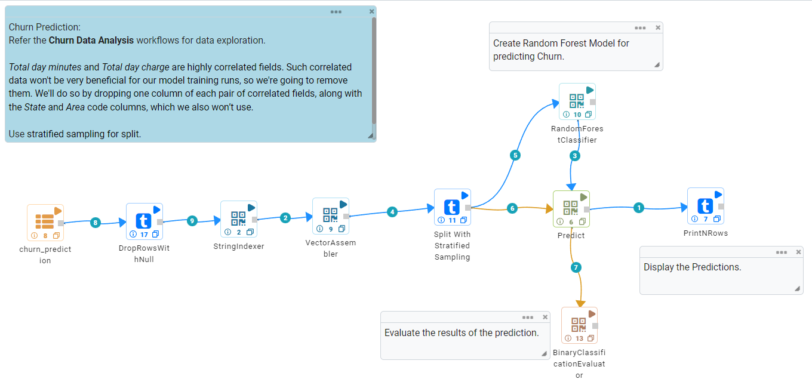

Building Apache Spark Workflows
==================================

Below is a Spark ML workflow which trains a Classification Model for Churn prediction on Telco data.

The standard flow to build a predictive Spark ML workflow is enlisted as below.

* Read in the Data.
	-	Multiple Connectors and Read-Structured nodes are available to read dataset. Read CSV is one of the common node to read data in CSV format.
	- 	It is advisable to have data validated and processed. This step is important to ensure that ML Workflow don't break while processing and only the selected features are being processed.
* Perform Feature Engineering.
	-	Various Feature Engineering steps can be executed to ensure that right set of Features have been created to build a stable and accurate model.
	-	Data Profiling step such as Correlation can be executed to identify correlation among different features which in turn helps in Feature Selection.
* Convert strings to numeric values.
	-	Feature data must be represented in Numeric Values for Model Building in Apache Spark.
	- 	String Indexer node can be used to index String Categorical data in a column. It would result in corresponding Numeric values facilitating Model Building.
	-	One Hot Encoder node can also be used for this purpose.
* Use the Vector Assembler node to create features columns. It will contain data from all the columns which would be used as features in the Model.
	-	A set of incoming columns can be selected as Feature List. Featue List would be used to determine predicted value.
	-	Feature List needs to be selected based on the Feature Selection method.
* Split the DataFrame for training and test.
	-	Split nodes can be used to split the data into Training and Test Dataset. Percentage value provided as an input determines the split size.
* Choose one of the train node to build the model like Regression or Classification or Clustering to create the model on the training dataset.
	-	Multiple Regression or Classification or Clustering ML Nodes are available to train the model. 
* Choose a Predict node for predicting on the test dataset using the Model created.
	-	ML Model built in the previous step can be applied on the Test Dataset using the Predict Node to predict values.
* Choose an Evaluator node for evaluating the model results.
	-	Evaluator node can be used to evaluate accuracy of the Model. Various Steps can be taken to improve accuracy of the Model, some of which are Feature Engineering, Re-Configuring Regression ML node and so on.

