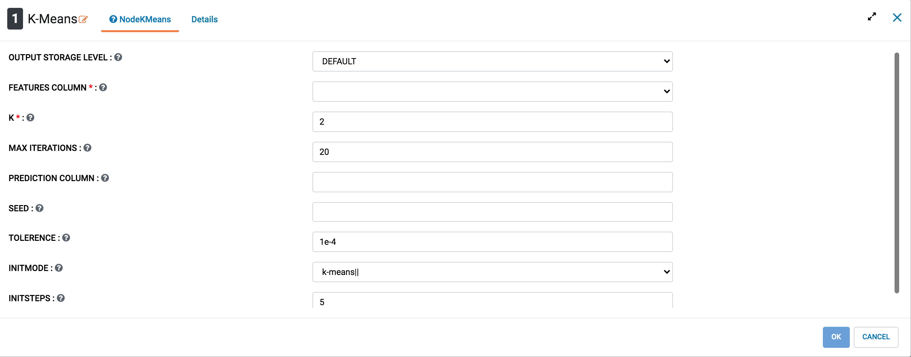
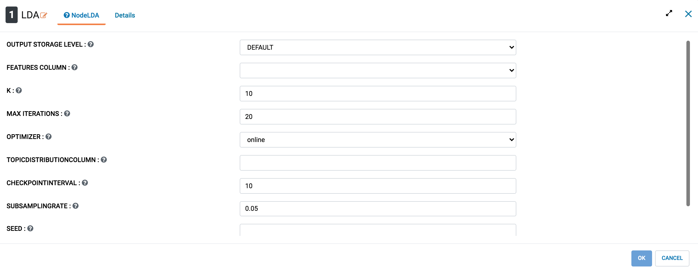
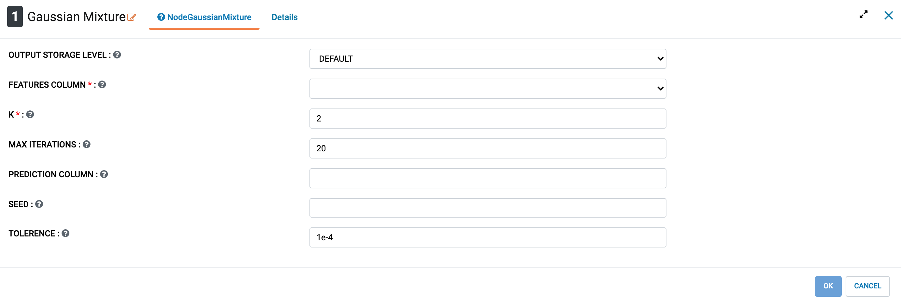

Clustering
==========

Clustering is the task of grouping a set of objects in such a way that objects in the same group (called a cluster) are more similar (in some sense) to each other than to those in other groups (clusters). It is a main task of exploratory data mining, and a common technique for statistical data analysis, used in many fields, including machine learning, pattern recognition, image analysis, information retrieval, bioinformatics, data compression, and computer graphics.

More details regarding clustering can be found at: https://en.wikipedia.org/wiki/Cluster_analysis

Clustering Processors in Fire Insights
----------------------------------------

.. list-table:: Apache Spark based Clustering Processors in Fire Insights
   :widths: 30 70
   :header-rows: 1

   * - Title
     - Description
   * - KMeans
     - k-means is one of the most commonly used clustering algorithms that clusters the data points into a predefined number of clusters. The MLlib implementation includes a parallelized variant of the k-means++ method called kmeans||.

   * - LDA
     - LDA is implemented as an Estimator that supports both EMLDAOptimizer and OnlineLDAOptimizer, and generates a LDAModel as the base model.

   * - Gaussian Mixture
     - A Gaussian Mixture Model represents a composite distribution whereby points are drawn from one of k Gaussian sub-distributions, each with its own probability. The spark.ml implementation uses the expectation-maximization algorithm to induce the maximum-likelihood model given a set of samples.

K-means
+++++++++++++++++++

k-means is one of the most commonly used clustering algorithms that clusters the data points into a predefined number of clusters. The MLlib implementation includes a parallelized variant of the k-means++ method called kmeans||.
The implementation in spark.mllib has the following parameters:

k is the number of desired clusters. Note that it is possible for fewer than k clusters to be returned, for example, if there are fewer than k distinct points to cluster.
- maxIterations is the maximum number of iterations to run.
- initializationMode specifies either random initialization or initialization via k-means||.
- runs This param has no effect since Spark 2.0.0.
- initializationSteps determines the number of steps in the k-means|| algorithm.
- epsilon determines the distance threshold within which we consider k-means to have converged.
- initialModel is an optional set of cluster centers used for initialization. If this parameter is supplied, only one run is performed.

More details regarding K-means can be found at: https://spark.apache.org/docs/latest/ml-clustering.html#k-means

   

Latent Dirichlet allocation (LDA)
+++++++++++++++++++

LDA is implemented as an Estimator that supports both EMLDAOptimizer and OnlineLDAOptimizer, and generates a LDAModel as the base model. Expert users may cast a LDAModel generated by EMLDAOptimizer to a DistributedLDAModel if needed.

Latent Dirichlet allocation (LDA) is a topic model which infers topics from a collection of text documents. LDA can be thought of as a clustering algorithm as follows:

- Topics correspond to cluster centers, and documents correspond to examples (rows) in a dataset.
- Topics and documents both exist in a feature space, where feature vectors are vectors of word counts (bag of words).
- Rather than estimating a clustering using a traditional distance, LDA uses a function based on a statistical model of how text documents are generated.
LDA supports different inference algorithms via setOptimizer function. EMLDAOptimizer learns clustering using expectation-maximization on the likelihood function and yields comprehensive results, while OnlineLDAOptimizer uses iterative mini-batch sampling for online variational inference and is generally memory friendly.

LDA takes in a collection of documents as vectors of word counts and the following parameters (set using the builder pattern):

- **k:** Number of topics (i.e., cluster centers)
- **optimizer:** Optimizer to use for learning the LDA model, either EMLDAOptimizer or OnlineLDAOptimizer
- **docConcentration:** Dirichlet parameter for prior over documents’ distributions over topics. Larger values encourage smoother inferred distributions.
- **topicConcentration:** Dirichlet parameter for prior over topics’ distributions over terms (words). Larger values encourage smoother inferred distributions.
- **maxIterations:** Limit on the number of iterations.
- **checkpointInterval:** If using checkpointing (set in the Spark configuration), this parameter specifies the frequency with which checkpoints will be created. If maxIterations is large, using checkpointing can help reduce shuffle file sizes on disk and help with failure recovery.
All of spark.mllib’s LDA models support:

- **describeTopics:** Returns topics as arrays of most important terms and term weights.
- **topicsMatrix:** Returns a vocabSize by k matrix where each column is a topic.

More details regarding LDA can be found at: https://spark.apache.org/docs/latest/ml-clustering.html#latent-dirichlet-allocation-lda

   
Bisecting K-means
+++++++++++++++++++

Bisecting K-means can often be much faster than regular K-means, but it will generally produce a different clustering.

Bisecting k-means is a kind of hierarchical clustering. Hierarchical clustering is one of the most commonly used method of cluster analysis which seeks to build a hierarchy of clusters. Strategies for hierarchical clustering generally fall into two types:

- **Agglomerative:** This is a “bottom up” approach: each observation starts in its own cluster, and pairs of clusters are merged as one moves up the hierarchy.
- **Divisive:** This is a “top down” approach: all observations start in one cluster, and splits are performed recursively as one moves down the hierarchy.
Bisecting k-means algorithm is a kind of divisive algorithms. The implementation in MLlib has the following parameters:

- **k:** the desired number of leaf clusters (default: 4). The actual number could be smaller if there are no divisible leaf clusters.
- **maxIterations:** the max number of k-means iterations to split clusters (default: 20).
- **minDivisibleClusterSize:** the minimum number of points (if >= 1.0) or the minimum proportion of points (if < 1.0) of a divisible cluster (default: 1).
- **seed:** a random seed (default: hash value of the class name).

Gaussian mixture
+++++++++++++++++++

A Gaussian Mixture Model represents a composite distribution whereby points are drawn from one of k Gaussian sub-distributions, each with its own probability. The spark.mllib implementation uses the expectation-maximization algorithm to induce the maximum-likelihood model given a set of samples. The implementation has the following parameters:

- **k:** is the number of desired clusters.
- **convergenceTol:** is the maximum change in log-likelihood at which we consider convergence achieved.
- **maxIterations:** is the maximum number of iterations to perform without reaching convergence.
- **initialModel** is an optional starting point from which to start the EM algorithm. If this parameter is omitted, a random starting point will be constructed from the data.

   
Power iteration clustering (PIC)
+++++++++++++++++++

Power iteration clustering (PIC) is a scalable and efficient algorithm for clustering vertices of a graph given pairwise similarities as edge properties, described in Lin and Cohen, Power Iteration Clustering. It computes a pseudo-eigenvector of the normalized affinity matrix of the graph via power iteration and uses it to cluster vertices. spark.mllib includes an implementation of PIC using GraphX as its backend. It takes an RDD of (srcId, dstId, similarity) tuples and outputs a model with the clustering assignments. The similarities must be nonnegative. PIC assumes that the similarity measure is symmetric. A pair (srcId, dstId) regardless of the ordering should appear at most once in the input data. If a pair is missing from input, their similarity is treated as zero. spark.mllib’s PIC implementation takes the following (hyper-)parameters:

- **k:** number of clusters.
- **maxIterations:** maximum number of power iterations.
- **initializationMode:** initialization model. This can be either “random”, which is the default, to use a random vector as vertex properties, or “degree” to use normalized sum similarities.

Streaming K-means
+++++++++++++++++++

When data arrive in a stream, we may want to estimate clusters dynamically, updating them as new data arrive. spark.mllib provides support for streaming k-means clustering, with parameters to control the decay (or “forgetfulness”) of the estimates. The algorithm uses a generalization of the mini-batch k-means update rule. For each batch of data, we assign all points to their nearest cluster, compute new cluster centers, then update each cluster.
