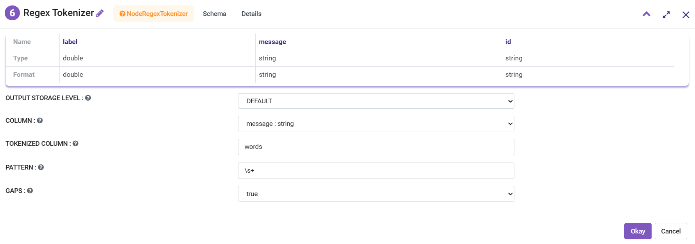
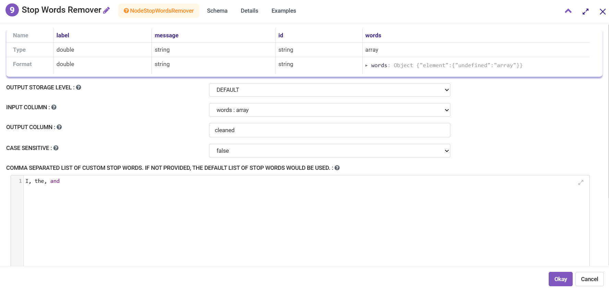
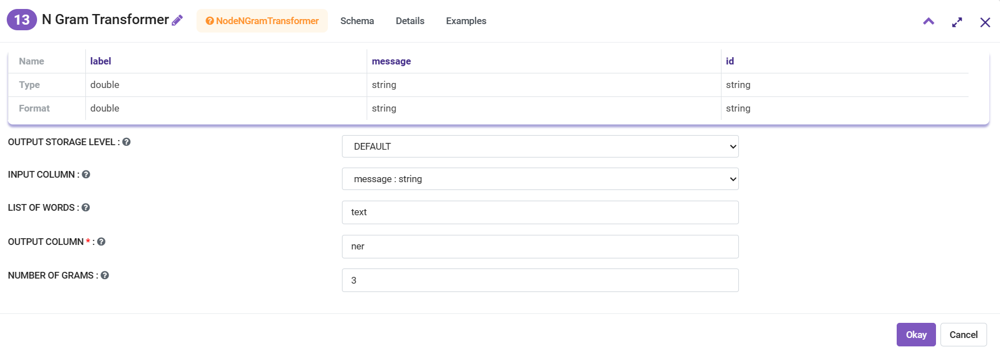
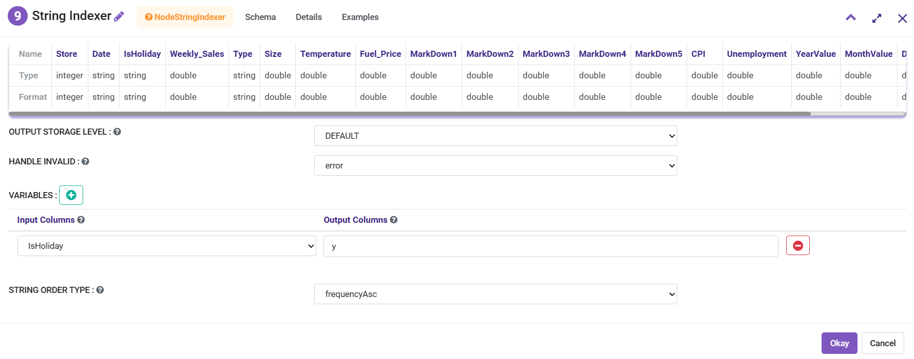
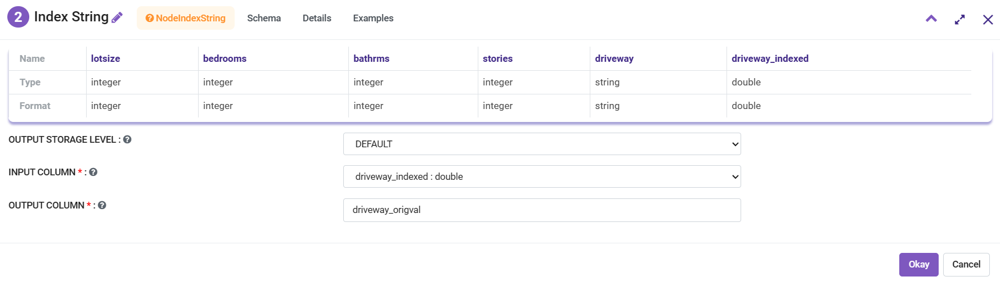
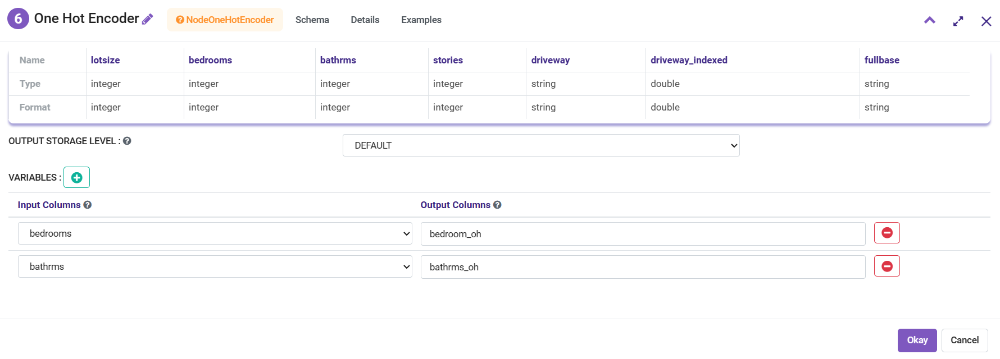
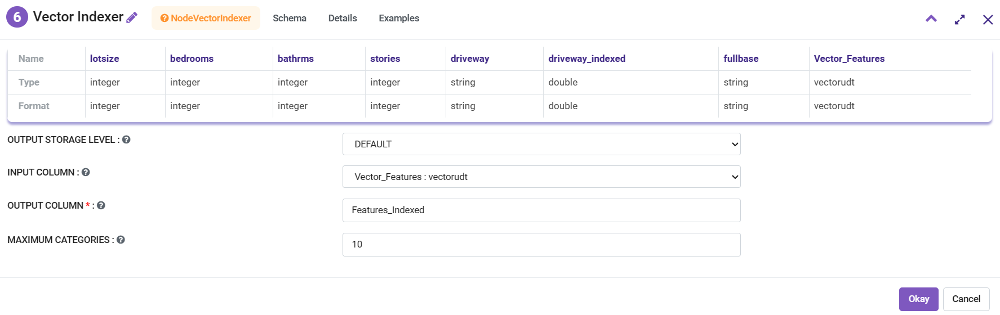
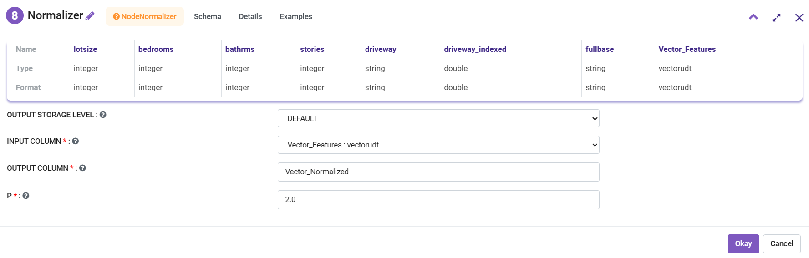
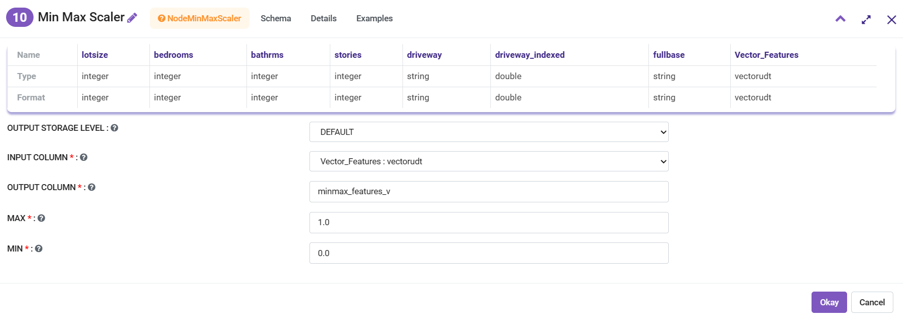
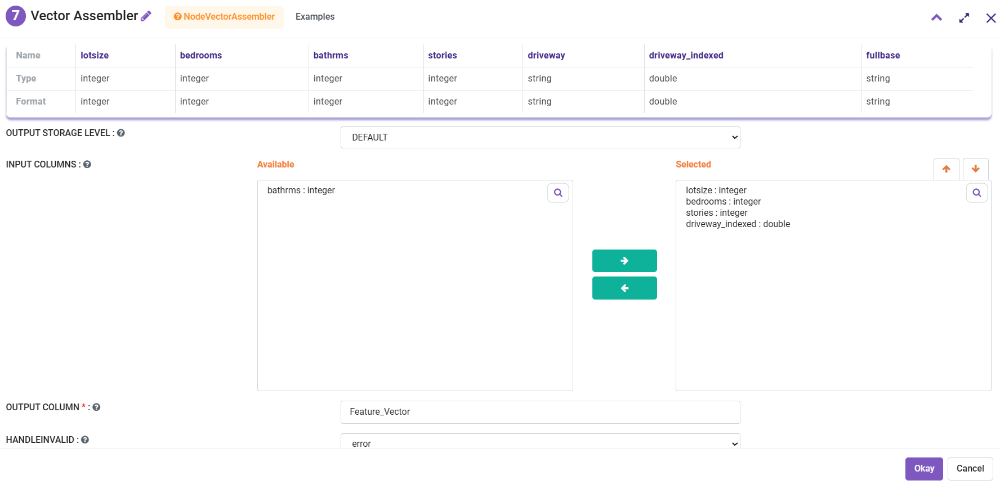

Feature Transformation
======================

Feature transformation is simply a function that transforms features from one representation to another. Feature transformation techniques are used for several reasons:

   - data types are not suitable to be fed into a machine learning algorithm, e.g. text, categories.
   - feature values may cause problems during the learning process, e.g. data represented in different scales.
   - we want to reduce the number of features to plot and visualize data, speed up training or improve the accuracy of a specific model.

Apache Spark has a number of Feature Transformers which are provided by Fire Insights in the form of processors so that these can be easily used in the workflows.

Feature Transformer Processors in Fire Insights
----------------------------------------------

.. list-table:: Apache Spark based Feature Transformer Processors in Fire Insights
   :widths: 20 50
   :header-rows: 1

   * - Title
     - Description
     
   * - Tokenizer
     - Tokenization is the process of taking text (such as a sentence) and breaking it into individual terms (usually words).
     
   * - Regex Tokenizer
     - RegexTokenizer allows more advanced tokenization based on regular expression (regex) matching.

   * - Stop Words Remover
     - StopWordsRemover takes as input a sequence of strings (e.g. the output of a Tokenizer) and drops all the stop words from the input sequences.
     
   * - N-Gram Transformer
     - An n-gram is a sequence of n tokens (typically words) for some integer n. The NGram class can be used to transform input features into n-grams.
     
   * - Binarizer
     - Binarization is the process of thresholding numerical features to binary (0/1) features.
     
   * - PCA
     - PCA is a statistical procedure that uses an orthogonal transformation to convert a set of observations of possibly correlated variables into a set of values of linearly uncorrelated variables called principal components.
     
   * - Polynomial Expansion
     - Polynomial expansion is the process of expanding your features into a polynomial space, that is formulated by an n-degree combination of original dimensions.
     
   * - String Indexer
     - StringIndexer encodes a string column of labels to a column of label indices.
     
   * - Index String
     - Symmetrically to StringIndexer, IndexToString maps a column of label indices back to a column containing the original labels as strings.
     
   * - One Hot Encoder
     - One-hot encoding maps a categorical feature, represented as a label index, to a binary vector with at most a single one-value indicating the presence of a specific feature value from among the set of all feature values.
     
   * - Vector Indexer
     - VectorIndexer helps index categorical features in datasets of Vectors.
     
   * - Normalizer
     - Normalizer is a feature transformer that transforms a dataset of Vector rows, normalizing each Vector to have unit norm.
     
   * - Standard Scalar
     - StandardScaler transforms a dataset of Vector rows, normalizing each feature to have unit standard deviation and/or zero mean.
     
   * - Min Max Scalar
     - MinMaxScaler transforms a dataset of Vector rows, rescaling each feature to a specific range (often [0, 1]).
     
   * - SQL Transformer
     - SQLTransformer implements the transformations which are defined by a SQL statement.
     
   * - Vector Assembler
     - VectorAssembler is a transformer that combines a given list of columns into a single vector column.
     
   * - Quantile Discretizer
     - QuantileDiscretizer takes a column with continuous features and outputs a column with binned categorical features.
     
     

More details regarding the Feature Transformers in Spark can be found at: https://spark.apache.org/docs/latest/ml-features#feature-transformers

Tokenizer
------------
Tokenization is the process of taking text (such as a sentence) and breaking it into individual terms (usually words). A simple Tokenizer class provides this functionality. The example below shows how to split sentences into sequences of words. 

Additional Information and examples can be found at: https://spark.apache.org/docs/latest/ml-features#tokenizer

*Tokenizer node can be configured as below:*

.. figure:: ../../../_assets/user-guide/machine-learning/sparkml/featuretransformation/tokenizer.png
   :alt: Machine Learning
   :width: 75%

-	Column from the incoming DataFrame that needs to be broken down to words is to be selected in ``Input Column`` list. Only String columns can be selected.
-	Output column that lists the split data needs to be entered in ``Output Column`` box.

Regex Tokenizer
-----------------
RegexTokenizer allows more advanced tokenization based on regular expression (regex) matching. By default, the parameter “pattern” (regex, default: "\\s+") is used as delimiters to split the input text. Alternatively, users can set parameter “gaps” to false indicating the regex “pattern” denotes “tokens” rather than splitting gaps, and find all matching occurrences as the tokenization result. 

*Regex Tokenizer node can be configured as below:*

-	Column from the incoming DataFrame that needs to be broken down to words is to be selected in ``Column`` list. Only String columns can be selected.
-	Output column that lists the split data needs to be entered in ``Tokenized Column`` box.
-	Regex pattern that needs to be used to split data in the incoming column is to be entered in ``Pattern`` box.
-	If split needs to be done on gaps then ``Gaps`` is to be selected as True.

Stop Words Remover
--------------------
Stop words are words that should be excluded from the input, typically because the words appear frequently and don’t carry as much meaning. 

StopWordsRemover takes as input a sequence of strings (e.g. the output of a Tokenizer) and drops all the stop words from the input sequences. The list of stopwords is specified by the stopWords parameter. Default stop words for some languages are accessible by calling StopWordsRemover.loadDefaultStopWords(language), for which available options are “danish”, “dutch”, “english”, “finnish”, “french”, “german”, “hungarian”, “italian”, “norwegian”, “portuguese”, “russian”, “spanish”, “swedish” and “turkish”. A boolean parameter caseSensitive indicates if the matches should be case sensitive (false by default). 

Additional Information and examples can be found at: https://spark.apache.org/docs/latest/ml-features#stopwordsremover

*Stop Word Remover node can be configured as below:*

-	Column from the incoming dataframe that contains array of string data from which Stop Words needs to be removed is to be selected in ``Column`` list. Only String Array columns can be selected.
-	Output column that lists transformed data needs to be entered in ``Output Column`` box.
-	If Stop Words needs to be searched in case-sensitive manner then ``Case Sensitive`` is to be selected as True.
-	List of Stop Words needs to be entered in ``Stop Words list``. If no list has been provided then default list is used.

N Gram Transformer
--------------------
An n-gram is a sequence of n tokens (typically words) for some integer n. The NGram class can be used to transform input features into n-grams.

NGram takes as input a sequence of strings (e.g. the output of a Tokenizer). The parameter n is used to determine the number of terms in each n-gram. The output will consist of a sequence of n-grams where each n-gram is represented by a space-delimited string of n consecutive words. If the input sequence contains fewer than n strings, no output is produced.

Additional Information and examples can be found at: https://spark.apache.org/docs/latest/ml-features#n-gram

*N Gram Transformer node can be configured as below:*

-	Column from the incoming dataframe in which sequence of tokens needs to be identified is to be selected in ``Input Column`` list.
-	Output column that lists the sequence of tokens/words from the selected column needs to be entered in ``List of Words`` box.
-	Output column that lists N-Gram data needs to be entered in ``Output Column`` box.
-	Number of Grams or the number of words each gram would consist of needs to be entered in ``Number of Grams`` box.

Binarizer
-----------
Binarization is the process of thresholding numerical features to binary (0/1) features.

Binarizer takes the common parameters inputCol and outputCol, as well as the threshold for binarization. Feature values greater than the threshold are binarized to 1.0; values equal to or less than the threshold are binarized to 0.0. Both Vector and Double types are supported for inputCol.

Additional Information and Examples can be found at: https://spark.apache.org/docs/latest/ml-features#binarizer

*Binarizer node can be configured as below:*

.. figure:: ../../../_assets/user-guide/machine-learning/sparkml/featuretransformation/binarizer.png
   :alt: Machine Learning
   :width: 75%

-	Column from the incoming dataframe that needs to be converted to binary value is to be selected in ``Input Column`` list. Only Double or Vector columns can be selected.
-	Output column that lists the binary data needs to be entered in ``Output Column`` box. Output Column is added to the outgoing dataset.
-	Value against which incoming data needs to be compared is to be entered in ``Threshold`` box. If data point is greater than Threshold value then 1.0 is assigned otherwise 0.0 is assigned.

PCA
----
PCA is a statistical procedure that uses an orthogonal transformation to convert a set of observations of possibly correlated variables into a set of values of linearly uncorrelated variables called principal components. A PCA class trains a model to project vectors to a low-dimensional space using PCA. 

Additional Information and examples can be found at: https://spark.apache.org/docs/latest/ml-features#pca

Polynomial Expansion
----------------------
Polynomial expansion is the process of expanding your features into a polynomial space, which is formulated by an n-degree combination of original dimensions. A PolynomialExpansion class provides this functionality. 

Additional Information and Examples can be found at: https://spark.apache.org/docs/latest/ml-features#polynomialexpansion

String Indexer
----------------
StringIndexer encodes a string column of labels to a column of label indices. StringIndexer can encode multiple columns. The indices are in [0, numLabels), and four ordering options are supported: “frequencyDesc”: descending order by label frequency (most frequent label assigned 0), “frequencyAsc”: ascending order by label frequency (least frequent label assigned 0), “alphabetDesc”: descending alphabetical order, and “alphabetAsc”: ascending alphabetical order (default = “frequencyDesc”). Note that in case of equal frequency when under “frequencyDesc”/”frequencyAsc”, the strings are further sorted by alphabet.

The unseen labels will be put at index numLabels if user chooses to keep them. If the input column is numeric, we cast it to string and index the string values. When downstream pipeline components such as Estimator or Transformer make use of this string-indexed label, you must set the input column of the component to this string-indexed column name. In many cases, you can set the input column with setInputCol.

Additionally, there are three strategies regarding how StringIndexer will handle unseen labels when you have fit a StringIndexer on one dataset and then use it to transform another: throw an exception (which is the default), skip the row containing the unseen label entirely, put unseen labels in a special additional bucket, at index numLabels. 

Additional Information and Examples can be found at: https://spark.apache.org/docs/latest/ml-features#stringindexer

*String Indexer node can be configured as below:*

-	String Column that needs to be index to Numeric values is to be selected in ``Input Columns`` list.
-	Output column that lists the Indexed data needs to be entered in ``Output Columns`` box.
- 	Additional entries can be made to index more columns.

Index String
---------------
Symmetrically to StringIndexer, IndexToString maps a column of label indices back to a column containing the original labels as strings. A common use case is to produce indices from labels with StringIndexer, train a model with those indices and retrieve the original labels from the column of predicted indices with IndexToString. However, you are free to supply your own labels.

Additional Information and examples can be found at: https://spark.apache.org/docs/latest/ml-features#indextostring

*Index String node can be configured as below:*

-	Column from the incoming dataframe that contains indexed values needs to be converted back to the original values is to be selected in ``Input Column`` list. Only Numeric columns can be selected.
-	Output column that lists the reconverted data needs to be entered in ``Output Column`` box.

One Hot Encoder
-----------------
One-hot encoding maps a categorical feature, represented as a label index, to a binary vector with at most a single one-value indicating the presence of a specific feature value from among the set of all feature values. This encoding allows algorithms which expect continuous features, such as Logistic Regression, to use categorical features. For string type input data, it is common to encode categorical features using StringIndexer first.

OneHotEncoder can transform multiple columns, returning an one-hot-encoded output vector column for each input column. It is common to merge these vectors into a single feature vector using VectorAssembler.

OneHotEncoder supports the handleInvalid parameter to choose how to handle invalid input during transforming data. Available options include ‘keep’ (any invalid inputs are assigned to an extra categorical index) and ‘error’ (throw an error).

Additional Information and examples can be found at: https://spark.apache.org/docs/latest/ml-features#onehotencoder

*One Hot Encoder node can be configured as below:*

-	String Column that contains Categorical data and whose String Labels need to be encoded to Numeric values is to be selected in ``Input Columns`` list.
-	Output column that lists the Encoded data needs to be entered in ``Output Columns`` box.
- 	Additional entries can be made to encode more columns.

Vector Indexer
-----------------
VectorIndexer helps index categorical features in datasets of Vectors. It can both automatically decide which features are categorical and convert original values to category indices. Specifically, it does the following:

1. Take an input column of type Vector and a parameter maxCategories.
2. Decide which features should be categorical based on the number of distinct values, where features with at most maxCategories are declared categorical.
3. Compute 0-based category indices for each categorical feature.
4. Index categorical features and transform original feature values to indices.
5. Indexing categorical features allows algorithms such as Decision Trees and Tree Ensembles to treat categorical features appropriately, improving performance.

Additional Information and examples can be found at: https://spark.apache.org/docs/latest/ml-features#vectorindexer

*Vector Indexer node can be configured as below:*

-	Column from the incoming dataframe that contains vector data of features consisting of categorical features that needs to be indexed is to selected in ``Input Column`` list. Only Vector columns can be selected.
-	Output column that lists transformed data needs to be entered in ``Output Column`` box.

Normalizer
------------
Normalizer is a Transformer which transforms a dataset of Vector rows, normalizing each Vector to have unit norm. It takes parameter p, which specifies the p-norm used for normalization. (p=2 by default.) This normalization can help standardize your input data and improve the behavior of learning algorithms.

Additional Information and examples can be found at: https://spark.apache.org/docs/latest/ml-features#normalizer

*Normalizer node can be configured as below:*

-	Column from the incoming dataframe which contains Vector data that needs to be normalized is to selected in ``Input Column`` list.
-	Output column that lists the transformed data needs to be entered in ``Output Column`` box.
-	p-norm that needs to be used to Normalize vector data is to be entered in ``P`` box.

Standard Scaler
------------------
StandardScaler transforms a dataset of Vector rows, normalizing each feature to have unit standard deviation and/or zero mean. It takes parameters:

1. withStd: True by default. Scales the data to unit standard deviation.
2. withMean: False by default. Centers the data with mean before scaling. It will build a dense output, so take care when applying to sparse input.
3. StandardScaler is an Estimator which can be fit on a dataset to produce a StandardScalerModel; this amounts to computing summary statistics. The model can then transform a Vector column in a dataset to have unit standard deviation and/or zero mean features.

Note that if the standard deviation of a feature is zero, it will return default 0.0 value in the Vector for that feature.

Additional Information and examples can be found at: https://spark.apache.org/docs/latest/ml-features#standardscaler

``Standard Scaler`` node is used after ``Vector Assembler`` node.

*Standard Scaler node can be configured as below:*

.. figure:: ../../../_assets/user-guide/machine-learning/sparkml/featuretransformation/standard-scaler.png
   :alt: Machine Learning
   :width: 75%

*	Feature Vector column from the ``Vector Assembler`` node is to be selected in ``Input Column`` list.
*	Output column that lists the scaled feature values needs to be entered in ``Output Column`` box.
*	``With Mean`` needs to be selected as True if individual column data needs to be centered around mean before scaling. It is False by default.
*	``With Standard Dev`` needs to be selected as True if individual column data needs to be scaled to 1 Standard Deviation value.

Min Max Scaler
----------------
MinMaxScaler transforms a dataset of Vector rows, rescaling each feature to a specific range (often [0, 1]). It takes parameters:

1. min: 0.0 by default. Lower bound after transformation, shared by all features.
2. max: 1.0 by default. Upper bound after transformation, shared by all features.
3. MinMaxScaler computes summary statistics on a data set and produces a MinMaxScalerModel. The model can then transform each feature individually such that it is in the given range.

Additional Information and examples can be found at: https://spark.apache.org/docs/latest/ml-features#minmaxscaler

``MinMax Scaler`` node is used after ``Vector Assembler`` node.

*MinMax Scaler node can be configured as below:*

*	Feature Vector column from the ``Vector Assembler`` node is to be selected in ``Input Column`` list.
*	Output column that lists the scaled feature values needs to be entered in ``Output Column`` box.
*	Upper bound value after transformation is to be entered in ``Max`` box. It is shared by all features.
*	Lower bound value after transformation is to be entered in ``Min`` box. It is shared by all features.

SQL Transformer
-------------------
SQLTransformer implements the transformations which are defined by SQL statement. Currently, we only support SQL syntax like "SELECT ... FROM __THIS__ ..." where "__THIS__" represents the underlying table of the input dataset. The select clause specifies the fields, constants, and expressions to display in the output, and can be any select clause that Spark SQL supports. Users can also use Spark SQL built-in function and UDFs to operate on these selected columns. 

Additional Information and examples can be found at: https://spark.apache.org/docs/latest/ml-features#sqltransformer

Vector Assembler
------------------
VectorAssembler is a transformer that combines a given list of columns into a single vector column. It is useful for combining raw features and features generated by different feature transformers into a single feature vector, in order to train ML models like logistic regression and decision trees. VectorAssembler accepts the following input column types: all numeric types, boolean type, and vector type. In each row, the values of the input columns will be concatenated into a vector in the specified order.

Additional Information and examples can be found at: https://spark.apache.org/docs/latest/ml-features#vectorassembler

*Vector Assembler node can be configured as below:*

-	Columns that would be part of Feature Vector need to be selected in ``Input Columns`` list.
-	Output column that lists the Vector data needs to be entered in ``Output Column`` box.

Quantile Discretizer
-----------------------
QuantileDiscretizer takes a column with continuous features and outputs a column with binned categorical features. The number of bins is set by the numBuckets parameter. It is possible that the number of buckets used will be smaller than this value, for example, if there are too few distinct values of the input to create enough distinct quantiles.

NaN values: NaN values will be removed from the column during QuantileDiscretizer fitting. This will produce a Bucketizer model for making predictions. During the transformation, Bucketizer will raise an error when it finds NaN values in the dataset, but the user can also choose to either keep or remove NaN values within the dataset by setting handleInvalid. If the user chooses to keep NaN values, they will be handled specially and placed into their own bucket, for example, if 4 buckets are used, then non-NaN data will be put into buckets[0-3], but NaNs will be counted in a special bucket[4].

Additional Information and examples can be found at: https://spark.apache.org/docs/latest/ml-features#quantilediscretizer
