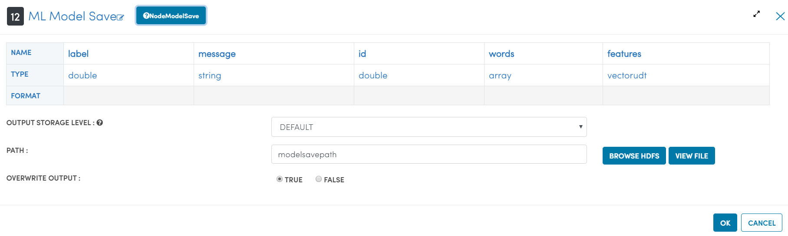
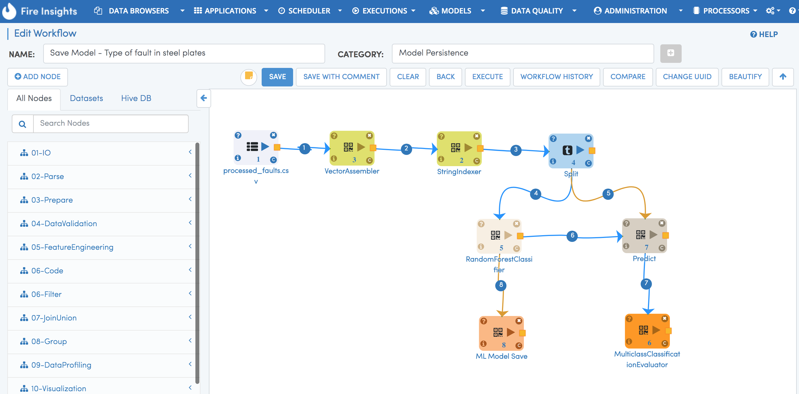
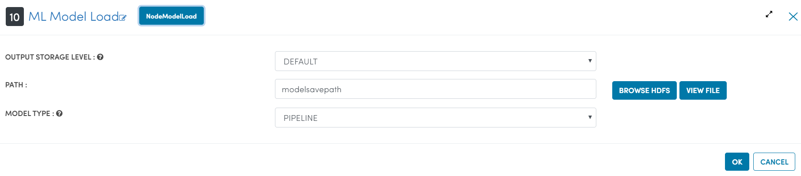

Persisting SparkML Models
=========================

Spark ML Models
---------------

Spark ML models are saved into a directory with multiple files in it. Fire Insights has processors for saving and loading the Spark ML models.

Save Model Processor
+++++++++++++++++++++

NodeModelSave processor saves the given Apache Spark ML model at the given location.

   
ML Save Workflow
+++++++++++++++++++++

   
   
Load Model Processor
+++++++++++++++++++++

   
   
   
ML Load Workflow
+++++++++++++++++++++
   
.. figure:: ../../../_assets/model/mlmodelload.png
   :alt: Modelsave
   :width: 80%   
   
