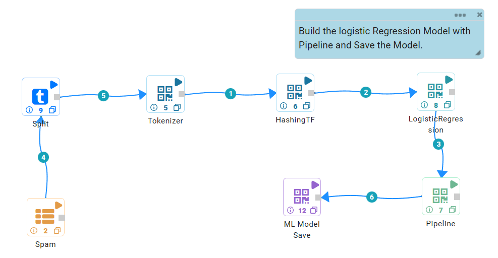
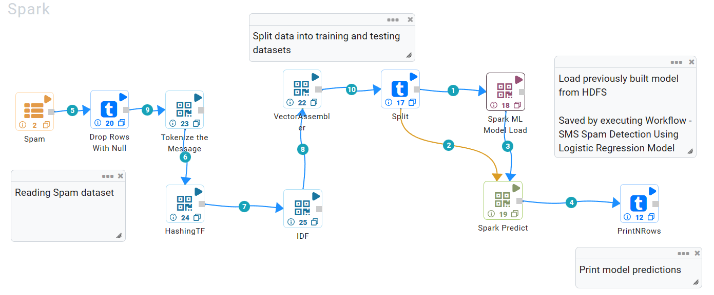

Scoring using Apache Spark ML Models
===========================

Fire Insights creates Apache Spark ML models. These models can be saved as files on the File System.

``NodeModelSave`` saves the Spark ML model as file. It uses the Spark interfaces to save the model.

Once the SparkML model is saved, it can be loaded and used in scoring. Fire Insights enables the saving of both, Spark ML models and pipelines.

Batch Model Scoring
--------------------

By using NodeModelLoad & selecting the particular type of model to be loaded, the model would be loaded in the workflow and it can be used for scoring the input data.

For Apache Spark ML, Fire Insights has a Predict node for predictions.

It takes inputs as Spark ML model and a Spark DataFrame. The result of predicition is stored in a new column in the DataFrame called 'prediction'.

Online Scoring with Kafka and Spark Streaming:
---------------------------------------------

Scalable messaging platform like Kafka to send newly acquired data to a long running Spark Streaming process. The Spark process can then make a new prediction based on the new data.

