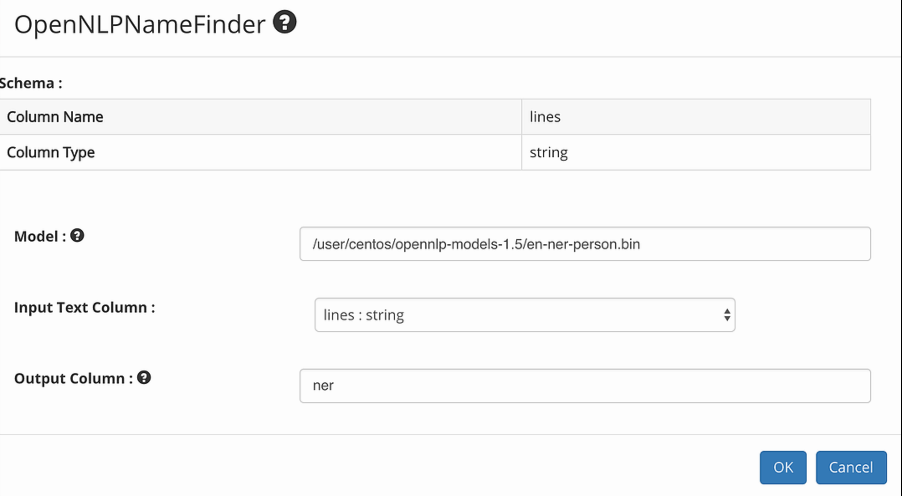

Installing/Using OpenNLP model jars
=============================

When running locally
--------------------

* Create a directory called opennlp-models-1.5 on the local file system
* Download the OpenNLP model jar from : http://opennlp.sourceforge.net/models-1.5/
  * eg: wget http://opennlp.sourceforge.net/models-1.5/en-ner-person.bin
* Copy the OpenNLP model jar into the opennlp-models-1.5 directory created

 

When running on a Spark cluster
-----------------------------

* Copy the model file onto HDFS into a directory called opennlp-models-1.5
* For example /user/centos/opennlp-models-1.5/en-ner-person.bin
* The model file should be accessible by all the users who would use it

Using OpenNLP model jars
------------------------

* Specify the path of the jar file in the dialog box of the Open NLP nodes in the workflow
* For example for the OpenNLPNameFinder node the path can be : /user/centos/opennlp-models-1.5/en-ner-person.bin

   
