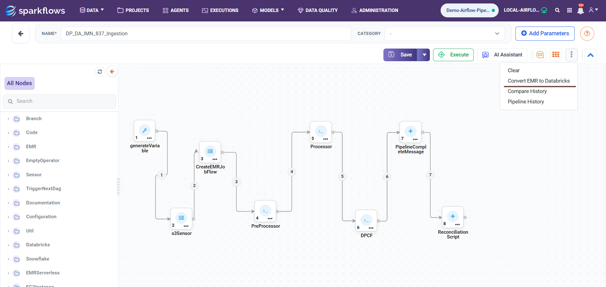
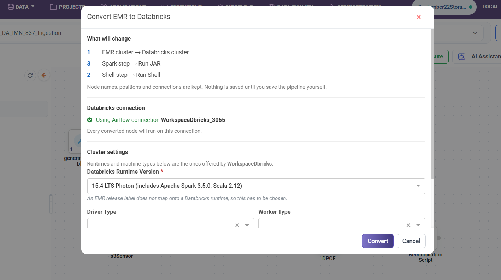
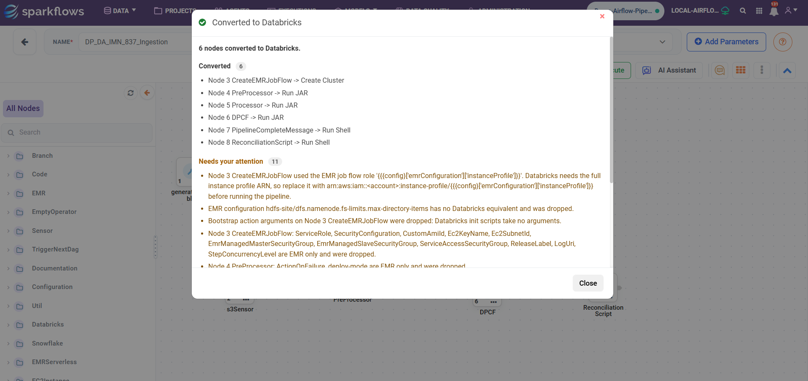
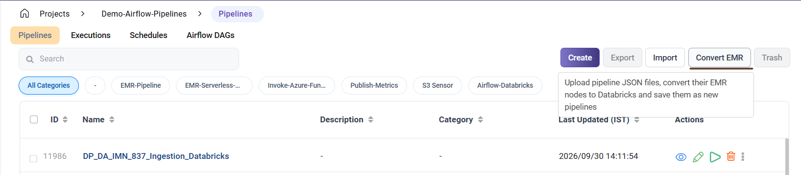
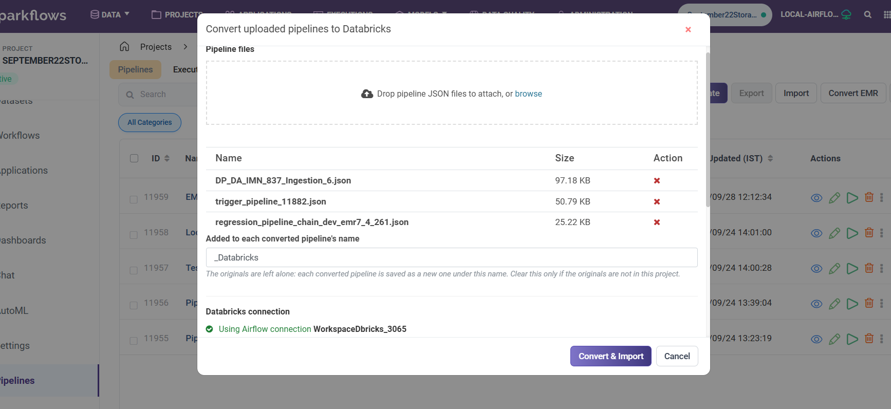

Convert EMR Pipelines to Databricks
====================================

This document explains the steps required to convert EMR pipelines to Databricks in Sparkflows.

Overview
---------------

Sparkflows converts the Amazon EMR nodes in a pipeline to their Databricks equivalents while preserving the node names, positions, and connections. Only the nodes and the compute they run on are changed.

There are two ways to convert a pipeline:

- Convert a pipeline from the Pipeline editor.
- Convert one or more pipeline JSON files from the Pipelines page.

Prerequisites
----------------

Before starting the conversion, make sure the following requirements are in place:

.. list-table::
   :widths: 30 70
   :header-rows: 1

   * - Requirement
     - Why it is needed
   * - Airflow is enabled
     - The converted pipeline is executed through Airflow, and the Databricks connection is read from it. When ``airflow.enabled`` is false, the conversion options do not appear.
   * - A Databricks connection synced to Airflow
     - Every converted node is pointed to this connection. Sparkflows resolves the connection automatically, so no ID needs to be entered. The connection must exist in Airflow.
   * - Write access to the project
     - Conversion in the editor changes the pipeline on the canvas. Conversion from the Pipelines list creates new pipelines in the project.

**Note:** A Databricks Runtime version must also be selected. An EMR release label does not map to a Databricks runtime, so this is the one setting that cannot be determined automatically during the conversion.

Option 1: Convert the Pipeline from the Pipeline Editor
----------------------------------------------

Use this option when working with a single pipeline and when the converted pipeline needs to be reviewed on the canvas before saving.

Step 1: Open the Pipeline
++++++++++++++++++++++++++++

Open the pipeline in the Pipeline editor.

Step 2: Select Convert EMR to Databricks
++++++++++++++++++++++++++++++++++++++++++

Click the **⋮ (more actions)** button on the editor toolbar and select **Convert EMR to Databricks**.

Step 3: Review the Conversion Details
+++++++++++++++++++++++++++++++++++++++++++

The conversion dialog displays what the conversion will change, the Databricks connection that was resolved, and the cluster settings to be applied.

Step 4: Select the Databricks Runtime Version
++++++++++++++++++++++++++++++++++++++++++++++++++

Choose a **Databricks Runtime Version**.

Optionally, select the **Driver Type**, **Worker Type**, and worker counts.

Step 5: Convert the Pipeline
++++++++++++++++++++++++++++++++

Click **Convert**. The converted pipeline is displayed on the canvas.

Step 6: Review and Save the Pipeline
+++++++++++++++++++++++++++++++++++++++++

Review the converted pipeline and click **Save** to keep the changes.

.. note:: Nothing is written until the pipeline is saved. If the conversion is not required, leave the pipeline without saving. The pipeline remains unchanged. A failed conversion does not change the canvas.

Option 2: Convert Uploaded Pipeline Files
---------------------------------

Use this option when converting multiple pipelines or when the pipelines are available as exported JSON files.

Unlike the Pipeline editor, this option does not display the converted pipeline on a canvas. Each converted pipeline is saved as a new pipeline in the project, while the original pipelines remain unchanged.

Running the Conversion
++++++++++++++++++++++++++

Step 1: Navigate to the Pipelines Page
++++++++++++++++++++++++++++++++++++++++

Go to the **Pipelines** page of the project.

Step 2: Select Convert EMR
-----------------------------

Click **Convert EMR** on the toolbar next to **Import**.

Step 3: Upload the Pipeline JSON Files
-----------------------------------------

Drop the pipeline JSON files into the upload area, or click **browse** to select them.

Several files can be converted at the same time.

Step 4: Check the Pipeline Name Suffix
----------------------------------------

Check the suffix in **Added to each converted pipeline’s name**.

The default suffix is **" - Databricks"**.

Step 5: Select the Databricks Runtime Version
------------------------------------------------

Choose the **Databricks Runtime Version** and, if required, the machine types.

Step 6: Convert and Import
-----------------------------

Click **Convert and Import**.

Why the Name Suffix Matters
----------------------------

Pipeline files usually come from pipelines that are still in the project. The files are exported before they are converted.

Saving a converted pipeline with the original name would conflict with the existing pipeline, and the import would be refused.

The suffix prevents this conflict. The converted pipeline is saved as ``<original name><suffix>`` with a new UUID, allowing the original and converted pipelines to appear side by side in the Pipelines list.

Clear the suffix only if the original pipelines are not in the project.

Reading the Conversion Report
------------------------------

When the batch conversion is complete, a report opens.

The counts at the top provide an overview of the conversion results, and each file is listed in a separate row.

.. list-table::
   :widths: 20 80
   :header-rows: 1

   * - Count
     - What it means
   * - Files
     - The number of files read from the upload.
   * - Imported
     - Files that contained EMR nodes, were converted successfully, and were saved as new pipelines.
   * - No EMR nodes
     - Files with nothing to convert. Nothing was saved. This is an outcome, not a failure.
   * - Failed
     - Files that could not be read, converted, or saved. The row shows the reason for the failure.

Each row shows the status, the name under which the pipeline was saved, and a one-line summary.

When additional information is available, the row displays a notes count. Click the row to open the notes, or click **Expand all**.

The notes are grouped as follows:

- **Converted** — Nodes replaced by their Databricks equivalents.
- **Switched to run on Databricks** — Nodes that were kept as they were, with their **Run on** setting changed.
- **Added** — Nodes introduced during the conversion, such as a cluster to run on.
- **Needs your attention** — EMR settings that do not have a Databricks equivalent and require review.

.. note:: A conversion that reports warnings is still saved. The warnings indicate what could not be carried over, not that the pipeline was rejected. Review the warnings before running the converted pipeline.
