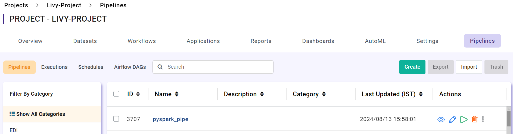
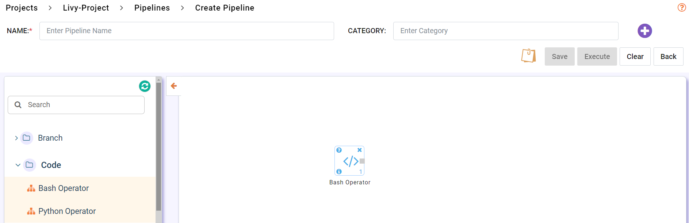
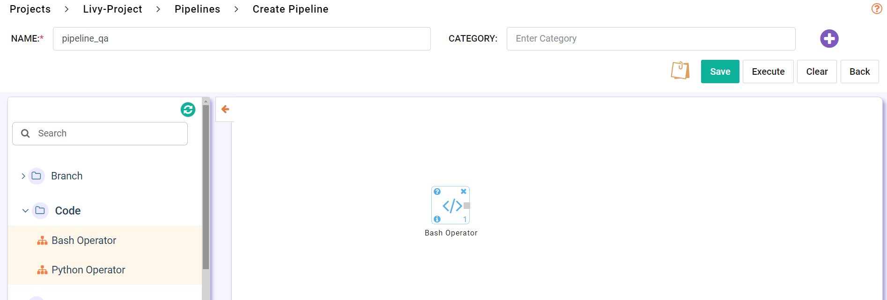
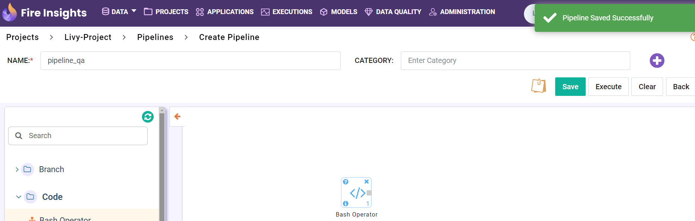

Create Pipeline
=====================
This document explains the steps required to create a pipeline in Sparkflows.

Step 1 : Navigate to the Pipeline Tab
----------------------------------------

Go to the **Pipeline tab** within your project.

Step 2 : Initiate Pipeline Creation
-------------------------------------

Click on the **Create** Pipeline button.

Step 3 : Add Nodes to the Pipeline
-----------------------------------------

In the new Pipeline canvas, add the desired Nodes.

Step 4 : Provide Pipeline Details
---------------------------------------

Enter a Pipeline **Name** and select a Pipeline **Category**.

Step 5 : Save the Pipeline
-----------------------------

Click on the **Save** button to finalize and save your new Pipeline.

