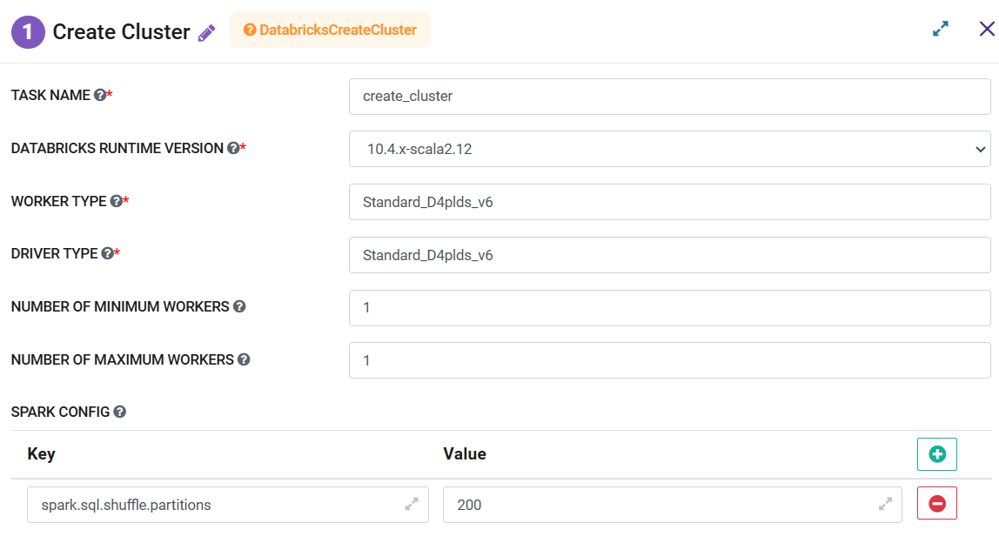
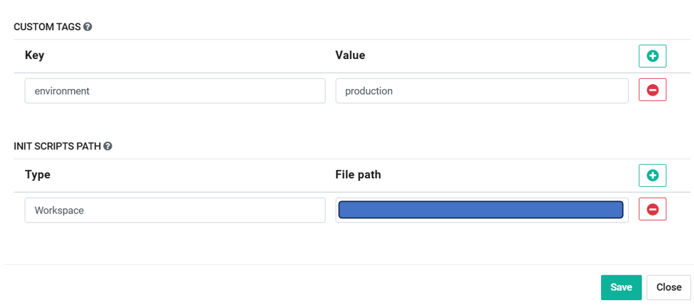

Create Databricks Cluster
=========
**Create Databricks Cluster** node creates a new **Databricks Cluster** by using the details in configuration and passes the Cluster id to the next step.

**Create Databricks Cluster** node can be configured as below:

   

*   **Task Name:** Enter Unique name of the task in the Airflow DAG.
*   **Databricks Runtime Version:** Select a value from the drop which would be used for Cluster creation.
*   **Worker Type:** Enter type of the Worker Node to be created. Pls refer to the Airflow documentation for the available options. They are responsible to execute the tasks received from the Driver. Their size would depend on the processing need.

	Examples of Worker Type are as follows:

	* Standard DS3 v2 (2 CPUs, 14 GB RAM)
	* Standard DS4 v2 (4 CPUs, 28 GB RAM)
	* Standard DS5 v2 (8 CPUs, 56 GB RAM)

*   **Driver Type:** Enter type of the Worker Node to be created. Pls refer to the Airflow documentation for the available options. It distributes tasks to the worker nodes. They are usually larger machine and need to be selected based on the computation needed.

	Examples of Driver Type are as follows:

	* Standard DS3 v2 (2 CPUs, 14 GB RAM)
	* Standard DS4 v2 (4 CPUs, 28 GB RAM)
	* Standard DS5 v2 (8 CPUs, 56 GB RAM)

*   **Number of Minimum Worker:** Enter a value for min number of Worker Nodes to be onboarded.
*   **Number of Maximum Worker:** Enter a value for max number of Worker Nodes to be onboarded. It would be dependent on the processing/workload need and size of cluster. These setting would be used to scale up or down based on the workload.
*   **Spark Config:** Spark Config values would be used while executing spark jobs on the cluster. Multiple values can be entered in Key-Value pair.
*   **Custom Tags:** Multiple values can be entered in Key-Value pair. They are used to categorize and for better management of clusters.
*   **Init Scripts Path:** Add path of the script to perform initial setup tasks when cluster is started. Multiple scripts can be added.
