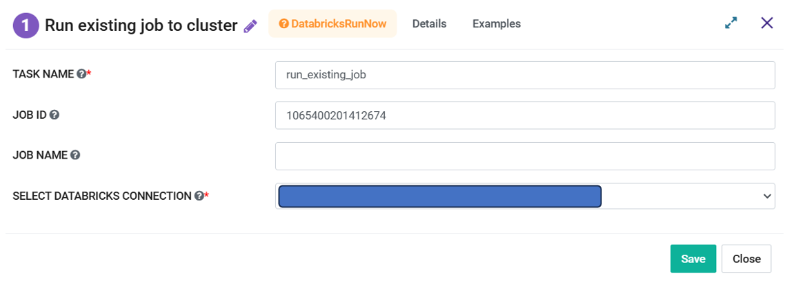

Databricks Run Now
=========
**Databricks Run Now** node can be used to execute an existing **Databricks Job**. If Databricks Job was used to run a Notebook then same would be executed. It doesn't create a new Job. It uses the same cluster info as earlier.

**Databricks Run Now** node can be configured as below:

   
*   **Task Name:** Enter Unique name of the task in the Airflow DAG.
*   **Job ID:** Enter an existing Job Id that needs to be re-executed.
*   **Job Name:** Enter the Job Name.
*   **Select Databricks Connection:** Select the Databricks Connection from the dropdown. List contains the connections defined in the Airflow. Selected connection would be used by the Airflow to communicate with Databricks.
