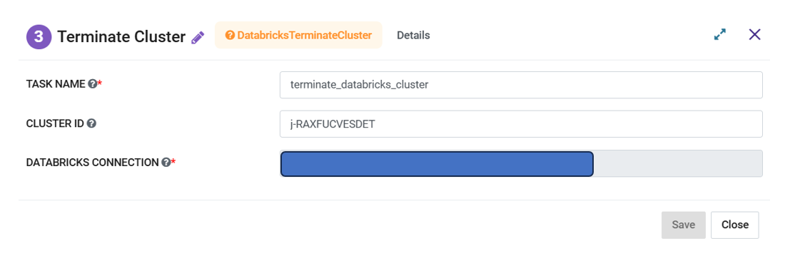

Databricks Terminate Cluster
=========
**Databricks Terminate Cluster** node can be used to terminate an existing Databricks Cluster.

**Databricks Terminate Cluster** node can be configured as below:

   
*   **Task Name:** Enter Unique name of the task in the Airflow DAG.
*   **Cluster ID:** Enter an existing Databricks Cluster ID. If left blank then it uses the Cluster ID created in the previous step.
*   **Select Databricks Connection:** Select the Databricks Connection from the dropdown. List contains the connections defined in the Airflow. Selected connection would be used by the Airflow to communicate with Databricks.
