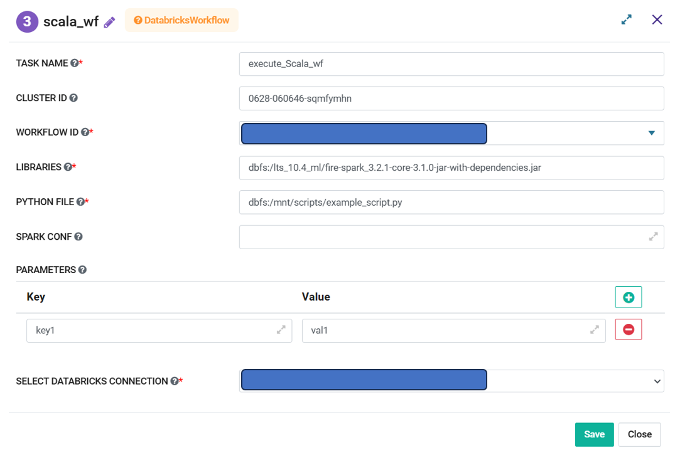

Databricks Workflow
=========
**Databricks Workflow** node can be used to execute a scala Workflow defined in the Project.

**Databricks Workflow** node can be configured as below:

   
*   **Task Name:** Enter Unique name of the task in the Airflow DAG.
*   **Cluster ID:** Enter an existing Databricks Cluster ID. If left blank then it uses the Cluster ID created in the previous step.
*   **Workflow ID:** Select a Workflow from the dropdown. Selected workflow would be executed in the Cluster provided.
*   **Libraries:** Enter the libraries that are needed to execute the workflow in the Databricks Cluster. They are mainly the dependencies that are attached to the cluster to enable workflow execution.
*   **Python File:** If selected Workflow is Pyspark one then provide path of the Python file that needs to be executed.
*   **Spark Conf:** Enter Spark Configuration details that would be used to run the job in the cluster.
*   **Parameters:** Enter the Parameters values as expected by the workflow for execution.
*   **Select Databricks Connection:** Select the Databricks Connection from the dropdown. List contains the connections defined in the Airflow. Selected connection would be used by the Airflow to communicate with Databricks.

