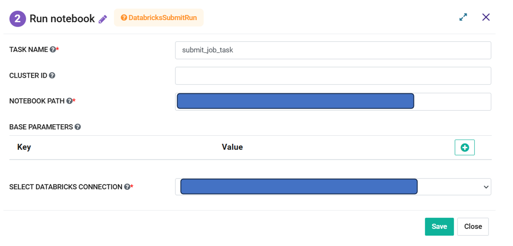

Run Databricks Notebook
=========
**Run Databricks Notebook** node can be used to execute a **Databricks Notebook** in a **Databricks Cluster** by using the details in configuration.

**Run Databricks Notebook** node can be configured as below:

*   **Task Name:** Enter Unique name of the task in the Airflow DAG.
*   **Cluster ID:** Enter a Databricks Cluster ID in which notebook is to be executed. If this node is connected to a **Create Cluster** node then it can be blank and it would use the newly created cluster.
*   **Notebook Path:** Enter path of the **Databricks Notebook** that needs to be executed.
*   **Base Parameters:** These parameters are passed to the notebook and are used for processing. Multiple values can be added in Key-Value pair.
*   **Select Databricks Connection:** Select the Databricks Connection from the dropdown. List contains the connections defined in the Airflow. Selected connection would be used by the Airflow to communicate with Databricks.
