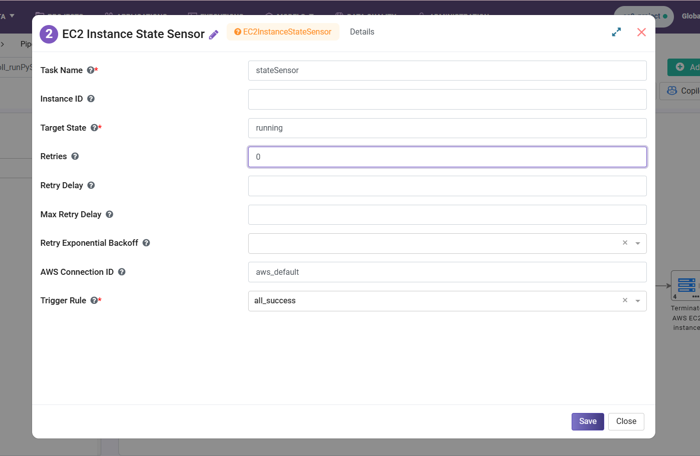
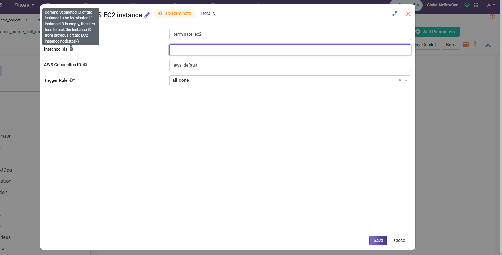
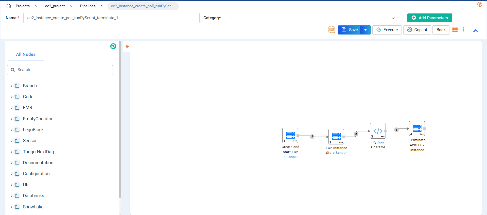

EC2 Instance Node in Pipeline
===================================

The EC2 Instance Node enables you to create an Amazon EC2 instance, execute a Python script using AWS Systems Manager (SSM), and terminate the instance as part of a pipeline workflow.

Step 1 : Create and Start EC2 Instance
------------------------------------------
To create the instance, follow the steps given below:

#. Configure the EC2 creation task with the AMI ID, AWS connection, retry settings, and trigger rule. This step launches the EC2 instance.

    .. figure:: ../../_assets/user-guide/pipeline/ec2-instance-node/1.png
       :alt: EC2 Pipeline
       :width: 60%

#. Provide the EC2 instance configuration including IAM role, instance type, subnet, security groups, and key pair.

    .. figure:: ../../_assets/user-guide/pipeline/ec2-instance-node/2.png
       :alt: EC2 Pipeline
       :width: 60%

#. Add EC2 tags and user data bootstrap commands to install Python dependencies and prepare the instance environment.

    .. figure:: ../../_assets/user-guide/pipeline/ec2-instance-node/3.png
       :alt: EC2 Pipeline
       :width: 60%

Step 2 : Configure EC2 Instance State Sensor
-----------------------------------------------

The sensor waits until the EC2 instance reaches the `running` state before executing downstream tasks.

Step 3 : Configure Python Operator
----------------------------------

The Python Operator uses AWS Systems Manager (SSM) to copy and run a Python script stored in Amazon S3 on the EC2 instance.

    .. figure:: ../../_assets/user-guide/pipeline/ec2-instance-node/python2.png
       :alt: EC2 Pipeline
       :width: 60%

Step 4 : Terminate EC2 Instance
-------------------------------------

Terminate the EC2 instance after script execution to avoid unnecessary resource usage and cost.

**Final Workflow Pipeline**
***************************

Below is the complete pipeline flow:

Create EC2 Instance → Sensor → Run Python Script → Terminate EC2 Instance

Python Code Used in Python Operator
-------------------------------------------

The following Python code is used in the Python Operator.

.. code-block:: python

  from airflow.providers.amazon.aws.hooks.base_aws import AwsBaseHook
  import time

  def run_script_via_ssm(**context):
  ti = context["ti"]
  instance_id = ti.xcom_pull(task_ids="create_ec2_instance", key="return_value")[0]
  
     ssm = AwsBaseHook(
         aws_conn_id="aws_default",
         client_type="ssm"
     ).get_conn()
  
     # Send command
     response = ssm.send_command(
         InstanceIds=[instance_id],
         DocumentName="AWS-RunShellScript",
         Parameters={
             "commands": [
                 "echo Hello from EC2"
             ]
         },
     )
  
     command_id = response["Command"]["CommandId"]
  
     # Poll until command finishes
     print(f"Command sent: {command_id}, waiting for result...")
  
     for _ in range(20):
         time.sleep(10)
  
         result = ssm.get_command_invocation(
             CommandId=command_id,
             InstanceId=instance_id
         )
  
         status = result["Status"]
         print(f"Status: {status}")
  
         if status in ("Success", "Failed", "Cancelled", "TimedOut"):
             break
  
     # Print output
     print("=== STDOUT ===")
     print(result["StandardOutputContent"])
  
     print("=== STDERR ===")
     print(result["StandardErrorContent"])
  
     if result["Status"] != "Success":
         raise Exception(
             f"SSM command failed: {result['StandardErrorContent']}"
         )
  
     return result["StandardOutputContent"]
  
