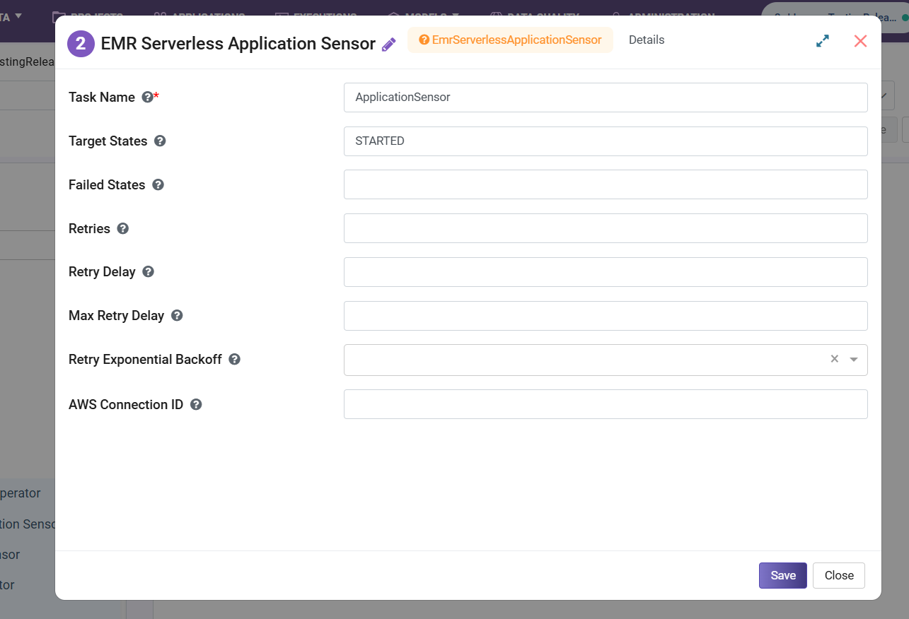

EMR Serverless Application Sensor Operator
================================================

Once your application is created, this node periodically checks the state of an EMR Serverless application and waits until it reaches a desired state.

**EMR Serverless Application Sensor Operator** node can be configured as below:

* **Task Name:** Enter Unique name of the task in the Airflow DAG.
* **Target States:** Enter comma separated values for Target States.
* **Failed States:** Enter comma separated values for Failed States.
