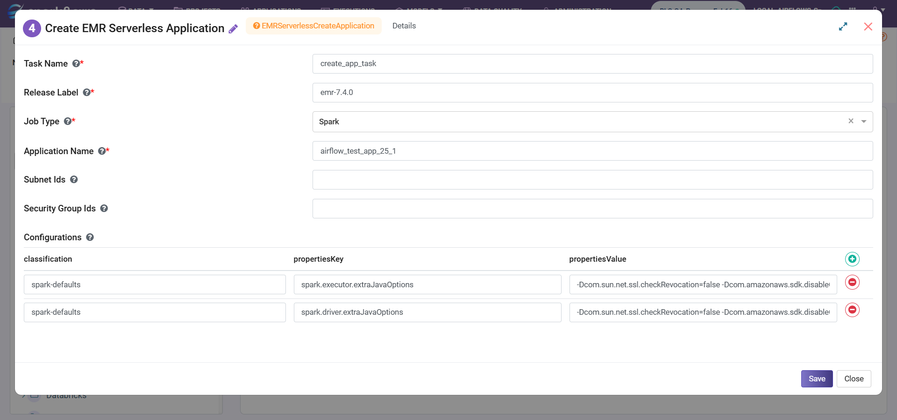

Create EMR Serverless Application
==========================================

This node creates an EMR Serverless application with the specified configuration, including release version, job type, and optional VPC connectivity.

**Create EMR Serverless Application** node can be configured as below:

* **Task Name:** Enter Unique name of the task in the Airflow DAG.
* **Release Label:** The EMR release version associated with the application.
* **Job Type:** The type of application you want to start such as Spark or Hive.
* **Application Name:** A name to identify this application. Maximum length of 64 characters.
