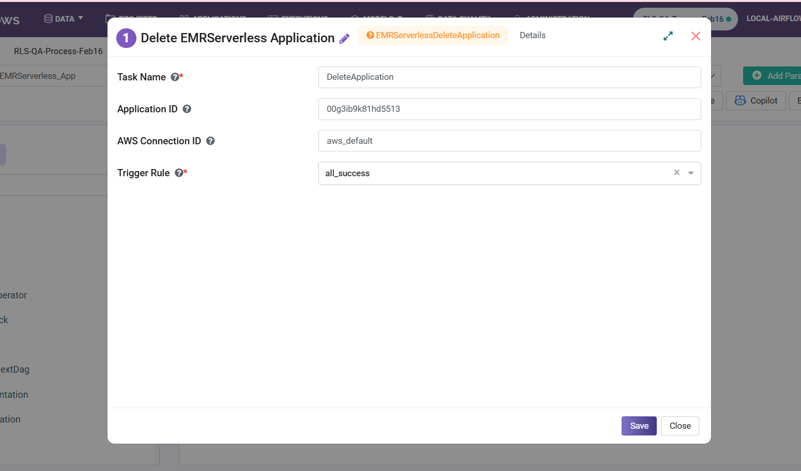

Delete EMR Serverless Application
=========================================

**Delete EMR Serverless Application** node removes an EMR Serverless application from AWS.

**Delete EMR Serverless Application** node can be configured as below:

* **Task Name:** Enter a unique name of the task in the Airflow DAG.
* **Application ID:** Enter an Application ID.
