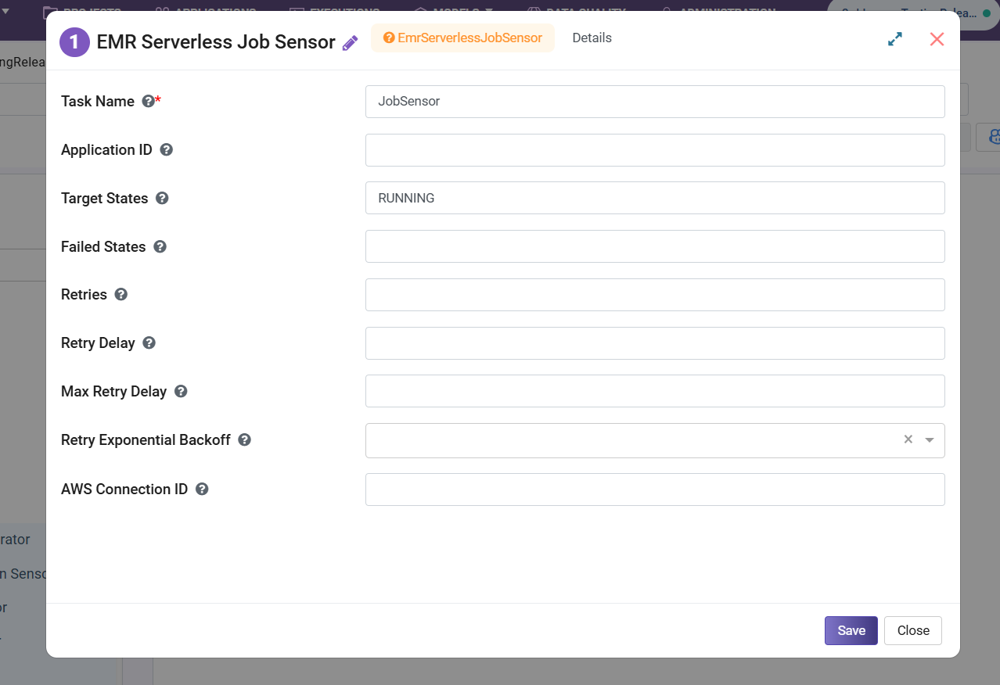

EMR Serverless Job Sensor
========================================

**EMR Serverless Job Sensor** node waits until a job run reaches a desired state. It polls job run status until it reaches a target state or fails if it hits a failure state.

**EMR Serverless Job Sensor** node can be configured as below:

* **Task Name:** Enter a unique name of the task in the Airflow DAG.
* **Target States:** Enter comma separated values for Target States.
* **Failed States:** Enter comma separated values for Failed States.
