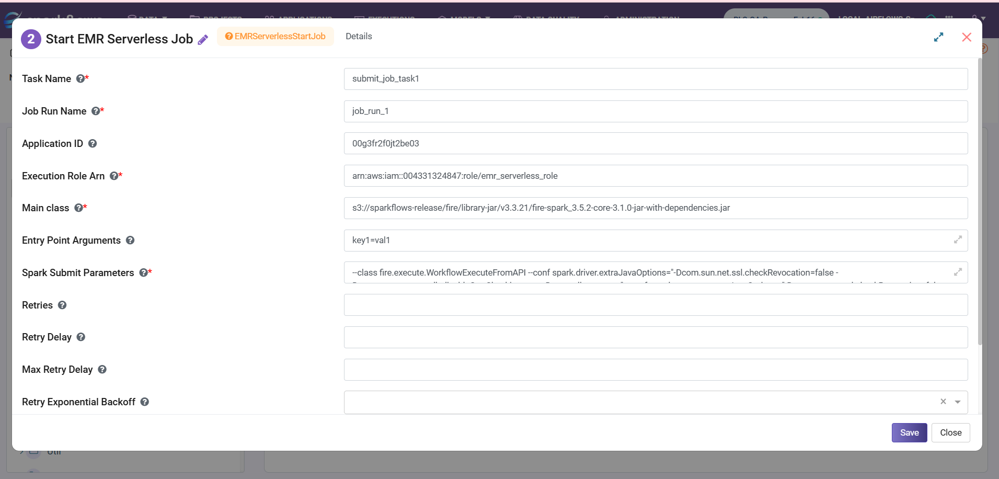

Start EMR Serverless Job
==================================

**Start EMR Serverless Job** node launches a standalone EMR Serverless job run.

**Start EMR Serverless Job** node can be configured as below:

* **Task Name:** Enter a unique name of the task in the Airflow DAG.
* **Application ID:** Enter an Application ID.
* **Execution Role ARN:** The IAM role assumed by the job.
* **Main Class:** Main class is the entry point for the application.
* **Entry Point Arguments:** Add Comma separated arguments.
* **Spark Submit Parameters:** Add configuration properties that can be specified for each job.
