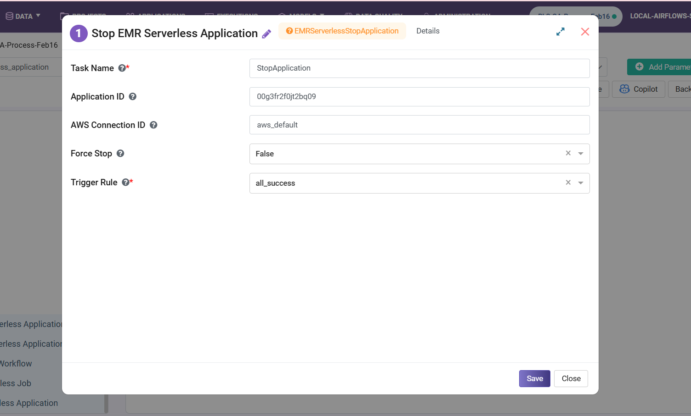

Stop EMR Serverless Application 
====================================

**Stop EMR Serverless Application** node stops a running application. Optionally force stops it if needed.

**Stop EMR Serverless Application** node can be configured as below:

* **Task Name:** Enter a unique name of the task in the Airflow DAG.
* **Application ID:** Enter an Application ID.
