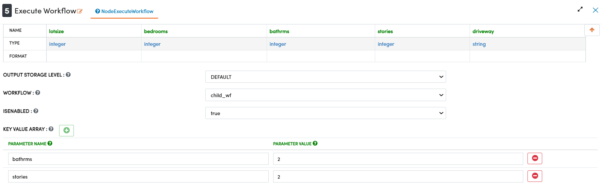
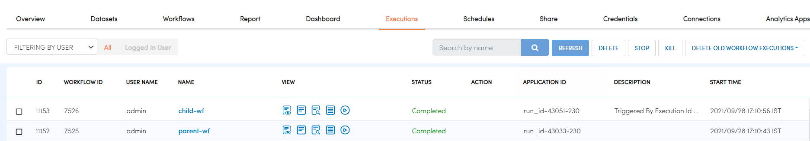
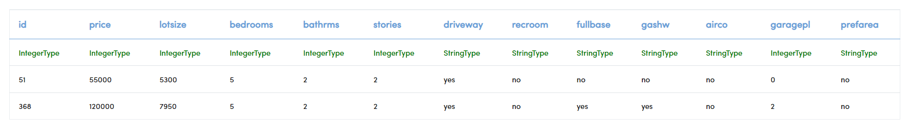

Execute Workflow 
================

Sparkflows provides a node using which another Workflow can be executed.

Using this node enables the creation of a DAG of workflows.

Overview
--------

The `Execute Workflow` node sends a message to Sparkflows to execute a specific Workflow. The workflow has to be within the same project. The workflow gets executed with the user who execute the original workflow. Parameters can be passed to the workflow as well.

Below are the steps on how to execute a specific workflow in Fire Insights.

Create Workflow
--------------------

Click on **Create New Workflow** and search **Execute Workflow** Node in the left pane and drag it to editor.

Add below parameters in 'Execute Workflow' Node.

.. list-table:: 
   :widths: 10 20 
   :header-rows: 1

   * - Title
     - Value
   * - Workflow
     - Select the workflow to execute
   * - IsEnabled
     - Set IsEnabled to true to execute the selected workflow
   * - Key Value Array
     - Add 'Parameter Name' and 'Parameter Value' if you want to pass workflow parameters

Execute Workflow
------------

Once the above workflow got configured with needed details, you can execute the workflow.

When it's executed, go to workflow execution page. The workflows selected in Execute Workflow Node would be executed and you can see their result in corresponding tabs.

 
Result after passing workflow parameters:
 

.. note:: Make sure to update Execute Workflow Node as last node.
