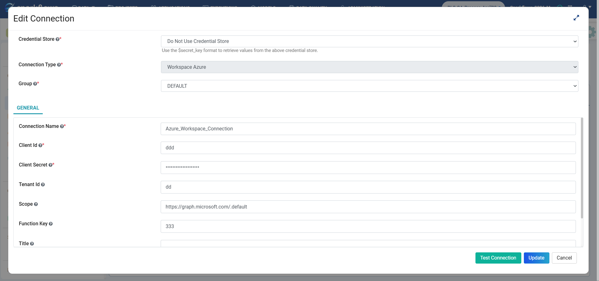
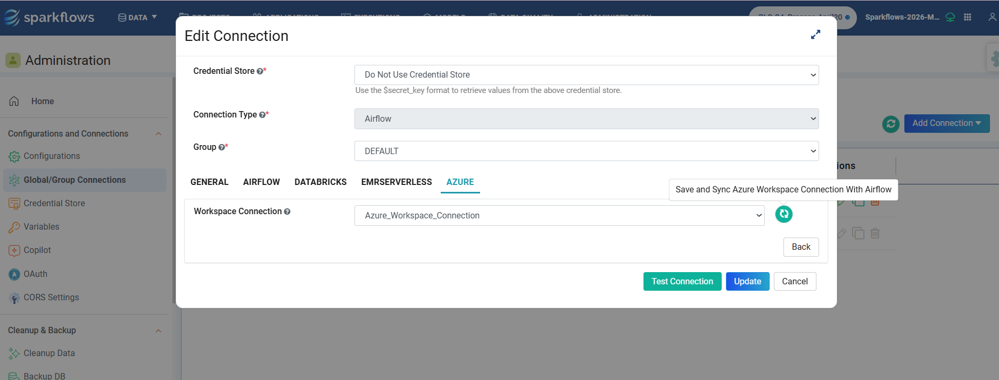
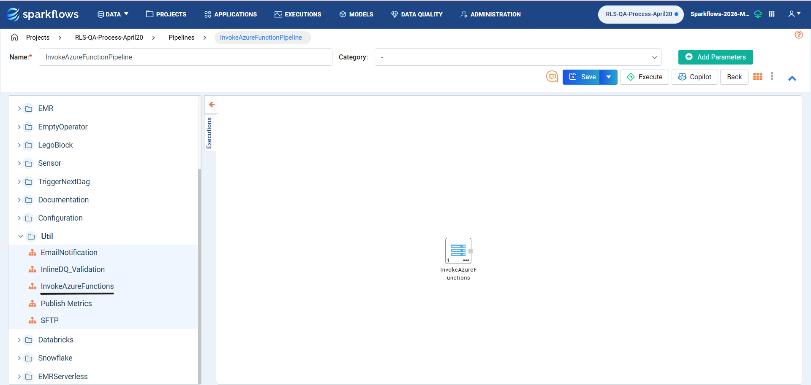
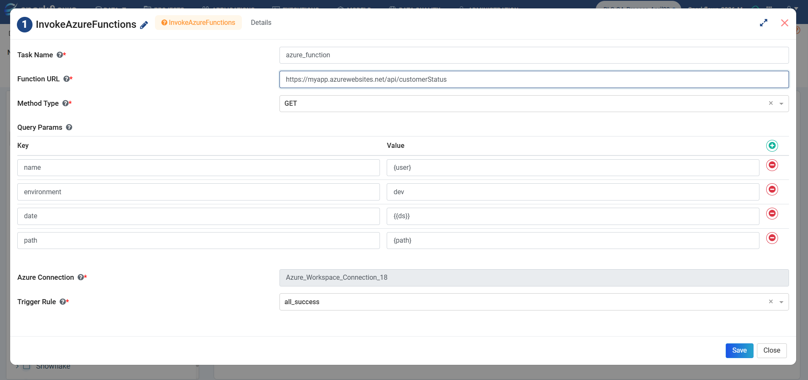
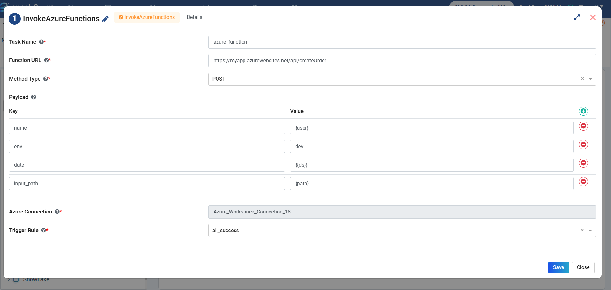

Invoke Azure Functions
======================

This node invokes Azure Functions and allows triggering Azure Function endpoints using GET or POST methods from the pipeline using Airflow.

Connection Configuration
------------------------

Create an Azure Workspace connection, then sync this connection with Airflow by selecting the Azure Workspace connection under Sparkflows Airflow Connection.

**Azure Workspace Connection**
+++++++++++++++++++++++++++++++

  
- **Client Id**: The Application (Client) ID from Azure App Registration. Used to identify your Azure application during authentication.
- **Client Secret**: Secret key/password generated for the Azure App Registration. Used with the Client ID for secure authentication.
- **Tenant Id**: Your Azure Directory (Tenant) ID. Identifies which Azure organization/account owns the app.
- **Scope**: Specifies the target resource for the access token. For example, **{client_id}/.default** requests a token for the application itself (ensuring correct aud and permissions), whereas other scopes (e.g., Microsoft Graph) target different resources and may not be valid for the intended API.
- **Function Key**: Authorization key for Azure Functions. Used when calling secured Azure Function endpoints.

**Airflow Connection**
+++++++++++++++++++++++++++++

Node Field Descriptions
-----------------------

+----------------+---------------------------------------------------------------+-------------+
| Field          | Description                                                   | Requirement |
+================+===============================================================+=============+
| Task Name      | Provide a unique name for this task to track it in the DAG.   | Required    |
+----------------+---------------------------------------------------------------+-------------+
| Function URL   | Specify the Azure Function URL to be triggered.               | Required    |
+----------------+---------------------------------------------------------------+-------------+
| Method Type    | Choose the HTTP method: GET or POST.                          | Required    |
+----------------+---------------------------------------------------------------+-------------+
| Query Params   | Used only for GET requests. Add key/value query parameters.   | Conditional |
+----------------+---------------------------------------------------------------+-------------+
| Payload        | Used only for POST requests. Add key/value payload entries.   | Conditional |
+----------------+---------------------------------------------------------------+-------------+
| Trigger Rule   | Airflow trigger rule controlling task execution.              | Required    |
+----------------+---------------------------------------------------------------+-------------+

  
GET Example Configuration
-------------------------

.. code-block:: json

   {
     "Name": "invoke_customer_status",
     "functionUrl": "https://myapp.azurewebsites.net/api/customerStatus",
     "methodType": "GET",
     "queryParams": [
       {"Key":"name","Value":"admin"},
       {"Key":"path","Value":"s3://abc"}
     ],
     "AzureConnectionId": "Azure_Workspace_Connection_18",
     "trigger_rule": "all_success"
   }

POST Example Configuration
--------------------------

.. code-block:: json

   {
     "Name": "invoke_create_order",
     "functionUrl": "https://myapp.azurewebsites.net/api/createOrder",
     "methodType": "POST",
     "payload": [
       {"Key":"name","Value":"admin"},
       {"Key":"path","Value":"s3://abc"}
     ],
     "AzureConnectionId": "Azure_Workspace_Connection_18",
     "trigger_rule": "all_success"
   }

.. note::

    - Use Query Params only when Method Type is GET.
    - Use Payload only when Method Type is POST.
    - Ensure the Azure Connection has permission to access the function.
    - Task Name should be unique within the DAG.
