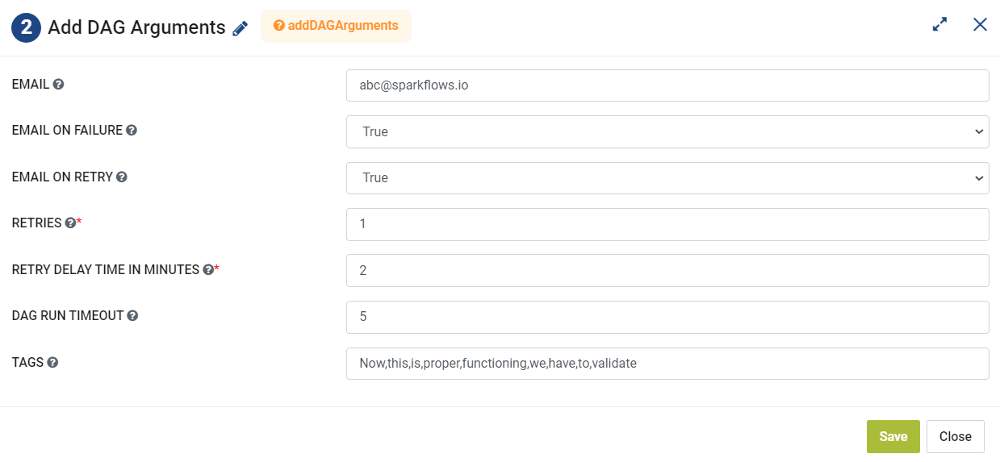

Add DAG Arguments
=========
**Add DAG Arguments** node is used to add DAG arguments.

**Add DAG Arguments** can be configured as below:

*   **Email:** Enter email id where notification for failure or retry would be sent.
*   **Email On Failure:** Set True is notification needs to be sent to the specified email id if Airflow DAG fails.
*   **Email On Retry:** Set True is notification needs to be sent to the specified email id if Airflow DAG retries.
* 	**Retries:** Enter the number of retries.
*   **Retry Delay In Minutes:** Enter a value for Retry delay in minutes.
*   **DAG Run Timeout:** Add DAG Run Timeout value in minutes.
*   **Tags:** Add comma separated tags for Airflow DAG.
