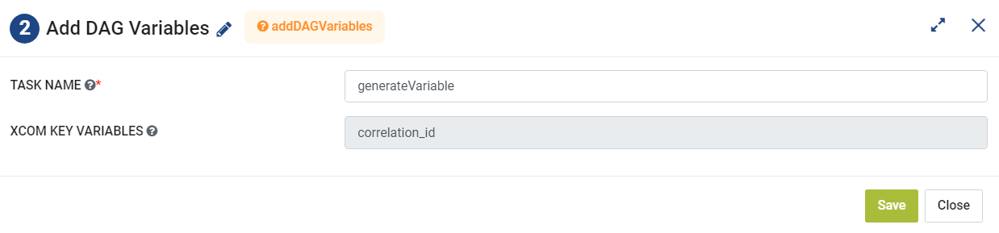

Add DAG Variables
=========
**Add DAG Variables** node executes a python code to add DAG Variables using the Python operator.

**Add DAG Variables** can be configured as below:

*   **Task Name:** Enter Unique name of the task in the Airflow DAG.
*   **XCOM Key Variables:** Enter a key variable that would be used to pull value from XCOM.
