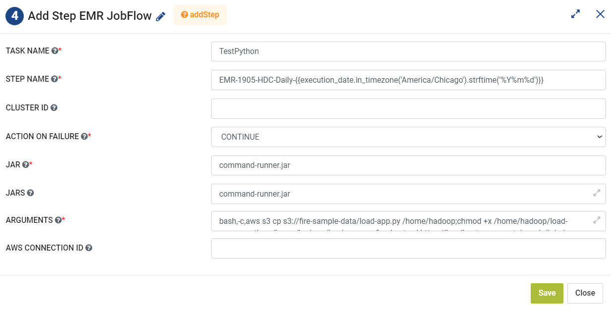

Add Step EMR Jobflow
=========
**Add Step EMR Jobflow** node add steps to an existing EMR Jobflow and executes the arguments as one command using command-runner.jar.

**Add Step EMR Jobflow** can be configured as below:

*   **Task Name:** Enter Unique name of the task in the Airflow DAG.
*   **Step Name:** Enter name of the EMR step.
* 	**Cluster ID:** Enter a Cluster ID.
*   **Action On Failure:** Select an action from the list that can be teaken on failure.
*   **Jar:** Add name of the jar to execute the command.
*   **Jars:** Add comma separated jars that would be used during execution.
*   **Arguments:** Add comma separated list of arguments.
*   **AWS Connection ID:** Enter AWS Connection ID to be used.
